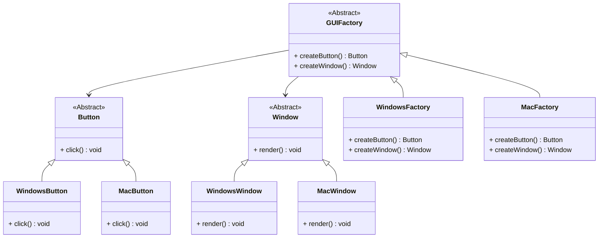

# 抽象工厂模式详解

## 定义  
抽象工厂模式（Abstract Factory Pattern）是一种创建型设计模式，它提供一个接口，用于创建一系列相关或相互依赖的对象，而无需指定它们的具体类。  
抽象工厂模式特别适合**产品族**的创建，保证产品的兼容性和一致性。

---

## 抽象工厂模式的特点

### **优点**
1. **分离接口与实现**：客户端仅依赖抽象接口，与具体实现解耦。
2. **产品族一致性**：确保同一工厂创建的对象是兼容的，避免出现不匹配的情况。
3. **遵循开闭原则**：添加新产品族时，只需新增具体工厂类，无需修改已有代码。

### **缺点**
1. **扩展产品种类困难**：新增产品种类时，需要修改抽象工厂接口及所有子类。
2. **增加系统复杂性**：引入额外的抽象层，使系统的类结构更加复杂。

---

## 适用场景

1. **跨平台应用开发**  
   通过抽象工厂为不同操作系统（Windows、Mac、Linux）创建平台相关的 UI 控件。
2. **数据库访问**  
   支持不同数据库（MySQL、Oracle、SQL Server）的数据访问逻辑。
3. **游戏开发**  
   在游戏中为不同种族或阵营创建一系列相关的角色和武器。
4. **主题风格切换**  
   应用支持切换不同主题，每个主题有一组对应的按钮、窗口样式。

---

## 抽象工厂模式的结构

### 核心角色
1. **抽象工厂（Abstract Factory）**：定义创建一系列相关或相互依赖对象的接口。
2. **具体工厂（Concrete Factory）**：实现抽象工厂接口，创建特定产品族的对象。
3. **抽象产品（Abstract Product）**：为每种产品定义一个接口。
4. **具体产品（Concrete Product）**：实现抽象产品接口，由具体工厂创建。

---

## 使用案例

### 案例 1：跨平台 UI  
根据操作系统不同，创建适配的按钮和窗口。

### 案例 2：数据库访问  
创建针对不同数据库的连接对象和查询对象。

### 案例 3：游戏装备  
为不同阵营创建特定类型的武器、护甲等装备。

---

## 抽象工厂模式的实现

### C++ 实现

```cpp
#include <iostream>
#include <memory>

// 抽象产品 A
class Button {
public:
    virtual void click() = 0;
    virtual ~Button() = default;
};

// 抽象产品 B
class Window {
public:
    virtual void render() = 0;
    virtual ~Window() = default;
};

// 具体产品 A1
class WindowsButton : public Button {
public:
    void click() override {
        std::cout << "Windows Button Clicked!" << std::endl;
    }
};

// 具体产品 A2
class MacButton : public Button {
public:
    void click() override {
        std::cout << "Mac Button Clicked!" << std::endl;
    }
};

// 具体产品 B1
class WindowsWindow : public Window {
public:
    void render() override {
        std::cout << "Rendering Windows Window!" << std::endl;
    }
};

// 具体产品 B2
class MacWindow : public Window {
public:
    void render() override {
        std::cout << "Rendering Mac Window!" << std::endl;
    }
};

// 抽象工厂
class GUIFactory {
public:
    virtual std::unique_ptr<Button> createButton() = 0;
    virtual std::unique_ptr<Window> createWindow() = 0;
    virtual ~GUIFactory() = default;
};

// 具体工厂 1
class WindowsFactory : public GUIFactory {
public:
    std::unique_ptr<Button> createButton() override {
        return std::make_unique<WindowsButton>();
    }
    std::unique_ptr<Window> createWindow() override {
        return std::make_unique<WindowsWindow>();
    }
};

// 具体工厂 2
class MacFactory : public GUIFactory {
public:
    std::unique_ptr<Button> createButton() override {
        return std::make_unique<MacButton>();
    }
    std::unique_ptr<Window> createWindow() override {
        return std::make_unique<MacWindow>();
    }
};

// 客户端代码
int main() {
    std::unique_ptr<GUIFactory> factory = std::make_unique<WindowsFactory>();
    auto button = factory->createButton();
    auto window = factory->createWindow();

    button->click();
    window->render();

    factory = std::make_unique<MacFactory>();
    button = factory->createButton();
    window = factory->createWindow();

    button->click();
    window->render();

    return 0;
}
```

---

### C# 实现

```csharp
using System;

// 抽象产品 A
public abstract class Button {
    public abstract void Click();
}

// 抽象产品 B
public abstract class Window {
    public abstract void Render();
}

// 具体产品 A1
public class WindowsButton : Button {
    public override void Click() {
        Console.WriteLine("Windows Button Clicked!");
    }
}

// 具体产品 A2
public class MacButton : Button {
    public override void Click() {
        Console.WriteLine("Mac Button Clicked!");
    }
}

// 具体产品 B1
public class WindowsWindow : Window {
    public override void Render() {
        Console.WriteLine("Rendering Windows Window!");
    }
}

// 具体产品 B2
public class MacWindow : Window {
    public override void Render() {
        Console.WriteLine("Rendering Mac Window!");
    }
}

// 抽象工厂
public abstract class GUIFactory {
    public abstract Button CreateButton();
    public abstract Window CreateWindow();
}

// 具体工厂 1
public class WindowsFactory : GUIFactory {
    public override Button CreateButton() {
        return new WindowsButton();
    }

    public override Window CreateWindow() {
        return new WindowsWindow();
    }
}

// 具体工厂 2
public class MacFactory : GUIFactory {
    public override Button CreateButton() {
        return new MacButton();
    }

    public override Window CreateWindow() {
        return new MacWindow();
    }
}

// 客户端代码
class Program {
    static void Main(string[] args) {
        GUIFactory factory = new WindowsFactory();
        Button button = factory.CreateButton();
        Window window = factory.CreateWindow();

        button.Click();
        window.Render();

        factory = new MacFactory();
        button = factory.CreateButton();
        window = factory.CreateWindow();

        button.Click();
        window.Render();
    }
}
```

---

## 抽象工厂模式的类图



---

## 扩展与对比

#### **1. 抽象工厂 vs 工厂方法**
| 特性              | 工厂方法模式                     | 抽象工厂模式                     |
|-------------------|--------------------------------|--------------------------------|
| **关注点**         | 单一产品的创建                 | 产品族的创建                   |
| **扩展性**         | 添加新产品需新增具体工厂类       | 添加新产品族需新增抽象工厂及实现 |
| **复杂度**         | 较低                          | 较高                          |

#### **2. 抽象工厂扩展**
- **结合单例模式**：避免频繁创建工厂实例。
- **结合建造者模式**：处理复杂产品的构建细节。

---

## 总结

抽象工厂模式非常适合**产品族**场景，能很好地保证产品间的兼容性。但在产品种类频繁变化的情况下，其扩展性受到限制。通过结合其他模式（如单例、建造者），可以进一步提升其灵活性和实用性。