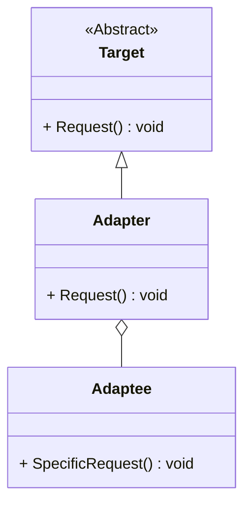

# 适配器模式（Adapter Pattern）详解

## 定义

适配器模式是一种结构型设计模式，通过将一个类的接口转换为客户期望的另一个接口，使得原本接口不兼容的类可以一起工作。适配器模式又称“包装器（Wrapper）”。

----------

## 适配器模式的结构

### 核心角色

1.  **目标接口（Target）**  
    定义客户需要的接口，是客户代码直接调用的接口。
    
2.  **适配者（Adaptee）**  
    现有的接口，无法直接满足客户需求。
    
3.  **适配器（Adapter）**  
    将适配者的接口转换为目标接口，使客户可以通过目标接口访问适配者。
    

----------

## 适配器模式的使用场景

1.  **旧系统的兼容性问题**：当需要使用一个已有系统，但它的接口与新系统不兼容时，可以通过适配器模式进行适配。
2.  **第三方库整合**：当使用第三方库的接口与当前项目需求不一致时，可以通过适配器封装以符合需求。
3.  **统一接口**：在多种类似功能的接口中，适配器可以对不同实现进行封装，提供统一的访问接口。

----------

## 适配器模式的优缺点

### 优点

1.  **提高兼容性**：使原本不兼容的类可以协同工作。
2.  **遵循开闭原则**：通过添加适配器实现扩展，无需修改原有代码。
3.  **灵活性高**：可以动态添加新的适配器以支持不同的接口。

### 缺点

1.  **过多适配器增加复杂性**：如果需要适配的类很多，适配器数量可能会迅速增长，导致系统复杂性提升。
2.  **可能影响性能**：适配器的额外封装会引入一定的性能开销。

----------

## 适配器模式的两种实现方式

1.  **类适配器**（使用继承）：适配器继承适配者类，并实现目标接口。
2.  **对象适配器**（使用组合）：适配器中包含适配者对象的引用，通过委托实现适配。

----------

## 类适配器与对象适配器的比较

| 特性               | 类适配器                     | 对象适配器                   |
|--------------------|------------------------------|------------------------------|
| **实现方式**       | 使用继承                     | 使用组合                     |
| **适配者数量**     | 只能适配一个类               | 可以适配多个适配者           |
| **灵活性**         | 较低，受限于单继承           | 较高，适配器与适配者松耦合   |
| **扩展性**         | 需要创建子类                 | 不需要修改适配器类即可扩展   |


## 使用案例

### 案例 1：图形绘制系统

现有一个老版本的绘图类 `LegacyRenderer`，需要将其适配到新的绘图接口 `NewRenderer`，以兼容新功能。

### 案例 2：支付系统整合

整合多个第三方支付接口（如 PayPal、Stripe）到统一的支付系统中。

### 案例 3：硬件设备驱动

将不同厂商的硬件设备接口统一适配为系统标准接口。

----------

## 适配器模式的类图



----------

## 适配器模式的实现

### C++ 实现

```cpp
#include <iostream>
using namespace std;

// 目标接口
class Target {
public:
    virtual void Request() const {
        cout << "Target: Default implementation of Request" << endl;
    }
    virtual ~Target() = default;
};

// 适配者
class Adaptee {
public:
    void SpecificRequest() const {
        cout << "Adaptee: SpecificRequest called" << endl;
    }
};

// 适配器
class Adapter : public Target {
private:
    Adaptee* adaptee;
public:
    Adapter(Adaptee* adaptee) : adaptee(adaptee) {}
    void Request() const override {
        adaptee->SpecificRequest();
    }
};

// 客户端代码
void ClientCode(const Target* target) {
    target->Request();
}

int main() {
    cout << "Client: I can work just fine with the Target objects:\n";
    Target* target = new Target;
    ClientCode(target);

    cout << "\nClient: The Adapter makes the Adaptee's interface compatible:\n";
    Adaptee* adaptee = new Adaptee;
    Target* adapter = new Adapter(adaptee);
    ClientCode(adapter);

    delete target;
    delete adaptee;
    delete adapter;

    return 0;
}
```

----------

### C# 实现

```csharp
using System;

// 目标接口
public interface ITarget {
    void Request();
}

// 适配者
public class Adaptee {
    public void SpecificRequest() {
        Console.WriteLine("Adaptee: SpecificRequest called");
    }
}

// 适配器
public class Adapter : ITarget {
    private readonly Adaptee _adaptee;

    public Adapter(Adaptee adaptee) {
        _adaptee = adaptee;
    }

    public void Request() {
        _adaptee.SpecificRequest();
    }
}

// 客户端代码
class Program {
    static void Main(string[] args) {
        Console.WriteLine("Client: I can work with Target interface:");
        ITarget target = new Adapter(new Adaptee());
        target.Request();
    }
}
```

----------

## 适配器模式的总结

-   **应用场景**：适配器模式适用于系统接口不兼容，但必须协同工作的场景。
-   **实现选择**：类适配器在需要直接继承的情况下使用，对象适配器适用于松耦合场景。
-   **灵活性**：适配器可以动态适配多个不同的接口，从而提供更灵活的解决方案。
-   **关键点**：实现中要注意目标接口与适配者接口之间的功能映射关系，以避免错误适配。
