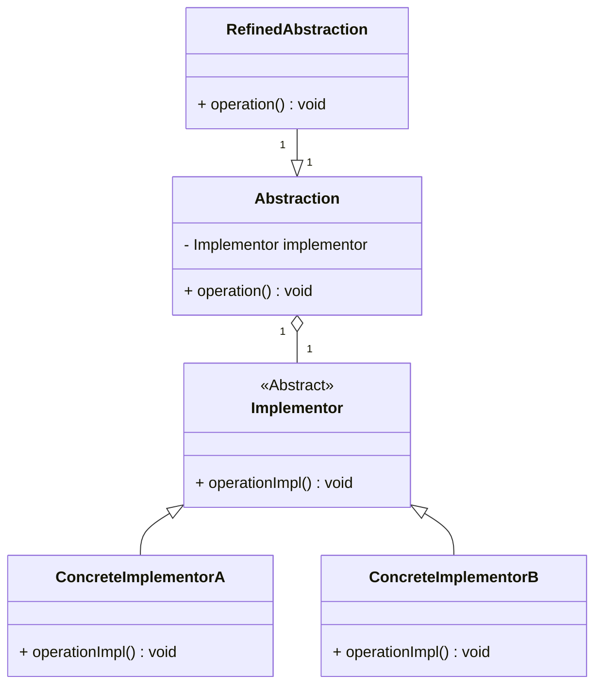

# 桥接模式（Bridge Pattern）详解

## 定义

桥接模式是一种结构型设计模式，旨在将抽象部分与实现部分分离，使它们可以独立地变化。通过这种方式，桥接模式减少了抽象和实现之间的依赖，提供了更高的灵活性和扩展性。

----------

## 桥接模式的结构

### 核心角色

1.  **抽象化（Abstraction）**  
    抽象类，定义了实现和接口之间的高层次关系，通常包含一个对实现接口的引用。
    
2.  **扩展抽象化（RefinedAbstraction）**  
    继承抽象化类的具体实现，通常会根据需要对抽象类进行拓展。
    
3.  **实现（Implementor）**  
    定义接口的实现部分，不关心具体的细节，它只提供了一些操作方法。
    
4.  **具体实现（ConcreteImplementor）**  
    具体的实现类，提供实现细节。
    

----------

## 桥接模式的使用场景

1.  **系统的抽象与实现有多个变化维度时**：比如，GUI框架需要独立于不同操作系统实现的特性进行设计。
2.  **希望抽象与实现之间可以独立变化**：桥接模式允许抽象层和实现层独立变化，避免了大规模的子类化。
3.  **避免类的爆炸式增长**：通过将实现与抽象分离，可以减少子类的数量。

----------

## 桥接模式的优缺点

### 优点

1.  **分离抽象与实现**：提高了系统的灵活性和可扩展性，避免了因为抽象和实现紧耦合导致的代码修改。
2.  **灵活的扩展性**：抽象层和实现层可以独立扩展和维护，避免了修改实现类时，频繁修改抽象类的代码。
3.  **减少子类数量**：通过组合而不是继承，可以有效减少由于多个维度变化带来的类爆炸。

### 缺点

1.  **复杂性增加**：桥接模式通过组合和接口的方式将抽象和实现分离，可能导致代码变得更加复杂。
2.  **理解门槛高**：桥接模式的设计理念和使用方式比其他设计模式稍复杂，理解和实现上有一定难度。

----------

## 桥接模式的类图



----------

## 使用案例

### 案例 1：图形绘制系统

假设我们有一个图形框架，它需要支持不同的操作系统（如Windows、Mac）和不同的图形类型（如圆形、方形）。我们可以使用桥接模式来分别处理图形类型的抽象和平台特定的实现。

-   **抽象层**：图形（Shape）
-   **实现层**：操作系统特定的绘制方式（WindowsDrawingAPI，MacDrawingAPI）

### 案例 2：跨平台UI框架

在一个UI框架中，UI组件的抽象（如按钮、文本框）需要在不同平台（如Android、iOS）上进行实现。桥接模式可以通过将UI组件的功能和具体平台的实现分离，提供良好的扩展性和平台适应性。

----------

## C++ 实现

```cpp
#include <iostream>
using namespace std;

// 实现接口
class DrawingAPI {
public:
    virtual void drawCircle(double x, double y, double radius) const = 0;
    virtual ~DrawingAPI() = default;
};

// 具体实现：Windows
class WindowsAPI : public DrawingAPI {
public:
    void drawCircle(double x, double y, double radius) const override {
        cout << "Drawing circle on Windows at (" << x << ", " << y << ") with radius " << radius << endl;
    }
};

// 具体实现：Mac
class MacAPI : public DrawingAPI {
public:
    void drawCircle(double x, double y, double radius) const override {
        cout << "Drawing circle on Mac at (" << x << ", " << y << ") with radius " << radius << endl;
    }
};

// 抽象类
class Shape {
protected:
    DrawingAPI* drawingAPI;  // 通过组合来关联具体实现

public:
    Shape(DrawingAPI* api) : drawingAPI(api) {}
    virtual void draw() const = 0;
    virtual void resize(double factor) = 0;
    virtual ~Shape() = default;
};

// 具体抽象类：圆形
class Circle : public Shape {
private:
    double x, y, radius;

public:
    Circle(double x, double y, double radius, DrawingAPI* api) : Shape(api), x(x), y(y), radius(radius) {}

    void draw() const override {
        drawingAPI->drawCircle(x, y, radius);
    }

    void resize(double factor) override {
        radius *= factor;
    }
};

// 客户端代码
int main() {
    WindowsAPI windowsAPI;
    MacAPI macAPI;

    Circle circle1(5, 5, 10, &windowsAPI);
    Circle circle2(10, 10, 20, &macAPI);

    circle1.draw();  // 通过WindowsAPI绘制
    circle2.draw();  // 通过MacAPI绘制

    return 0;
}
```

----------

## C# 实现

```csharp
using System;

// 实现接口
public interface IDrawingAPI {
    void DrawCircle(double x, double y, double radius);
}

// 具体实现：Windows
public class WindowsAPI : IDrawingAPI {
    public void DrawCircle(double x, double y, double radius) {
        Console.WriteLine($"Drawing circle on Windows at ({x}, {y}) with radius {radius}");
    }
}

// 具体实现：Mac
public class MacAPI : IDrawingAPI {
    public void DrawCircle(double x, double y, double radius) {
        Console.WriteLine($"Drawing circle on Mac at ({x}, {y}) with radius {radius}");
    }
}

// 抽象类
public abstract class Shape {
    protected IDrawingAPI drawingAPI;

    protected Shape(IDrawingAPI api) {
        drawingAPI = api;
    }

    public abstract void Draw();
    public abstract void Resize(double factor);
}

// 具体抽象类：圆形
public class Circle : Shape {
    private double x, y, radius;

    public Circle(double x, double y, double radius, IDrawingAPI api) : base(api) {
        this.x = x;
        this.y = y;
        this.radius = radius;
    }

    public override void Draw() {
        drawingAPI.DrawCircle(x, y, radius);
    }

    public override void Resize(double factor) {
        radius *= factor;
    }
}

// 客户端代码
class Program {
    static void Main() {
        IDrawingAPI windowsAPI = new WindowsAPI();
        IDrawingAPI macAPI = new MacAPI();

        Shape circle1 = new Circle(5, 5, 10, windowsAPI);
        Shape circle2 = new Circle(10, 10, 20, macAPI);

        circle1.Draw();  // 通过WindowsAPI绘制
        circle2.Draw();  // 通过MacAPI绘制
    }
}
```

----------

## 桥接模式的总结

1.  **桥接模式**用于将抽象和实现解耦，让它们可以独立变化。适用于系统的功能和实现各自有多个变化维度的情况。
2.  **提高扩展性和灵活性**：通过桥接模式，系统可以灵活地扩展功能或实现，不会相互影响，减少了继承带来的复杂性。
3.  **使用场景**：广泛应用于跨平台开发、硬件抽象、图形系统等场景。

通过这种方式，桥接模式实现了“将变化的部分与不变的部分分开”的设计理念，提高了系统的可维护性和可扩展性。