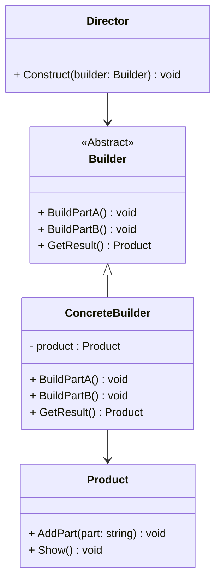

# 建造者模式详解

## 定义

建造者模式（Builder Pattern）是一种创建型设计模式，它通过将对象的构造与表示分离，使得同样的构建过程可以创建不同的对象。

----------

## 建造者模式的特点

### **优点**

1.  **解耦构造和表示**：构造复杂对象时可以灵活改变其内部结构或表示。
2.  **代码复用性强**：不同的具体建造者可以复用相同的构造过程。
3.  **易于扩展**：增加新的建造者无需修改已有代码，符合开闭原则。

### **缺点**

1.  **增加代码复杂度**：需要为每个产品定义具体的建造者。
2.  **对产品组成部分有依赖**：如果产品结构变化，所有建造者都需要修改。

----------

## 适用场景

1.  **复杂对象的构建**  
    需要多个步骤构建的对象，如嵌套、依赖其他对象的初始化等。
2.  **构建过程稳定，产品表示多样化**  
    不同的表示方式（如不同配置的车辆、不同风格的房屋）。
3.  **对象构造步骤依赖顺序**  
    例如必须先初始化再添加组件。

----------

## 建造者模式的结构

### 核心角色

1.  **抽象建造者（Builder）**：定义构建产品的步骤。
2.  **具体建造者（Concrete Builder）**：实现步骤以构建具体产品。
3.  **产品（Product）**：最终构建的复杂对象。
4.  **指挥者（Director）**：调用建造者的步骤来创建产品。

----------

## 使用案例

### 案例 1：汽车制造

不同配置的汽车（如电动车、SUV），但装配过程类似。

### 案例 2：软件配置生成器

根据用户输入生成复杂的配置文件。

### 案例 3：餐馆点餐

不同种类的套餐，包含固定步骤但菜品可以变化。

----------

## 建造者模式的实现

### C++ 实现

```cpp
#include <iostream>
#include <string>
#include <memory>

// 产品类
class Product {
public:
    void AddPart(const std::string& part) {
        parts += part + " ";
    }
    void Show() const {
        std::cout << "Product built with parts: " << parts << std::endl;
    }
private:
    std::string parts;
};

// 抽象建造者
class Builder {
public:
    virtual ~Builder() = default;
    virtual void BuildPartA() = 0;
    virtual void BuildPartB() = 0;
    virtual std::unique_ptr<Product> GetResult() = 0;
};

// 具体建造者
class ConcreteBuilder : public Builder {
public:
    ConcreteBuilder() { product = std::make_unique<Product>(); }
    void BuildPartA() override {
        product->AddPart("PartA");
    }
    void BuildPartB() override {
        product->AddPart("PartB");
    }
    std::unique_ptr<Product> GetResult() override {
        return std::move(product);
    }
private:
    std::unique_ptr<Product> product;
};

// 指挥者
class Director {
public:
    void Construct(std::shared_ptr<Builder> builder) {
        builder->BuildPartA();
        builder->BuildPartB();
    }
};

// 客户端代码
int main() {
    std::shared_ptr<Builder> builder = std::make_shared<ConcreteBuilder>();
    Director director;
    director.Construct(builder);
    std::unique_ptr<Product> product = builder->GetResult();
    product->Show();
    return 0;
}
```

----------

### C# 实现

```csharp
using System;

// 产品类
public class Product {
    private string parts = "";

    public void AddPart(string part) {
        parts += part + " ";
    }

    public void Show() {
        Console.WriteLine($"Product built with parts: {parts}");
    }
}

// 抽象建造者
public abstract class Builder {
    public abstract void BuildPartA();
    public abstract void BuildPartB();
    public abstract Product GetResult();
}

// 具体建造者
public class ConcreteBuilder : Builder {
    private Product product = new Product();

    public override void BuildPartA() {
        product.AddPart("PartA");
    }

    public override void BuildPartB() {
        product.AddPart("PartB");
    }

    public override Product GetResult() {
        return product;
    }
}

// 指挥者
public class Director {
    public void Construct(Builder builder) {
        builder.BuildPartA();
        builder.BuildPartB();
    }
}

// 客户端代码
class Program {
    static void Main(string[] args) {
        Builder builder = new ConcreteBuilder();
        Director director = new Director();
        director.Construct(builder);
        Product product = builder.GetResult();
        product.Show();
    }
}
```

----------

## 建造者模式的类图



----------

## 建造者模式的扩展

### **1. 多指挥者与多建造者结合**

多个指挥者（Director）可复用建造者以创建不同风格的产品。

### **2. 与工厂模式结合**

将建造者模式的产品创建交由工厂管理，建造者只专注于构造步骤。

### **3. 流式接口建造者**

通过流式接口（Fluent Interface）简化使用，如 `.BuildPartA().BuildPartB()`。

----------

## 总结

建造者模式非常适合构造复杂对象，并使构建过程具有可扩展性和灵活性。它通过分离构建步骤和产品表示，解决了对象创建的复杂性问题。在实际开发中，建造者模式可以结合工厂模式和原型模式实现更复杂的功能，尤其是在配置生成、产品装配等场景中应用广泛。