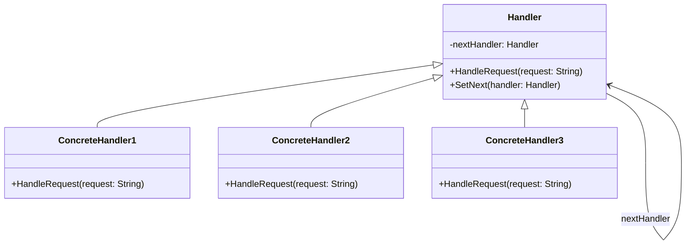

# 责任链模式（Chain of Responsibility Pattern）详解

## 1. 定义

责任链模式是一种行为型设计模式，它允许多个对象都有机会处理请求，而无需请求的发送者知道具体哪个对象会处理。将这些对象连成一条链，沿着这条链传递请求，直到有对象处理它为止。

**通俗解释：**  
想象一个公司中请假审批的过程，员工的请假单会沿着一个审批链，从主管到经理再到总监，直到某个人批准或拒绝为止。

----------

## 2. 使用场景

| 使用场景 | 描述 |
| --- | --- |
| 多个对象可以处理同一请求 | 请求的处理者是动态决定的，不固定在一个对象上。 |
| 需要避免请求发送者与处理者的耦合 | 请求发送者无需知道谁会处理请求，只需将请求交给责任链的起点。 |
| 多个处理者按顺序处理请求 | 请求会沿着责任链依次传递，直到被某个处理者处理或达到链的末尾。 |

## 3. 优点与缺点

| 优点 | 缺点 |
| --- | --- |
| **降低耦合度**：请求发送者与处理者分离。| **性能问题**：责任链过长会影响系统性能。|
| **灵活性高**：可以动态调整责任链的结构。|**调试困难**：请求沿链传递，可能难以跟踪和调试。|
| **增强扩展性**：新增处理者只需加入链中即可。| **可能无响应**：若无合适处理者，可能导致请求未被处理。|

markdown输出表格

## 4. 责任链模式的组成

1.  **Handler（处理者接口）**  
    定义一个处理请求的方法，并包含指向下一个处理者的引用。
    
2.  **ConcreteHandler（具体处理者）**  
    实现处理者接口，根据自身逻辑决定是否处理请求或将其传递给下一个处理者。
    
3.  **Client（客户端）**  
    创建责任链并向链的起点提交请求。
    

----------

## 5. 使用案例

### 示例描述：

一个在线客服系统，用户的请求会依次传递给客服助手、普通客服、高级客服，直到请求被处理。

----------

### C++ 示例

```cpp
#include <iostream>
#include <string>
using namespace std;

// 抽象处理者
class Handler {
protected:
    Handler* nextHandler = nullptr; // 下一个处理者
public:
    virtual ~Handler() {}
    void setNext(Handler* handler) {
        nextHandler = handler;
    }
    virtual void handleRequest(const string& request) {
        if (nextHandler) {
            nextHandler->handleRequest(request);
        } else {
            cout << "Request could not be handled: " << request << endl;
        }
    }
};

// 具体处理者1：客服助手
class AssistantHandler : public Handler {
public:
    void handleRequest(const string& request) override {
        if (request == "simple") {
            cout << "Assistant handled the request: " << request << endl;
        } else if (nextHandler) {
            nextHandler->handleRequest(request);
        }
    }
};

// 具体处理者2：普通客服
class CustomerHandler : public Handler {
public:
    void handleRequest(const string& request) override {
        if (request == "moderate") {
            cout << "Customer Service handled the request: " << request << endl;
        } else if (nextHandler) {
            nextHandler->handleRequest(request);
        }
    }
};

// 具体处理者3：高级客服
class SeniorHandler : public Handler {
public:
    void handleRequest(const string& request) override {
        if (request == "complex") {
            cout << "Senior Service handled the request: " << request << endl;
        } else if (nextHandler) {
            nextHandler->handleRequest(request);
        }
    }
};

// 客户端代码
int main() {
    Handler* assistant = new AssistantHandler();
    Handler* customer = new CustomerHandler();
    Handler* senior = new SeniorHandler();

    // 构建责任链
    assistant->setNext(customer);
    customer->setNext(senior);

    // 测试
    assistant->handleRequest("simple");
    assistant->handleRequest("moderate");
    assistant->handleRequest("complex");
    assistant->handleRequest("unknown");

    // 清理
    delete assistant;
    delete customer;
    delete senior;
    return 0;
}
```

----------

### C# 示例

```csharp
using System;

// 抽象处理者
abstract class Handler {
    protected Handler NextHandler;

    public void SetNext(Handler handler) {
        NextHandler = handler;
    }

    public virtual void HandleRequest(string request) {
        if (NextHandler != null) {
            NextHandler.HandleRequest(request);
        } else {
            Console.WriteLine($"Request could not be handled: {request}");
        }
    }
}

// 具体处理者1：客服助手
class AssistantHandler : Handler {
    public override void HandleRequest(string request) {
        if (request == "simple") {
            Console.WriteLine($"Assistant handled the request: {request}");
        } else if (NextHandler != null) {
            NextHandler.HandleRequest(request);
        }
    }
}

// 具体处理者2：普通客服
class CustomerHandler : Handler {
    public override void HandleRequest(string request) {
        if (request == "moderate") {
            Console.WriteLine($"Customer Service handled the request: {request}");
        } else if (NextHandler != null) {
            NextHandler.HandleRequest(request);
        }
    }
}

// 具体处理者3：高级客服
class SeniorHandler : Handler {
    public override void HandleRequest(string request) {
        if (request == "complex") {
            Console.WriteLine($"Senior Service handled the request: {request}");
        } else if (NextHandler != null) {
            NextHandler.HandleRequest(request);
        }
    }
}

// 客户端代码
class Program {
    static void Main() {
        Handler assistant = new AssistantHandler();
        Handler customer = new CustomerHandler();
        Handler senior = new SeniorHandler();

        // 构建责任链
        assistant.SetNext(customer);
        customer.SetNext(senior);

        // 测试
        assistant.HandleRequest("simple");
        assistant.HandleRequest("moderate");
        assistant.HandleRequest("complex");
        assistant.HandleRequest("unknown");
    }
}
```

----------

### 责任链模式的类图



----------

## 6. 责任链模式与其他模式对比


| 特性 | 责任链模式 | 状态模式 |
| --- | --- | --- |
| **核心作用** | 请求沿链传递，直到某个对象处理或结束。 | 对象在不同状态间切换，行为取决于当前状态。 |
| **封装性** | 封装请求处理逻辑与发送逻辑。 | 封装状态相关的行为。 |
| **使用场景** | 多个处理者可能对同一请求感兴趣。 | 对象行为会随状态而变化。 |
| **是否有请求终点** | 可能无终点，请求可能未被处理。 | 总有状态，行为不会丢失。 |


## 总结

-   **适用场景：** 当请求可能被多个对象处理，且不需要显式指定处理者时。
-   **优点：** 灵活性高，降低耦合，易于扩展。
-   **注意事项：** 责任链过长可能导致性能问题，需合理设计链的长度和顺序。