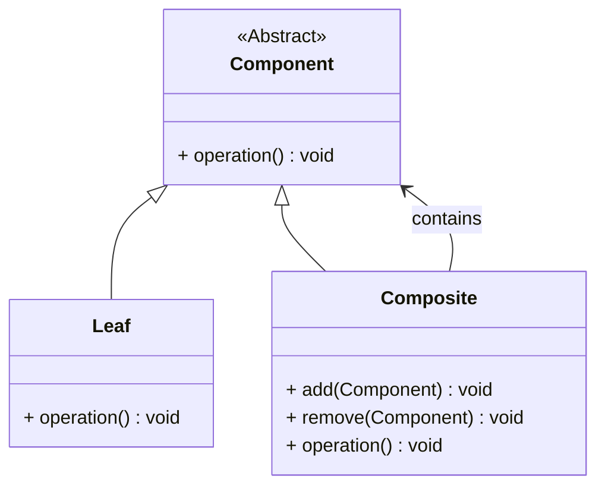

# 组合模式（Composite Pattern）详解

## 定义

组合模式是一种结构型设计模式，它将对象组织成树形结构以表示“部分-整体”的层次结构，使客户端对单个对象和对象组合的使用具有一致性。

----------

## 组合模式的结构

### 核心角色

1.  **抽象组件（Component）**  
    声明组合中对象的接口，定义了叶子节点和容器节点的共同行为。
    
2.  **叶子节点（Leaf）**  
    叶子对象表示树的叶节点，没有子节点，负责实现抽象组件的行为。
    
3.  **容器节点（Composite）**  
    容器对象包含子节点，负责实现管理子节点的操作（如添加、移除子节点），并实现抽象组件的行为。
    
4.  **客户端（Client）**  
    通过抽象组件与树形结构进行交互，不关心是单个对象还是组合结构。
    

----------

## 组合模式的适用场景

1.  **需要表示树形结构的对象**：如文件系统、组织架构、图形界面中的组件。
2.  **希望客户端可以一致地处理单个对象和组合对象**：无论是单一对象还是组合结构，都以统一的方式对待。
3.  **避免繁琐的类型检查**：通过抽象组件的统一接口，客户端不需要关注对象的具体类型。

----------

## 组合模式的优缺点

### 优点

1.  **一致性**：客户端可以一致地操作单个对象和组合对象，简化了代码。
2.  **灵活性**：通过组合不同的对象，可以轻松构建复杂的树形结构。
3.  **扩展性**：添加新的叶子节点或容器节点时无需修改现有代码。

### 缺点

1.  **复杂性增加**：需要引入更多的类和接口来表示树形结构，增加了系统的复杂性。
2.  **对子节点的管理不够严格**：由于客户端可能直接操作子节点，可能导致树形结构的混乱。

----------

## 组合模式的类图



----------

## 使用案例

### 案例 1：文件系统

-   **描述**：在一个文件系统中，文件和文件夹都可以作为抽象组件。文件夹可以包含文件或其他文件夹，文件是叶子节点。
-   **操作**：对文件和文件夹进行打开、删除等操作。

### 案例 2：图形系统

-   **描述**：在一个图形系统中，基本形状（如圆形、矩形）和复杂图形（由基本形状组合而成）都可以作为组件。
-   **操作**：绘制基本形状和复杂图形。

----------

## C++ 实现

```cpp
#include <iostream>
#include <vector>
#include <memory>
using namespace std;

// 抽象组件
class Component {
public:
    virtual void operation() const = 0;
    virtual ~Component() = default;
};

// 叶子节点
class Leaf : public Component {
private:
    string name;

public:
    explicit Leaf(const string& name) : name(name) {}
    void operation() const override {
        cout << "Leaf: " << name << endl;
    }
};

// 容器节点
class Composite : public Component {
private:
    vector<shared_ptr<Component>> children;

public:
    void add(const shared_ptr<Component>& component) {
        children.push_back(component);
    }

    void remove(const shared_ptr<Component>& component) {
        children.erase(remove(children.begin(), children.end(), component), children.end());
    }

    void operation() const override {
        cout << "Composite contains:" << endl;
        for (const auto& child : children) {
            child->operation();
        }
    }
};

// 客户端代码
int main() {
    auto leaf1 = make_shared<Leaf>("Leaf 1");
    auto leaf2 = make_shared<Leaf>("Leaf 2");

    auto composite = make_shared<Composite>();
    composite->add(leaf1);
    composite->add(leaf2);

    composite->operation();

    return 0;
}
```

----------

## C# 实现

```csharp
using System;
using System.Collections.Generic;

// 抽象组件
public abstract class Component {
    public abstract void Operation();
}

// 叶子节点
public class Leaf : Component {
    private string name;

    public Leaf(string name) {
        this.name = name;
    }

    public override void Operation() {
        Console.WriteLine($"Leaf: {name}");
    }
}

// 容器节点
public class Composite : Component {
    private readonly List<Component> children = new List<Component>();

    public void Add(Component component) {
        children.Add(component);
    }

    public void Remove(Component component) {
        children.Remove(component);
    }

    public override void Operation() {
        Console.WriteLine("Composite contains:");
        foreach (var child in children) {
            child.Operation();
        }
    }
}

// 客户端代码
class Program {
    static void Main() {
        var leaf1 = new Leaf("Leaf 1");
        var leaf2 = new Leaf("Leaf 2");

        var composite = new Composite();
        composite.Add(leaf1);
        composite.Add(leaf2);

        composite.Operation();
    }
}
```

----------

## 知识点对比表
| 特性               | 叶子节点（Leaf）           | 容器节点（Composite）         |
|--------------------|-----------------------------|-------------------------------|
| 是否包含子节点     | 否                          | 是                            |
| 操作方式           | 实现具体功能               | 管理子节点并实现功能         |
| 典型场景           | 文件、图形基本形状等       | 文件夹、组合图形等           |
| 设计复杂性         | 简单                        | 较复杂                        |


## 总结

1.  **组合模式的关键**：将单个对象和组合对象统一为树形结构，提供一致的操作方式。
2.  **使用时注意**：合理管理子节点，避免误操作导致结构混乱。
3.  **典型应用**：文件系统、GUI组件树、组织架构。

组合模式通过分层和组合，极大地提高了系统处理树形结构的能力，同时也对客户端代码的实现进行了很好的封装和抽象。