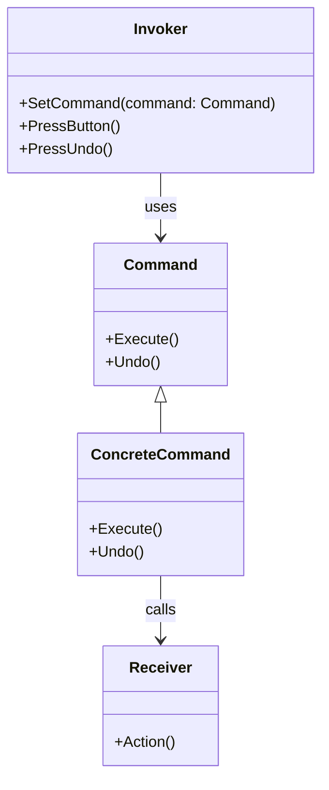

# 命令模式（Command Pattern）详解

## 1. 定义

命令模式是一种行为型设计模式，它将一个请求封装为一个对象，从而使得可以用不同的请求对客户进行参数化、对请求排队或记录日志，以及支持可撤销的操作。

**通俗解释：**  
将操作（请求）抽象成独立的对象，从而分离请求的发送者和接收者，允许轻松添加、修改和管理请求。

----------

## 2. 组成部分

| **组件**              | **描述**                                    |
|-----------------------|--------------------------------------------|
| **Command（命令接口）** | 定义命令执行的接口或抽象类，封装命令的行为。   |
| **ConcreteCommand**   | 具体命令类，绑定一个接收者并实现具体的操作。   |
| **Receiver（接收者）** | 执行命令的实际逻辑对象。                     |
| **Invoker（调用者）**   | 调用命令对象的接口，发送请求。               |
| **Client（客户端）**    | 创建具体命令对象并将其关联到调用者和接收者。   |

## 3. 使用场景

| **使用场景**              | **描述**                                       |
|---------------------------|-----------------------------------------------|
| **需要参数化方法调用**     | 命令模式将行为抽象为对象，方便动态指定行为。      |
| **需要支持撤销或恢复操作** | 通过存储命令对象的状态，实现撤销和恢复功能。      |
| **需要记录操作日志**       | 将命令的执行过程记录，方便后续分析或回滚。        |
| **需要解耦发送者与接收者** | 客户端只需操作命令对象，无需关心具体的操作逻辑。   |


## 4. 优点与缺点

| **优点**                     | **缺点**                              |
|------------------------------|---------------------------------------|
| **解耦性高**：将请求发送者与接收者分离。 | **增加系统复杂度**：每个操作都需要创建命令类。 |
| **扩展性强**：可以方便地新增命令。     | **命令对象可能过多**：复杂系统中命令类数量可能增加。 |
| **支持撤销和恢复**：便于实现操作历史管理。 | **性能开销**：需要额外的内存存储命令对象。     |

## 5. 使用案例

### 示例描述：

一个智能家居系统，包括电灯和电视，可以通过遥控器控制它们的开关，并支持撤销功能。

----------

### C++ 示例

```cpp
#include <iostream>
#include <stack>
using namespace std;

// 接收者：灯
class Light {
public:
    void on() {
        cout << "Light is ON" << endl;
    }
    void off() {
        cout << "Light is OFF" << endl;
    }
};

// 命令接口
class Command {
public:
    virtual void execute() = 0;
    virtual void undo() = 0;
    virtual ~Command() {}
};

// 具体命令：打开灯
class LightOnCommand : public Command {
private:
    Light* light;
public:
    LightOnCommand(Light* l) : light(l) {}
    void execute() override {
        light->on();
    }
    void undo() override {
        light->off();
    }
};

// 具体命令：关闭灯
class LightOffCommand : public Command {
private:
    Light* light;
public:
    LightOffCommand(Light* l) : light(l) {}
    void execute() override {
        light->off();
    }
    void undo() override {
        light->on();
    }
};

// 调用者：遥控器
class RemoteControl {
private:
    Command* command;
    stack<Command*> history;
public:
    void setCommand(Command* cmd) {
        command = cmd;
    }
    void pressButton() {
        if (command) {
            command->execute();
            history.push(command);
        }
    }
    void pressUndo() {
        if (!history.empty()) {
            Command* cmd = history.top();
            cmd->undo();
            history.pop();
        }
    }
};

// 客户端代码
int main() {
    Light light;
    LightOnCommand lightOn(&light);
    LightOffCommand lightOff(&light);

    RemoteControl remote;
    remote.setCommand(&lightOn);
    remote.pressButton(); // 打开灯
    remote.pressUndo();   // 撤销打开灯

    remote.setCommand(&lightOff);
    remote.pressButton(); // 关闭灯
    remote.pressUndo();   // 撤销关闭灯

    return 0;
}
```

----------

### C# 示例

```csharp
using System;
using System.Collections.Generic;

// 接收者：灯
class Light {
    public void On() {
        Console.WriteLine("Light is ON");
    }
    public void Off() {
        Console.WriteLine("Light is OFF");
    }
}

// 命令接口
interface ICommand {
    void Execute();
    void Undo();
}

// 具体命令：打开灯
class LightOnCommand : ICommand {
    private Light light;
    public LightOnCommand(Light light) {
        this.light = light;
    }
    public void Execute() {
        light.On();
    }
    public void Undo() {
        light.Off();
    }
}

// 具体命令：关闭灯
class LightOffCommand : ICommand {
    private Light light;
    public LightOffCommand(Light light) {
        this.light = light;
    }
    public void Execute() {
        light.Off();
    }
    public void Undo() {
        light.On();
    }
}

// 调用者：遥控器
class RemoteControl {
    private ICommand command;
    private Stack<ICommand> history = new Stack<ICommand>();

    public void SetCommand(ICommand command) {
        this.command = command;
    }

    public void PressButton() {
        command?.Execute();
        history.Push(command);
    }

    public void PressUndo() {
        if (history.Count > 0) {
            ICommand cmd = history.Pop();
            cmd.Undo();
        }
    }
}

// 客户端代码
class Program {
    static void Main(string[] args) {
        Light light = new Light();
        ICommand lightOn = new LightOnCommand(light);
        ICommand lightOff = new LightOffCommand(light);

        RemoteControl remote = new RemoteControl();
        remote.SetCommand(lightOn);
        remote.PressButton(); // 打开灯
        remote.PressUndo();   // 撤销打开灯

        remote.SetCommand(lightOff);
        remote.PressButton(); // 关闭灯
        remote.PressUndo();   // 撤销关闭灯
    }
}
```

----------

### 命令模式的类图



----------

## 6. 命令模式与其他模式对比


| **特性**           | **命令模式**                                | **策略模式**                             |
|--------------------|---------------------------------------------|------------------------------------------|
| **核心作用**       | 将请求封装为独立对象，支持撤销和记录功能。     | 定义一系列算法，将其封装并相互替换。        |
| **解耦性**         | 解耦发送者和接收者。                        | 解耦算法的使用和实现。                     |
| **适用场景**       | 需要对操作进行封装或扩展。                  | 需要动态选择算法或行为。                   |


## 总结

-   **适用场景：** 当需要参数化请求、支持撤销操作、记录操作日志时，适合使用命令模式。
-   **优点：** 解耦发送者和接收者，支持撤销与恢复操作，扩展性强。
-   **注意事项：** 不要因滥用模式而增加系统复杂度，仅在需要时使用。