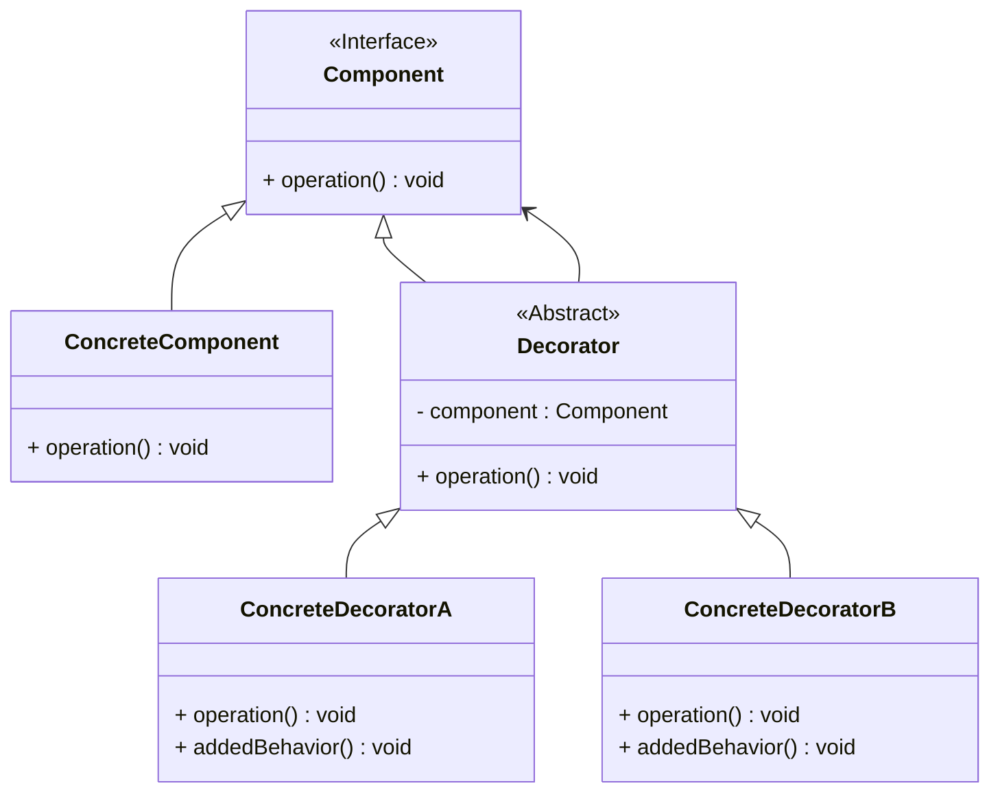

# 装饰模式（Decorator Pattern）详解

## 定义

装饰模式是一种结构型设计模式，允许动态地向对象添加新功能，而不会影响其他对象。装饰模式通过使用一系列装饰类，将额外的行为或责任以层叠的方式附加到对象上。

----------

## 核心概念

### 角色组成

1.  **抽象组件（Component）**  
    定义对象可以动态添加行为的接口。
    
2.  **具体组件（Concrete Component）**  
    实现抽象组件接口的基本对象，可被装饰类增强功能。
    
3.  **抽象装饰（Decorator）**  
    持有一个抽象组件的引用，并定义一个与抽象组件一致的接口。
    
4.  **具体装饰（Concrete Decorator）**  
    扩展抽象装饰类，负责向组件添加额外功能。
    

----------

## 装饰模式的类图



----------

## 使用场景

1.  **功能扩展**：需要在运行时动态地添加、修改或移除对象的行为。
2.  **避免继承膨胀**：如果通过继承为对象添加功能会导致大量子类，装饰模式是更优的选择。
3.  **遵守开放-封闭原则**：装饰类可以独立扩展，而不需要修改已有的类。

----------

## 装饰模式的优缺点

### 优点

1.  **动态扩展功能**：无需修改原始类，通过组合灵活添加功能。
2.  **遵守单一职责原则**：每个装饰类负责特定功能，职责清晰。
3.  **避免类爆炸**：减少子类数量，简化系统。

### 缺点

1.  **对象数量增加**：多层装饰可能导致对象管理复杂化。
2.  **调试困难**：由于装饰层叠的特性，可能难以跟踪功能的来源。

----------

## 使用案例

### 案例 1：图形系统

-   **描述**：在绘图应用中，可以为基本形状动态添加边框、阴影、颜色等功能。
-   **实现**：基本形状为组件，装饰器实现不同的图形效果。

### 案例 2：输入流

-   **描述**：在 Java 或 C# 中，输入流（如 `FileStream`）可以通过装饰器动态添加功能（如缓冲、加密）。
-   **实现**：基础流是组件，加密流、缓冲流是装饰器。

----------

## C++ 实现

```cpp
#include <iostream>
#include <memory>
using namespace std;

// 抽象组件
class Component {
public:
    virtual void operation() const = 0;
    virtual ~Component() = default;
};

// 具体组件
class ConcreteComponent : public Component {
public:
    void operation() const override {
        cout << "ConcreteComponent operation" << endl;
    }
};

// 抽象装饰
class Decorator : public Component {
protected:
    shared_ptr<Component> component;

public:
    explicit Decorator(shared_ptr<Component> comp) : component(move(comp)) {}
    void operation() const override {
        component->operation();
    }
};

// 具体装饰A
class ConcreteDecoratorA : public Decorator {
public:
    explicit ConcreteDecoratorA(shared_ptr<Component> comp) : Decorator(move(comp)) {}
    void operation() const override {
        Decorator::operation();
        addedBehavior();
    }

    void addedBehavior() const {
        cout << "ConcreteDecoratorA added behavior" << endl;
    }
};

// 具体装饰B
class ConcreteDecoratorB : public Decorator {
public:
    explicit ConcreteDecoratorB(shared_ptr<Component> comp) : Decorator(move(comp)) {}
    void operation() const override {
        Decorator::operation();
        addedBehavior();
    }

    void addedBehavior() const {
        cout << "ConcreteDecoratorB added behavior" << endl;
    }
};

// 客户端代码
int main() {
    shared_ptr<Component> component = make_shared<ConcreteComponent>();
    shared_ptr<Component> decoratorA = make_shared<ConcreteDecoratorA>(component);
    shared_ptr<Component> decoratorB = make_shared<ConcreteDecoratorB>(decoratorA);

    decoratorB->operation();

    return 0;
}
```

----------

## C# 实现

```csharp
using System;

// 抽象组件
public abstract class Component {
    public abstract void Operation();
}

// 具体组件
public class ConcreteComponent : Component {
    public override void Operation() {
        Console.WriteLine("ConcreteComponent operation");
    }
}

// 抽象装饰
public abstract class Decorator : Component {
    protected Component component;

    public Decorator(Component component) {
        this.component = component;
    }

    public override void Operation() {
        component.Operation();
    }
}

// 具体装饰A
public class ConcreteDecoratorA : Decorator {
    public ConcreteDecoratorA(Component component) : base(component) { }

    public override void Operation() {
        base.Operation();
        AddedBehavior();
    }

    private void AddedBehavior() {
        Console.WriteLine("ConcreteDecoratorA added behavior");
    }
}

// 具体装饰B
public class ConcreteDecoratorB : Decorator {
    public ConcreteDecoratorB(Component component) : base(component) { }

    public override void Operation() {
        base.Operation();
        AddedBehavior();
    }

    private void AddedBehavior() {
        Console.WriteLine("ConcreteDecoratorB added behavior");
    }
}

// 客户端代码
class Program {
    static void Main() {
        Component component = new ConcreteComponent();
        Component decoratorA = new ConcreteDecoratorA(component);
        Component decoratorB = new ConcreteDecoratorB(decoratorA);

        decoratorB.Operation();
    }
}
```

----------

## 知识点对比表

| 特性         | 装饰模式                           | 继承                                 | 扩展方式       |
|------------|-----------------------------------|--------------------------------------|--------------|
| 动态添加功能   | √（动态）                           | ×（静态，编译时）                         | 动态添加功能   |
| 开放-封闭原则   | 遵守                                | 可能违反（增加新功能需要修改子类）                 | 遵守         |
| 对象数量      | 多层装饰增加对象数量                   | 子类数量可能过多                           | 对象数量     |
| 使用场景      | 功能动态变化时更适合                   | 功能固定时更适合                           | 使用场景     |


## 总结

1.  **动态扩展功能**：装饰模式适合在运行时灵活地扩展对象行为。
2.  **避免类爆炸**：通过装饰类组合，取代大量子类的设计。
3.  **推荐场景**：需要动态变化的系统功能，且遵守开放-封闭原则的设计要求。