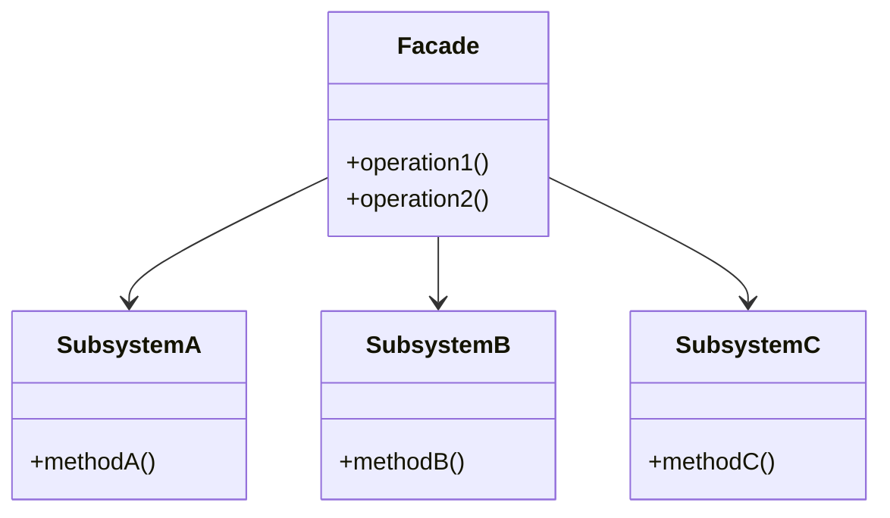

# 外观模式（Facade Pattern）详解

## 定义

外观模式是一种结构型设计模式，为子系统中的一组接口提供一个一致的接口。外观模式定义了一个高层接口，使得子系统更易于使用。

----------

## 核心概念

### 角色组成

1.  **外观（Facade）**  
    为复杂子系统提供简单的接口，负责协调子系统的调用。
2.  **子系统（Subsystems）**  
    一组实现功能的复杂模块，对外部隐藏其内部细节。

### 特性

-   **降低复杂性**：屏蔽子系统的实现细节，提供简单接口。
-   **松耦合**：客户端与子系统之间通过外观解耦。

----------

## 外观模式的类图



----------

## 使用场景

1.  **简化接口**：隐藏复杂系统的内部细节，为外部提供一个简单的调用接口。
2.  **分层设计**：降低客户端与复杂子系统之间的耦合。
3.  **遗留代码集成**：在使用遗留代码时，通过外观模式统一管理，避免直接依赖。

----------

## 优缺点分析

### 优点

1.  **简化接口**：隐藏复杂实现细节。
2.  **松耦合**：子系统的变化不影响客户端代码。
3.  **更易维护**：减少直接依赖，增强系统的可维护性。

### 缺点

1.  **不完全封装**：若客户端仍直接调用子系统，外观的效果会减弱。
2.  **职责单一性可能被破坏**：外观可能成为“大接口”，过于复杂。

----------

## 使用案例

### 案例 1：智能家居控制

-   **描述**：智能家居系统包含灯光、空调和安防模块。外观模式可提供一个统一的接口，如“回家模式”，一键控制所有子系统。
-   **实现**：灯光、空调、安防模块作为子系统，外观封装具体调用逻辑。

### 案例 2：数据库访问

-   **描述**：在复杂的数据库操作中，外观模式可统一处理查询、事务管理和日志记录。
-   **实现**：将底层数据库驱动操作封装为统一接口，客户端仅需调用外观。

----------

## 知识点对比表

| 特性       | 外观模式 | 直接调用子系统 |
|------------|----------|--------------|
| 接口复杂度 | 简单统一  | 复杂，需了解多个接口 |
| 耦合性     | 松耦合    | 紧耦合        |
| 适应性     | 易于扩展和修改 | 扩展时影响客户端 |
| 使用场景   | 封装复杂子系统 | 客户端需灵活控制子系统 |

## C++ 实现

```cpp
#include <iostream>
using namespace std;

// 子系统A
class SubsystemA {
public:
    void methodA() const {
        cout << "SubsystemA: methodA executed." << endl;
    }
};

// 子系统B
class SubsystemB {
public:
    void methodB() const {
        cout << "SubsystemB: methodB executed." << endl;
    }
};

// 子系统C
class SubsystemC {
public:
    void methodC() const {
        cout << "SubsystemC: methodC executed." << endl;
    }
};

// 外观类
class Facade {
private:
    SubsystemA subsystemA;
    SubsystemB subsystemB;
    SubsystemC subsystemC;

public:
    void operation1() {
        cout << "Facade: operation1 executing." << endl;
        subsystemA.methodA();
        subsystemB.methodB();
    }

    void operation2() {
        cout << "Facade: operation2 executing." << endl;
        subsystemC.methodC();
    }
};

// 客户端代码
int main() {
    Facade facade;
    facade.operation1();
    facade.operation2();
    return 0;
}
```

----------

## C# 实现

```csharp
using System;

// 子系统A
public class SubsystemA {
    public void MethodA() {
        Console.WriteLine("SubsystemA: MethodA executed.");
    }
}

// 子系统B
public class SubsystemB {
    public void MethodB() {
        Console.WriteLine("SubsystemB: MethodB executed.");
    }
}

// 子系统C
public class SubsystemC {
    public void MethodC() {
        Console.WriteLine("SubsystemC: MethodC executed.");
    }
}

// 外观类
public class Facade {
    private SubsystemA subsystemA = new SubsystemA();
    private SubsystemB subsystemB = new SubsystemB();
    private SubsystemC subsystemC = new SubsystemC();

    public void Operation1() {
        Console.WriteLine("Facade: Operation1 executing.");
        subsystemA.MethodA();
        subsystemB.MethodB();
    }

    public void Operation2() {
        Console.WriteLine("Facade: Operation2 executing.");
        subsystemC.MethodC();
    }
}

// 客户端代码
class Program {
    static void Main(string[] args) {
        Facade facade = new Facade();
        facade.Operation1();
        facade.Operation2();
    }
}
```

----------

## 总结

1.  **高层接口**：外观模式简化了复杂子系统的使用。
2.  **降低耦合**：实现了客户端与子系统的解耦。
3.  **推荐场景**：适用于隐藏复杂实现逻辑，统一接口调用的场景。