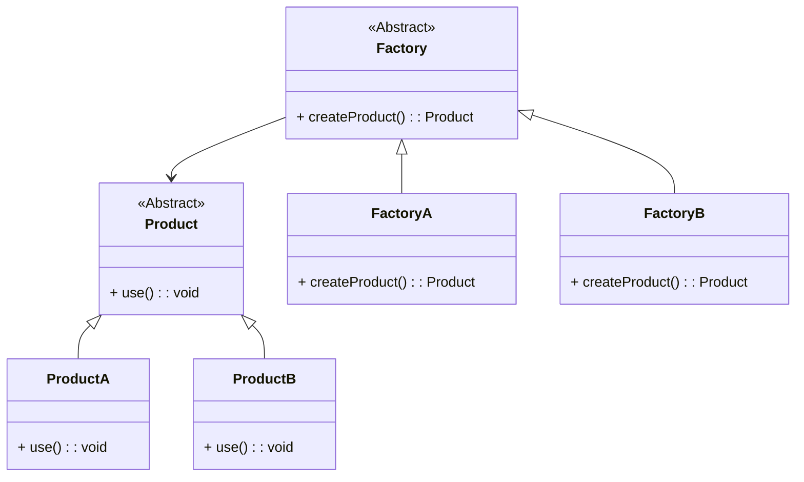

# 工厂方法模式详解

## **定义**
工厂方法模式（Factory Method Pattern）是一种创建型设计模式，定义一个创建对象的接口，但让子类决定要实例化的具体类。通过这种方式，工厂方法模式将对象的实例化推迟到子类。

## **特点**
1. **解耦性**：客户端通过工厂方法创建对象，而无需关心具体的类名。
2. **扩展性**：可以通过新增具体工厂类来扩展新产品类型，符合开闭原则。
3. **灵活性**：支持产品族的扩展。

---

# 使用场景
1. **当具体类的创建复杂时**：需要将创建逻辑封装到子类中。
2. **客户代码需要依赖抽象类或接口**：而不是具体实现。
3. **产品种类经常变化**：需要动态扩展新的产品类。

---

# 工厂方法模式的结构

工厂方法模式由以下几个部分组成：
1. **抽象产品（Product）**：定义产品的接口。
2. **具体产品（ConcreteProduct）**：实现产品接口。
3. **抽象工厂（Creator）**：定义工厂方法。
4. **具体工厂（ConcreteCreator）**：实现工厂方法，负责创建具体产品。

---

# 实现代码

## C++ 实现
```cpp
#include <iostream>
#include <memory>

// 抽象产品
class Product {
public:
    virtual void use() = 0;
    virtual ~Product() {}
};

// 具体产品 A
class ProductA : public Product {
public:
    void use() override {
        std::cout << "Using Product A" << std::endl;
    }
};

// 具体产品 B
class ProductB : public Product {
public:
    void use() override {
        std::cout << "Using Product B" << std::endl;
    }
};

// 抽象工厂
class Factory {
public:
    virtual std::unique_ptr<Product> createProduct() = 0;
    virtual ~Factory() {}
};

// 具体工厂 A
class FactoryA : public Factory {
public:
    std::unique_ptr<Product> createProduct() override {
        return std::make_unique<ProductA>();
    }
};

// 具体工厂 B
class FactoryB : public Factory {
public:
    std::unique_ptr<Product> createProduct() override {
        return std::make_unique<ProductB>();
    }
};

// 客户端代码
int main() {
    std::unique_ptr<Factory> factory = std::make_unique<FactoryA>();
    auto product = factory->createProduct();
    product->use();

    factory = std::make_unique<FactoryB>();
    product = factory->createProduct();
    product->use();

    return 0;
}
```

---

## C# 实现
```csharp
using System;

// 抽象产品
public abstract class Product {
    public abstract void Use();
}

// 具体产品 A
public class ProductA : Product {
    public override void Use() {
        Console.WriteLine("Using Product A");
    }
}

// 具体产品 B
public class ProductB : Product {
    public override void Use() {
        Console.WriteLine("Using Product B");
    }
}

// 抽象工厂
public abstract class Factory {
    public abstract Product CreateProduct();
}

// 具体工厂 A
public class FactoryA : Factory {
    public override Product CreateProduct() {
        return new ProductA();
    }
}

// 具体工厂 B
public class FactoryB : Factory {
    public override Product CreateProduct() {
        return new ProductB();
    }
}

// 客户端代码
class Program {
    static void Main(string[] args) {
        Factory factory = new FactoryA();
        Product product = factory.CreateProduct();
        product.Use();

        factory = new FactoryB();
        product = factory.CreateProduct();
        product.Use();
    }
}
```

---

# 类图



---

# 优缺点

## **优点**
1. **遵循开闭原则**：新增产品无需修改已有代码，只需新增具体工厂类。
2. **高内聚、低耦合**：通过工厂方法隔离了具体产品与客户端的依赖。
3. **灵活性**：可以动态决定实例化的具体类。

## **缺点**
1. **增加复杂性**：每新增一个产品类，都需要新增一个对应的工厂类。
2. **过度设计**：当产品种类固定时，工厂方法模式可能显得繁琐。

---

# 工厂方法模式的变体与扩展
1. **参数化工厂**：通过传递参数决定创建哪种产品，减少具体工厂类的数量。
   - **示例**：
     ```csharp
     public class ParameterizedFactory : Factory {
         public override Product CreateProduct(string type) {
             return type switch {
                 "A" => new ProductA(),
                 "B" => new ProductB(),
                 _ => throw new ArgumentException("Invalid type")
             };
         }
     }
     ```

2. **结合简单工厂**：将简单工厂作为抽象工厂的默认实现，用于处理常见或不复杂的实例化逻辑。

3. **与依赖注入结合**：通过 DI 容器动态注入具体工厂，简化复杂产品族的管理。

---

# 总结

1. 工厂方法模式提供了更高的扩展性和灵活性，适合复杂或动态变化的产品族。
2. 它的实现复杂度较高，不适合产品种类固定或单一的场景。
3. 在实际项目中，工厂方法模式常与依赖注入、简单工厂、抽象工厂模式结合使用，以实现更加灵活的设计架构。