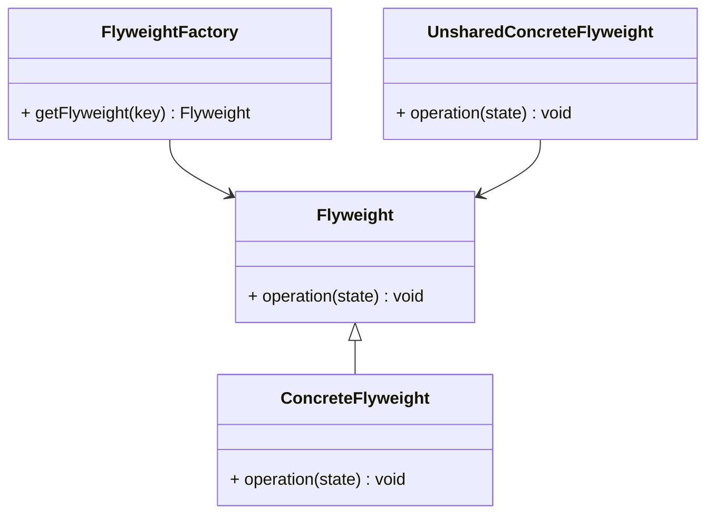

# 享元模式（Flyweight Pattern）详解

## 定义

享元模式是一种结构型设计模式，旨在通过共享对象来尽量减少内存的使用。享元模式通过将重复使用的对象分离成共享和非共享部分，达到复用的目的，从而有效节省内存。

----------

## 核心概念

### 角色组成

1.  **享元（Flyweight）**  
    定义共享对象的接口，并可以提供内部状态（共享部分）和外部状态（非共享部分）的管理方法。
    
2.  **具体享元（Concrete Flyweight）**  
    实现享元接口，并实现共享部分的存储与管理。
    
3.  **享元工厂（FlyweightFactory）**  
    管理享元对象的创建与复用。确保享元对象被正确地共享和管理。
    
4.  **非共享享元（Unshared Concrete Flyweight）**  
    不共享的部分，用来存储具体的、每个对象独立的状态。
    

----------

## 享元模式的类图



----------

## 使用场景

1.  **大量对象的重复创建**：当系统中存在大量相似对象，并且这些对象占用大量内存时，适合使用享元模式。
2.  **对象之间的共享性较强**：当对象的某些部分是可以共享的（比如图形的颜色、字符的字体），而某些部分是特有的（如对象的位置、大小等），使用享元模式可以显著降低内存消耗。
3.  **提高性能和内存使用效率**：通过共享相同状态，减少内存占用，提高程序性能。

----------

## 优缺点分析

### 优点

1.  **节省内存**：通过共享相同的对象，避免了内存的浪费。
2.  **提高性能**：避免了重复创建相同的对象，提高了性能。
3.  **易于扩展**：新的享元对象可以根据需要加入，而不影响现有的系统。

### 缺点

1.  **复杂性增加**：享元模式通过共享和非共享的状态分离，使得系统结构变得更加复杂。
2.  **不能共享所有状态**：不是所有的对象都能通过享元模式来共享，对于某些状态的对象可能无法进行共享。

----------

## 使用案例

### 案例 1：文本编辑器

-   **描述**：在文本编辑器中，每个字符都可以有不同的字体、大小和颜色，但大部分字符会使用相同的字体和颜色。通过享元模式，可以将这些重复的字符样式对象进行共享，以节省内存。
-   **实现**：字体、颜色等属性作为共享部分，字符内容作为非共享部分。

### 案例 2：图形系统

-   **描述**：在绘图应用中，多个相同类型的图形（如矩形、圆形）可能具有相同的属性（如颜色、填充等）。通过享元模式，可以将这些相同的属性提取为共享对象，只为每个图形的唯一位置和尺寸分配独立对象。
-   **实现**：图形的形状作为共享部分，位置和尺寸作为非共享部分。

----------

## 知识点对比表

| 特性       | 享元模式                                     | 不使用享元模式                             |
|------------|----------------------------------------------|------------------------------------------|
| 对象创建方式 | 共享和复用相同的对象                           | 每次创建新的对象                           |
| 内存使用   | 节省内存，避免重复对象                         | 内存使用较多，可能浪费空间                 |
| 复杂度     | 需要享元工厂和状态管理                         | 结构简单                                 |
| 使用场景   | 对象共享性强，内存紧张时                         | 对象间差异较大时，适合直接创建             |

## C++ 实现

```cpp
#include <iostream>
#include <unordered_map>
#include <memory>
using namespace std;

// 享元接口
class Flyweight {
public:
    virtual void operation(const string& extrinsicState) const = 0;
    virtual ~Flyweight() = default;
};

// 具体享元
class ConcreteFlyweight : public Flyweight {
private:
    string intrinsicState; // 共享状态

public:
    explicit ConcreteFlyweight(string state) : intrinsicState(move(state)) {}

    void operation(const string& extrinsicState) const override {
        cout << "Intrinsic state: " << intrinsicState << ", Extrinsic state: " << extrinsicState << endl;
    }
};

// 享元工厂
class FlyweightFactory {
private:
    unordered_map<string, shared_ptr<Flyweight>> flyweights;

public:
    shared_ptr<Flyweight> getFlyweight(const string& key) {
        if (flyweights.find(key) == flyweights.end()) {
            flyweights[key] = make_shared<ConcreteFlyweight>(key);
        }
        return flyweights[key];
    }
};

// 客户端代码
int main() {
    FlyweightFactory factory;
    shared_ptr<Flyweight> f1 = factory.getFlyweight("SharedState1");
    shared_ptr<Flyweight> f2 = factory.getFlyweight("SharedState1");
    shared_ptr<Flyweight> f3 = factory.getFlyweight("SharedState2");

    f1->operation("UniqueState1");
    f2->operation("UniqueState2");
    f3->operation("UniqueState3");

    return 0;
}
```

----------

## C# 实现

```csharp
using System;
using System.Collections.Generic;

// 享元接口
public abstract class Flyweight {
    public abstract void Operation(string extrinsicState);
}

// 具体享元
public class ConcreteFlyweight : Flyweight {
    private string intrinsicState; // 共享状态

    public ConcreteFlyweight(string state) {
        intrinsicState = state;
    }

    public override void Operation(string extrinsicState) {
        Console.WriteLine($"Intrinsic state: {intrinsicState}, Extrinsic state: {extrinsicState}");
    }
}

// 享元工厂
public class FlyweightFactory {
    private Dictionary<string, Flyweight> flyweights = new Dictionary<string, Flyweight>();

    public Flyweight GetFlyweight(string key) {
        if (!flyweights.ContainsKey(key)) {
            flyweights[key] = new ConcreteFlyweight(key);
        }
        return flyweights[key];
    }
}

// 客户端代码
class Program {
    static void Main() {
        FlyweightFactory factory = new FlyweightFactory();
        Flyweight f1 = factory.GetFlyweight("SharedState1");
        Flyweight f2 = factory.GetFlyweight("SharedState1");
        Flyweight f3 = factory.GetFlyweight("SharedState2");

        f1.Operation("UniqueState1");
        f2.Operation("UniqueState2");
        f3.Operation("UniqueState3");
    }
}
```

----------

## 总结

1.  **内存优化**：享元模式通过共享对象，显著减少内存占用。
2.  **高效的对象管理**：通过享元工厂管理共享对象的生命周期，避免不必要的对象创建。
3.  **适用场景**：大量相似对象的场景，尤其是在需要节省内存时。