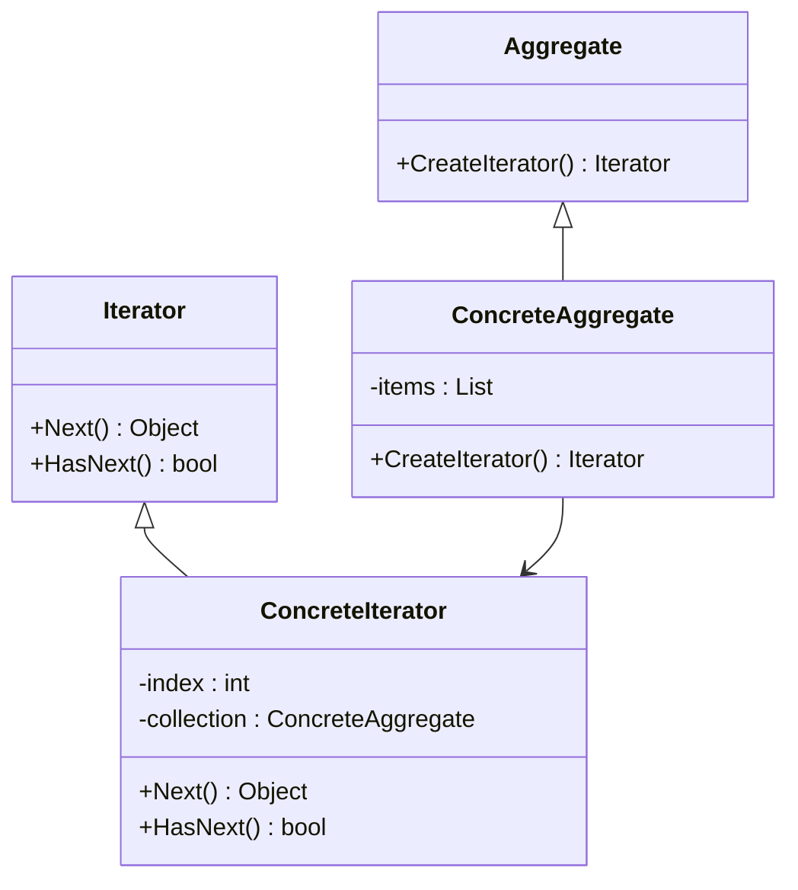

# 迭代器模式（Iterator Pattern）详解

## 1. 定义

迭代器模式是一种行为型设计模式，用于提供一种顺序访问集合对象元素的方法，而不暴露集合的内部表示。通过迭代器模式，用户可以独立于集合的实现来遍历集合。

**通俗解释：**  
迭代器就像一份菜单上的翻页工具，它不关心菜单的内容是如何存储的，只负责让顾客按顺序查看菜单上的菜品。

----------

## 2. 使用场景

| 使用场景         | 描述                                                         |
|--------------|------------------------------------------------------------|
| **需要顺序访问集合中的元素** | 集合的内部结构可能复杂，但需要对其元素进行简单遍历。                   |
| **屏蔽集合内部实现细节**   | 用户不关心集合是数组、链表还是其他数据结构，只关注遍历功能。           |
| **统一不同集合的遍历方式** | 对不同集合提供统一的遍历接口，提升代码的通用性和灵活性。                 |


## 3. 迭代器模式的优缺点

| 特性         | 优点                                                         | 缺点                                                         |
|------------|------------------------------------------------------------|------------------------------------------------------------|
| **封装性**       | 用户无需了解集合的内部结构。                                   | 为每种集合类型实现迭代器类可能会增加代码量。                       |
| **灵活性**       | 可以轻松替换集合实现，不影响遍历逻辑。                           | 对于特别大的集合，迭代器可能带来额外的内存开销。                     |
| **统一接口**     | 使遍历操作对用户透明。                                         | 单一责任原则冲突：迭代器承担遍历和状态管理职责。                     |

## 4. 迭代器模式的组成

1.  **迭代器接口**  
    定义访问和遍历集合元素的方法（如 `First`、`Next`、`IsDone`、`CurrentItem`）。
    
2.  **具体迭代器**  
    实现迭代器接口，维护遍历的状态（如当前索引）。
    
3.  **集合接口**  
    定义一个方法，返回迭代器对象。
    
4.  **具体集合**  
    实现集合接口，返回具体迭代器实例。
    

----------

## 5. 使用案例

### 示例描述：

一个音乐播放应用中，有“播放列表”，它可以包含不同类型的集合（如数组、链表）。迭代器模式可用于统一遍历这些集合，不论内部结构如何。

----------

### C++ 示例

```cpp
#include <iostream>
#include <vector>
#include <string>
using namespace std;

// 迭代器接口
template <typename T>
class Iterator {
public:
    virtual ~Iterator() {}
    virtual T next() = 0;       // 返回下一个元素
    virtual bool hasNext() = 0; // 是否还有更多元素
};

// 具体迭代器
template <typename T>
class PlaylistIterator : public Iterator<T> {
    vector<T>& playlist;
    size_t index = 0;
public:
    PlaylistIterator(vector<T>& playlist) : playlist(playlist) {}

    T next() override {
        return playlist[index++];
    }

    bool hasNext() override {
        return index < playlist.size();
    }
};

// 集合接口
template <typename T>
class Aggregate {
public:
    virtual ~Aggregate() {}
    virtual Iterator<T>* createIterator() = 0; // 创建迭代器
};

// 具体集合
template <typename T>
class Playlist : public Aggregate<T> {
    vector<T> songs;
public:
    void addSong(const T& song) {
        songs.push_back(song);
    }

    Iterator<T>* createIterator() override {
        return new PlaylistIterator<T>(songs);
    }
};

// 客户端代码
int main() {
    Playlist<string> playlist;
    playlist.addSong("Song A");
    playlist.addSong("Song B");
    playlist.addSong("Song C");

    Iterator<string>* iterator = playlist.createIterator();
    while (iterator->hasNext()) {
        cout << "Playing: " << iterator->next() << endl;
    }

    delete iterator;
    return 0;
}
```

----------

### C# 示例

```csharp
using System;
using System.Collections.Generic;

// 迭代器接口
public interface IIterator<T> {
    T Next();          // 返回下一个元素
    bool HasNext();    // 是否还有更多元素
}

// 具体迭代器
public class PlaylistIterator<T> : IIterator<T> {
    private readonly List<T> _playlist;
    private int _index = 0;

    public PlaylistIterator(List<T> playlist) {
        _playlist = playlist;
    }

    public T Next() {
        return _playlist[_index++];
    }

    public bool HasNext() {
        return _index < _playlist.Count;
    }
}

// 集合接口
public interface IAggregate<T> {
    IIterator<T> CreateIterator(); // 创建迭代器
}

// 具体集合
public class Playlist<T> : IAggregate<T> {
    private readonly List<T> _songs = new();

    public void AddSong(T song) {
        _songs.Add(song);
    }

    public IIterator<T> CreateIterator() {
        return new PlaylistIterator<T>(_songs);
    }
}

// 客户端代码
class Program {
    static void Main() {
        Playlist<string> playlist = new();
        playlist.AddSong("Song A");
        playlist.AddSong("Song B");
        playlist.AddSong("Song C");

        IIterator<string> iterator = playlist.CreateIterator();
        while (iterator.HasNext()) {
            Console.WriteLine("Playing: " + iterator.Next());
        }
    }
}
```

----------

### 迭代器模式的类图



----------

## 6. 迭代器模式与其他模式对比

| 特性         | 迭代器模式                                               | 组合模式                                                     |
|------------|----------------------------------------------------------|----------------------------------------------------------|
| **核心作用**    | 提供顺序访问集合的方式                                       | 组织对象成树状结构以表现整体-部分关系                             |
| **封装性**      | 封装集合内部结构                                           | 封装整体和部分的操作                                          |
| **使用场景**    | 对集合进行遍历                                           | 处理树状结构（如文件系统）                                     |
| **是否依赖集合结构** | 不依赖具体集合结构，支持多种集合类型                           | 通常依赖于树状集合结构                                         |E


## 总结

-   **适用场景：** 当需要以一致的方式遍历不同类型集合时，可以使用迭代器模式。
-   **优点：** 分离集合的遍历逻辑和集合的实现，增强灵活性。
-   **注意事项：** 对于性能敏感的场景，需注意迭代器的内存开销。