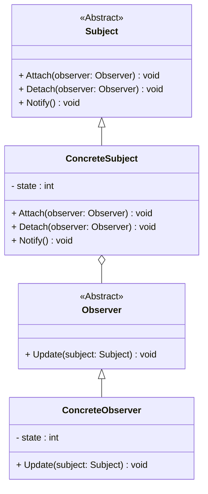

# 观察者模式详解

## 定义

观察者模式（Observer Pattern）是一种行为型设计模式，用于定义对象间的一对多依赖关系，使得当一个对象的状态发生变化时，所有依赖于它的对象都会自动收到通知并更新。这种模式主要用于实现发布-订阅机制。

----------

## 观察者模式的结构

### 核心角色

1.  **主题（Subject）**：被观察的对象，包含多个观察者。它提供注册、注销和通知观察者的方法。
2.  **观察者（Observer）**：依赖于主题的对象，当主题发生变化时，观察者会收到通知并更新自己的状态。
3.  **具体主题（Concrete Subject）**：实现了通知机制的具体对象，它在状态变化时通知所有注册的观察者。
4.  **具体观察者（Concrete Observer）**：每个观察者响应主题的状态变化，并进行相应的操作。

----------

## 使用案例

### 案例 1：气象站数据更新

多个显示设备（例如手机、电视、天气站）都订阅气象站，当气象数据更新时，它们自动显示最新信息。

### 案例 2：股票价格监控

多个投资者或应用程序监控股票价格，当价格变化时，所有订阅者会收到通知并做出反应。

### 案例 3：用户界面组件更新

UI组件（如按钮、文本框）观察模型数据，当模型数据变化时，UI组件会自动更新，保持一致。

----------

## 观察者模式的优缺点

### **优点**

1.  **低耦合**：观察者与主题之间是松耦合的，观察者并不依赖于主题的具体实现。
2.  **动态添加观察者**：可以在运行时动态添加或移除观察者，灵活性高。
3.  **自动更新**：当主题状态发生变化时，所有观察者会自动得到更新通知。

### **缺点**

1.  **可能引起过多更新**：如果观察者过多，频繁的通知可能带来性能问题。
2.  **不适合同步通知**：如果观察者之间有较强依赖关系，直接通知可能导致不一致性。
3.  **可能会造成内存泄漏**：如果没有正确管理观察者的生命周期，可能会导致观察者未能正确注销。

----------

## 观察者模式的结构图



----------

## 观察者模式的实现

### C++ 实现

```cpp
#include <iostream>
#include <vector>
#include <memory>

// 抽象观察者
class Observer {
public:
    virtual void Update(int state) = 0;
    virtual ~Observer() = default;
};

// 具体观察者
class ConcreteObserver : public Observer {
private:
    int state;
public:
    void Update(int newState) override {
        state = newState;
        std::cout << "Observer state updated to: " << state << std::endl;
    }
};

// 抽象主题
class Subject {
public:
    virtual void Attach(std::shared_ptr<Observer> observer) = 0;
    virtual void Detach(std::shared_ptr<Observer> observer) = 0;
    virtual void Notify() = 0;
    virtual ~Subject() = default;
};

// 具体主题
class ConcreteSubject : public Subject {
private:
    std::vector<std::shared_ptr<Observer>> observers;
    int state;
public:
    void Attach(std::shared_ptr<Observer> observer) override {
        observers.push_back(observer);
    }

    void Detach(std::shared_ptr<Observer> observer) override {
        observers.erase(std::remove(observers.begin(), observers.end(), observer), observers.end());
    }

    void Notify() override {
        for (auto& observer : observers) {
            observer->Update(state);
        }
    }

    void SetState(int newState) {
        state = newState;
        Notify();
    }
};

// 客户端代码
int main() {
    auto subject = std::make_shared<ConcreteSubject>();
    auto observer1 = std::make_shared<ConcreteObserver>();
    auto observer2 = std::make_shared<ConcreteObserver>();

    subject->Attach(observer1);
    subject->Attach(observer2);

    subject->SetState(1); // 更新状态并通知观察者

    return 0;
}
```

----------

### C# 实现

```csharp
using System;
using System.Collections.Generic;

// 抽象观察者
public interface IObserver {
    void Update(int state);
}

// 具体观察者
public class ConcreteObserver : IObserver {
    private int state;
    public void Update(int newState) {
        state = newState;
        Console.WriteLine($"Observer state updated to: {state}");
    }
}

// 抽象主题
public interface ISubject {
    void Attach(IObserver observer);
    void Detach(IObserver observer);
    void Notify();
}

// 具体主题
public class ConcreteSubject : ISubject {
    private List<IObserver> observers = new List<IObserver>();
    private int state;

    public void Attach(IObserver observer) {
        observers.Add(observer);
    }

    public void Detach(IObserver observer) {
        observers.Remove(observer);
    }

    public void Notify() {
        foreach (var observer in observers) {
            observer.Update(state);
        }
    }

    public void SetState(int newState) {
        state = newState;
        Notify();
    }
}

// 客户端代码
class Program {
    static void Main(string[] args) {
        ConcreteSubject subject = new ConcreteSubject();
        ConcreteObserver observer1 = new ConcreteObserver();
        ConcreteObserver observer2 = new ConcreteObserver();

        subject.Attach(observer1);
        subject.Attach(observer2);

        subject.SetState(1);  // 更新状态并通知观察者
    }
}
```

----------

## 观察者模式的优缺点对比

| 特性       | 优点                                         | 缺点                                     |
|------------|--------------------------------------------|------------------------------------------|
| 松耦合     | 观察者和主题之间解耦，可以动态添加观察者 | 如果观察者过多，可能导致性能下降       |
| 灵活性     | 允许主题对象在运行时增加或删除观察者     | 不适合复杂的同步通知                   |
| 自动更新   | 主题状态变化时自动通知观察者             | 如果没有正确管理生命周期，可能会导致内存泄漏 |


## 总结

观察者模式是一种非常重要的行为型设计模式，它非常适用于需要在某些事件发生时通知多个对象的场景。它具有高灵活性和可扩展性，在许多系统中都可以找到它的身影，尤其是在事件驱动和消息发布-订阅系统中。使用观察者模式时，需注意管理观察者的生命周期，并避免频繁的状态更新导致性能问题。