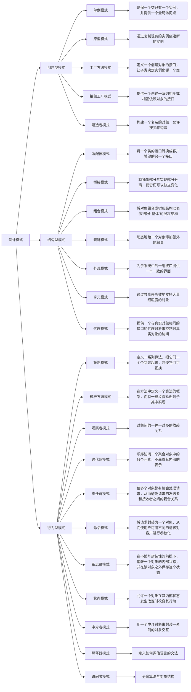

# 设计模式概述

设计模式是软件工程中的一种最佳实践，它描述了软件设计过程中一些常见问题的解决方案。这些模式是经过验证的、可重用的设计方案，可以帮助开发者解决特定的问题，提高代码的可重用性、可读性和可靠性。

在学习设计模式之前，建议至少要学会自己画UML图中的类图，这在之后的文章中我会做详细讲解。

## 为什么要学习设计模式

1.  **提高思维能力**：设计模式是对面向对象设计原则的实际运用，有助于提高程序员的思维能力、编程能力和设计能力。
2.  **标准化程序设计**：使程序设计更加标准化，代码编制更加工程化，提高软件开发效率，缩短开发周期。
3.  **增强代码质量**：设计的代码具有高可重用性、强可读性、高可靠性、良好灵活性和易维护性。

## 如何学习设计模式

1.  **理解基本原则**：掌握SOLID原则（单一职责原则、开闭原则、里氏替换原则、接口隔离原则、依赖倒置原则）。
2.  **学习经典模式**：深入学习GoF（Gang of Four）的23种设计模式，理解每种模式的适用场景和实现方式。
3.  **实践应用**：通过实际项目应用设计模式，加深理解并掌握其精髓。
4.  **阅读源码**：分析流行框架的源码，了解设计模式在实际开发中的应用。

## 流行框架中的设计模式应用

| 设计模式       | 应用实例                                                         |
|--------------|--------------------------------------------------------------|
| **单例模式**    | 在Spring框架中，Bean的默认作用域是单例，确保每个Bean只有一个实例。       |
| **工厂模式**    | 在Java集合框架中，ArrayList、LinkedList等都是通过工厂方法创建的。         |
| **装饰器模式**  | 在Java I/O库中，通过装饰器模式动态地给流添加功能，如BufferedReader装饰InputStream。 |
| **观察者模式**  | 在GUI编程中，事件监听和处理机制通常使用观察者模式实现。                   |
| **适配器模式**  | 在Java中，`java.util.Arrays`和`java.util.List`之间的适配器。             |
| **桥接模式**    | 在GUI框架中，如Swing，将界面与功能分离，使得两者可以独立变化。             |
| **组合模式**    | 在文件系统中，文件和文件夹的层次结构使用组合模式实现。                     |
| **策略模式**    | 在排序算法中，不同的排序策略（如快速排序、归并排序）可以通过策略模式动态切换。 |
| **模板方法模式**| 在框架中，定义算法骨架，让子类实现具体步骤，如JUnit中的测试框架。          |
| **命令模式**    | 在GUI中，按钮点击事件的处理可以通过命令模式实现。                           |
| **备忘录模式**  | 在文本编辑器中，保存和恢复文档状态的功能可以通过备忘录模式实现。             |
| **状态模式**    | 在工作流管理系统中，任务的不同状态（如待审核、审核中、已完成）可以通过状态模式管理。 |
| **访问者模式**  | 在编译器中，对不同的语法结构进行操作（如计算、优化）可以通过访问者模式实现。    |
| **中介者模式**  | 在网络应用程序中，组件之间的交互可以通过中介者模式进行解耦。                   |
| **解释器模式**  | 在解析表达式或命令时，如计算器程序，可以使用解释器模式。                     |
| **迭代器模式**  | 在集合框架中，遍历元素时使用迭代器模式，如`java.util.Iterator`。             |
| **责任链模式**  | 在Web框架中，请求的处理可以通过责任链模式传递给不同的处理器。                 |
| **享元模式**    | 在数据库连接池中，通过享元模式减少对象的创建和销毁，提高性能。               |

## 设计模式SOLID五大原则

1. **单一职责原则（Single Responsibility Principle, SRP）**：一个类应该只有一个引起它变化的原因。这意味着一个类应该只有一项职责。如果一个类有多于一项的职责，那么这些职责就会耦合在一起，当一个职责发生改变时，可能会影响到其他的职责。

2. **开放封闭原则（Open Closed Principle, OCP）**：软件实体（类、模块、函数等等）应该可以扩展，但是不可修改。这个原则的目标是允许系统可以应对新的功能需求和变化，但是不需要修改已经测试过的旧代码。

3. **里氏替换原则（Liskov Substitution Principle, LSP）**：子类型必须能够替换掉它们的基类型。这个原则主要涉及到继承复用的问题，如果子类不能完全替代父类的话，那么可能就会带来问题。

4. **接口隔离原则（Interface Segregation Principle, ISP）**：客户端不应该依赖它不需要的接口。这个原则的目标是减少系统间的依赖，避免因为一个模块的改变影响到其他的模块。

5. **依赖倒置原则（Dependency Inversion Principle, DIP）**：高层模块不应该依赖低层模块，两者都应该依赖其抽象。抽象不应该依赖细节，细节应该依赖抽象。这个原则的目标是要降低模块间的耦合度，提高系统的稳定性。

以上五个原则是设计模式的基础，它们为我们提供了设计软件的指导思想。在实际的软件开发中，我们应该尽可能的遵循这些原则，以提高软件的可维护性、可复用性和可扩展性。

## 设计模式的分类

设计模式可以分为三大类：创建型、结构型和行为型。

### 创建型模式

-   **单例模式**：确保一个类只有一个实例，并提供一个全局访问点。
-   **原型模式**：通过复制现有的实例创建新的实例。
-   **工厂方法模式**：定义一个创建对象的接口，让子类决定实例化哪一个类。
-   **抽象工厂模式**：提供一个创建一系列相关或相互依赖对象的接口。
-   **建造者模式**：构建一个复杂的对象，允许按步骤构造。

### 结构型模式

-   **适配器模式**：将一个类的接口转换成客户希望的另一个接口。
-   **桥接模式**：将抽象部分与实现部分分离，使它们可以独立变化。
-   **组合模式**：将对象组合成树形结构以表示“部分-整体”的层次结构。
-   **装饰模式**：动态地给一个对象添加额外的职责。
-   **外观模式**：为子系统中的一组接口提供一个一致的界面。
-   **享元模式**：通过共享来高效地支持大量细粒度的对象。
-   **代理模式**：提供一个与真实对象相同的接口的代理对象来控制对真实对象的访问。

### 行为型模式

-   **策略模式**：定义一系列算法，把它们一个个封装起来，并使它们可互换。
-   **模板方法模式**：在方法中定义一个算法的框架，而将一些步骤延迟到子类中实现。
-   **观察者模式**：对象间的一种一对多的依赖关系。
-   **迭代器模式**：顺序访问一个聚合对象中的各个元素，不暴露其内部的表示。
-   **责任链模式**：使多个对象都有机会处理请求，从而避免请求的发送者和接收者之间的耦合关系。
-   **命令模式**：将请求封装为一个对象，从而使用户可用不同的请求对客户进行参数化。
-   **备忘录模式**：在不破坏封装性的前提下，捕获一个对象的内部状态，并在该对象之外保存这个状态。
-   **状态模式**：允许一个对象在其内部状态发生改变时改变其行为。
-   **访问者模式**：为一个对象结构（如组合结构）增加新能力。
-   **解释器模式**：为某个语言定义了它的语法（或表达式）的表示，并定义了一个解释器来解释这个语法
-   **中介者模式**：通过引入一个中介者对象来封装一组对象之间的交互

## 总结
