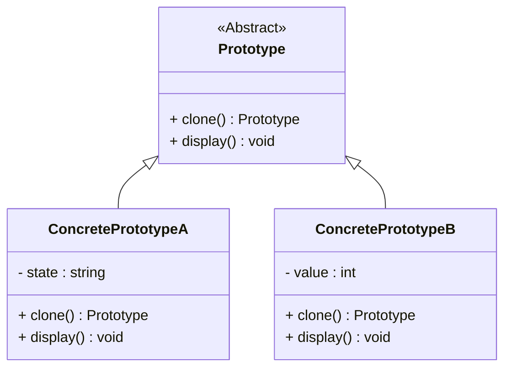

# 原型模式详解

## 定义

原型模式（Prototype Pattern）是一种创建型设计模式，它允许通过复制已有对象来创建新对象，而不是直接通过实例化类来创建。  
这种模式提供了一种创建对象的快捷方式，尤其适用于对象创建成本高或需要深复制的场景。

----------

## 原型模式的特点

### **优点**

1.  **性能优化**：通过复制已有对象，避免昂贵的资源初始化操作。
2.  **简化对象创建**：隐藏复杂的构造过程，减少耦合。
3.  **动态增加产品种类**：无需修改代码，可以通过复制现有对象快速生成新对象。

### **缺点**

1.  **深浅复制问题**：需要对对象中包含的引用类型进行深复制，增加实现复杂性。
2.  **对克隆方法的依赖**：每个类都需要实现自己的克隆逻辑，可能增加代码量。

----------

## 适用场景

1.  **对象创建成本高**  
    比如通过网络加载大数据对象或复杂初始化的对象。
2.  **对象状态的动态变化**  
    比如需要复制对象以保存当前状态。
3.  **需要避免工厂模式的复杂性**  
    通过复制对象创建实例比工厂方法更简单直接。
4.  **游戏开发**  
    克隆游戏角色、技能等对象，避免重复创建。

----------

## 原型模式的结构

### 核心角色

1.  **抽象原型（Prototype）**：定义一个接口，用于克隆自身。
2.  **具体原型（Concrete Prototype）**：实现克隆方法，并返回自身的副本。
3.  **客户端（Client）**：通过调用原型对象的克隆方法来创建新对象。

----------

## 使用案例

### 案例 1：文档编辑器

在图形化编辑器中复制图形或文档内容。

### 案例 2：数据库记录缓存

复制已有的数据记录以快速生成新记录。

### 案例 3：游戏角色克隆

玩家角色或敌人角色的复制，避免重复初始化。

----------

## 原型模式的实现

### C++ 实现

```cpp
#include <iostream>
#include <memory>
#include <string>

// 抽象原型
class Prototype {
public:
    virtual std::unique_ptr<Prototype> clone() const = 0;
    virtual void display() const = 0;
    virtual ~Prototype() = default;
};

// 具体原型 1
class ConcretePrototypeA : public Prototype {
    std::string state;
public:
    ConcretePrototypeA(const std::string& s) : state(s) {}
    std::unique_ptr<Prototype> clone() const override {
        return std::make_unique<ConcretePrototypeA>(*this); // 浅复制
    }
    void display() const override {
        std::cout << "ConcretePrototypeA with state: " << state << std::endl;
    }
};

// 具体原型 2
class ConcretePrototypeB : public Prototype {
    int value;
public:
    ConcretePrototypeB(int v) : value(v) {}
    std::unique_ptr<Prototype> clone() const override {
        return std::make_unique<ConcretePrototypeB>(*this); // 浅复制
    }
    void display() const override {
        std::cout << "ConcretePrototypeB with value: " << value << std::endl;
    }
};

// 客户端代码
int main() {
    std::unique_ptr<Prototype> prototypeA = std::make_unique<ConcretePrototypeA>("Initial State");
    std::unique_ptr<Prototype> cloneA = prototypeA->clone();
    cloneA->display();

    std::unique_ptr<Prototype> prototypeB = std::make_unique<ConcretePrototypeB>(42);
    std::unique_ptr<Prototype> cloneB = prototypeB->clone();
    cloneB->display();

    return 0;
}
```

----------

### C# 实现

```csharp
using System;

// 抽象原型
public abstract class Prototype {
    public abstract Prototype Clone();
    public abstract void Display();
}

// 具体原型 1
public class ConcretePrototypeA : Prototype {
    private string State;

    public ConcretePrototypeA(string state) {
        State = state;
    }

    public override Prototype Clone() {
        return (Prototype)this.MemberwiseClone(); // 浅复制
    }

    public override void Display() {
        Console.WriteLine($"ConcretePrototypeA with state: {State}");
    }
}

// 具体原型 2
public class ConcretePrototypeB : Prototype {
    private int Value;

    public ConcretePrototypeB(int value) {
        Value = value;
    }

    public override Prototype Clone() {
        return (Prototype)this.MemberwiseClone(); // 浅复制
    }

    public override void Display() {
        Console.WriteLine($"ConcretePrototypeB with value: {Value}");
    }
}

// 客户端代码
class Program {
    static void Main(string[] args) {
        Prototype prototypeA = new ConcretePrototypeA("Initial State");
        Prototype cloneA = prototypeA.Clone();
        cloneA.Display();

        Prototype prototypeB = new ConcretePrototypeB(42);
        Prototype cloneB = prototypeB.Clone();
        cloneB.Display();
    }
}
```

----------

## 原型模式的类图



----------

## 原型模式的扩展

### **1. 深复制与浅复制**

-   **浅复制**：复制对象时，引用类型的字段仍指向同一个对象。
-   **深复制**：复制对象时，同时复制所有引用类型的字段内容，生成新的对象实例。

### **2. 结合注册表模式**

将原型对象注册到一个集中管理的注册表中，客户端可以通过键值对直接获取克隆。

### **3. 与其他模式结合**

-   **与工厂模式结合**：工厂提供原型的注册和克隆服务。
-   **与装饰器模式结合**：克隆对象后对其进行装饰，动态添加功能。

----------

## 原型模式与其他模式对比


| 特性       | 原型模式                  | 工厂模式                   |
|------------|---------------------------|----------------------------|
| **关注点** | 通过复制现有对象创建新对象 | 通过实例化类创建对象        |
| **适用场景** | 对象初始化复杂或需要复制时 | 创建独立新对象时            |
| **灵活性** | 更高（动态克隆对象）       | 较低（需修改工厂实现）      |


----------

## 总结

原型模式通过复制已有对象，提供了一种高效的对象创建方式，适合对象初始化开销高或需要频繁复制的场景。其核心在于克隆方法的实现，正确处理深浅复制关系是关键。在实践中，原型模式通常与其他模式结合使用，如工厂模式、注册表模式，进一步提高代码的灵活性和复用性。

