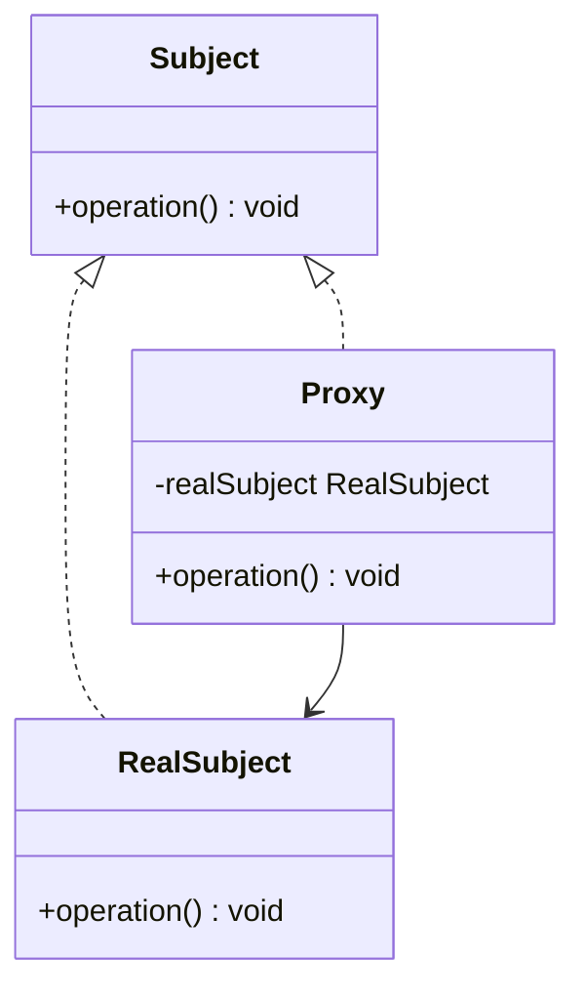

# 代理模式（Proxy Pattern）详解：通俗易懂版

## 定义

代理模式可以看作**委托别人去办事**。如果你想办一件事（比如访问一个资源、操作一个文件），但因为种种原因不能直接去做，就可以通过一个中间人来帮忙。这种中间人就是代理，既可以帮你完成任务，又可以加点“附加服务”，比如检查你的权限、记录操作日志等。

----------

## 生活中的例子

1.  **公司前台**  
    假设你要找某位公司高管谈事情，你不能直接冲进高管办公室，而是要先经过前台。前台会判断你有没有预约，或者是否符合要求。前台就相当于**代理**，高管则是**真实对象**。
    
2.  **明星经纪人**  
    你想请一位明星参加活动，不会直接联系明星，而是通过经纪人。经纪人会筛选请求、谈价格，最后安排明星工作。这里，经纪人是**代理**，明星是**真实对象**。
    
3.  **网购快递**  
    当你网购时，快递公司是你的代理。你买的东西最终是由快递送到你手上，商家并不直接交货给你，而是通过快递完成的。
    

----------

## 为什么需要代理模式？

代理模式的核心在于**控制访问和扩展功能**。以下是常见需求：

1.  **控制访问权限**：比如你不能直接访问数据库，需要验证身份。
2.  **优化性能**：有些资源初始化很慢，通过代理延迟加载可以节省性能。
3.  **增加功能**：可以在代理中加入日志、统计、监控等功能。

----------

## 代理模式的分类

1.  **远程代理（Remote Proxy）**  
    让客户端像访问本地对象一样访问远程对象。例如：RPC（远程过程调用）。
    
2.  **虚拟代理（Virtual Proxy）**  
    延迟创建耗资源的对象，按需加载。例如：图片加载器在图片未加载时显示占位符。
    
3.  **保护代理（Protection Proxy）**  
    控制对对象的访问权限。例如：文件操作时的权限检查。
    
4.  **智能引用代理（Smart Reference Proxy）**  
    在对象访问时增加额外功能，例如记录访问日志或统计引用次数。
    

----------
## 代理模式的优点和缺点

### 优点

1.  **单一职责**：将真实对象的核心功能与附加功能分离。
2.  **灵活性强**：可以动态添加功能，如权限控制、日志记录。
3.  **资源管理**：可以有效管理复杂对象的生命周期（如延迟加载）。

### 缺点

1.  **代码复杂性增加**：引入代理后，代码结构更复杂。
2.  **性能开销**：代理模式引入了额外的操作，可能会影响性能。

----------

## 使用场景

| 序号 | 场景         | 具体案例描述                                                     | 作用与目的                                                     |
|------|------------|--------------------------------------------------------------|--------------------------------------------------------------|
| 1    | 延迟加载       | 图片查看器延迟加载高清图片，先显示占位符。                                   | 减少初始页面加载时间，提高用户体验。                                     |
| 2    | 远程调用       | 分布式系统中访问远程服务时，通过代理简化调用。                                   | 降低远程服务调用的复杂性，提高代码的可维护性和可扩展性。                             |
| 3    | 权限控制       | 用户权限不足时，通过代理阻止对敏感资源的直接访问。                                 | 增强系统的安全性，确保只有授权用户才能访问敏感资源。                             |
| 4    | 监控与日志      | 为真实对象的每次操作记录日志，用于分析和调试。                                  | 便于追踪系统行为，分析问题原因，优化系统性能。                                |
| 5    | 事务管理       | 数据库操作时，代理处理事务的提交与回滚。                                      | 确保数据库操作的原子性、一致性、隔离性和持久性（ACID属性），维护数据的完整性。 |

## 更详细的实现步骤

1.  **定义抽象接口（Subject）**：所有请求的公共接口。
2.  **实现真实对象（RealSubject）**：负责处理具体的业务逻辑。
3.  **实现代理对象（Proxy）**：
    -   保存一个对真实对象的引用。
    -   在真实对象的方法调用前后，添加权限检查、日志等附加功能。
4.  **客户端通过代理访问真实对象**。

----------

## 更通俗的代码说明

**C++ 示例：图片延迟加载代理**

```cpp
#include <iostream>
#include <string>
#include <memory>
using namespace std;

// 抽象接口
class Image {
public:
    virtual void display() = 0;
    virtual ~Image() = default;
};

// 实际图片类
class RealImage : public Image {
private:
    string fileName;

    void loadFromDisk() {
        cout << "Loading " << fileName << " from disk..." << endl;
    }

public:
    RealImage(const string& fileName) : fileName(fileName) {
        loadFromDisk();
    }

    void display() override {
        cout << "Displaying " << fileName << endl;
    }
};

// 代理图片类
class ProxyImage : public Image {
private:
    unique_ptr<RealImage> realImage;
    string fileName;

public:
    ProxyImage(const string& fileName) : fileName(fileName) {}

    void display() override {
        if (!realImage) {
            realImage = make_unique<RealImage>(fileName);
        }
        realImage->display();
    }
};

// 客户端代码
int main() {
    unique_ptr<Image> image = make_unique<ProxyImage>("test.jpg");
    cout << "Image will not load until display() is called:" << endl;
    image->display(); // 第一次调用会加载图片
    image->display(); // 后续调用直接显示，不重新加载
    return 0;
}
```

**C# 示例：远程代理模拟**

```csharp
using System;

// 抽象接口
public interface IImage {
    void Display();
}

// 真实图片类
public class RealImage : IImage {
    private string FileName;

    public RealImage(string fileName) {
        FileName = fileName;
        LoadFromDisk();
    }

    private void LoadFromDisk() {
        Console.WriteLine($"Loading {FileName} from disk...");
    }

    public void Display() {
        Console.WriteLine($"Displaying {FileName}");
    }
}

// 代理图片类
public class ProxyImage : IImage {
    private RealImage _realImage;
    private string FileName;

    public ProxyImage(string fileName) {
        FileName = fileName;
    }

    public void Display() {
        if (_realImage == null) {
            _realImage = new RealImage(FileName);
        }
        _realImage.Display();
    }
}

// 客户端代码
class Program {
    static void Main(string[] args) {
        IImage image = new ProxyImage("test.jpg");
        Console.WriteLine("Image will not load until Display() is called:");
        image.Display(); // 第一次调用加载图片
        image.Display(); // 后续调用不再加载
    }
}
```

----------

## 代理模式的类图



----------

## 总结

1.  **定义核心**：代理为真实对象提供了一个间接访问的方式，方便控制权限或扩展功能。
2.  **实现灵活**：代码可以根据需要添加日志、延迟加载或权限控制等功能。
3.  **理解方法**：通过生活例子结合实际代码，代理模式的作用更加直观。