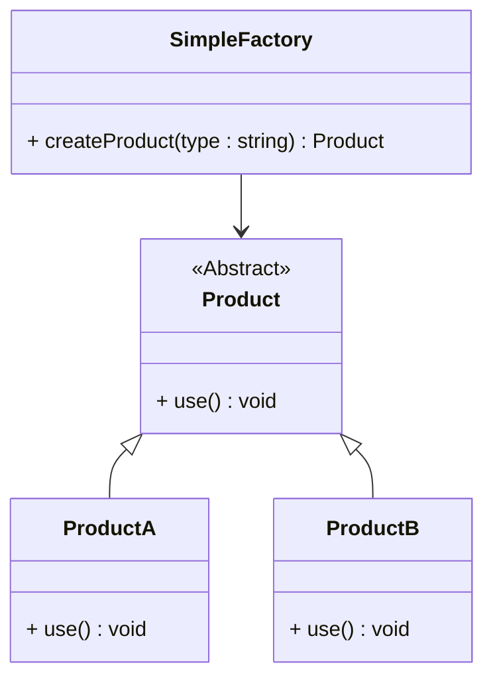

# 简单工厂模式详解

## 定义  
简单工厂模式（Simple Factory Pattern）是一种创建型设计模式，用于创建对象的实例。通过一个工厂类来决定实例化哪一个具体类，降低客户端与具体类之间的耦合。

对于长switch或者长if、else，且多处调用情形，可以考虑使用简单工厂模式。

## 特点  
- **封装实例化逻辑**：将对象的创建集中在一个工厂类中。
- **扩展性较弱**：如果需要增加新产品，需要修改工厂类代码，违反开闭原则。

## 适用场景  
1. 客户端需要创建不同种类的对象，但不需要关心具体的实现。
2. 需要对实例化的过程进行控制或封装。

---

## 使用案例  
1. **日志处理**：根据日志类型（如文件日志、数据库日志）创建不同的日志处理器。
2. **图形对象创建**：根据用户选择创建不同的图形对象（如圆形、矩形）。
3. **支付系统**：根据支付方式（如支付宝、微信、银行卡）创建不同的支付对象。

---

## 实现代码  
### C++ 实现  

```cpp
#include <iostream>
#include <string>
#include <memory>

// 产品基类
class Product {
public:
    virtual void use() = 0;
    virtual ~Product() {}
};

// 具体产品 A
class ProductA : public Product {
public:
    void use() override {
        std::cout << "Using Product A" << std::endl;
    }
};

// 具体产品 B
class ProductB : public Product {
public:
    void use() override {
        std::cout << "Using Product B" << std::endl;
    }
};

// 工厂类
class SimpleFactory {
public:
    static std::unique_ptr<Product> createProduct(const std::string& type) {
        if (type == "A") {
            return std::make_unique<ProductA>();
        } else if (type == "B") {
            return std::make_unique<ProductB>();
        } else {
            return nullptr;
        }
    }
};

// 客户端代码
int main() {
    auto product = SimpleFactory::createProduct("A");
    if (product) {
        product->use();
    }
    return 0;
}
```

---

### C# 实现  

```csharp
using System;

// 产品基类
public abstract class Product {
    public abstract void Use();
}

// 具体产品 A
public class ProductA : Product {
    public override void Use() {
        Console.WriteLine("Using Product A");
    }
}

// 具体产品 B
public class ProductB : Product {
    public override void Use() {
        Console.WriteLine("Using Product B");
    }
}

// 工厂类
public class SimpleFactory {
    public static Product CreateProduct(string type) {
        return type switch {
            "A" => new ProductA(),
            "B" => new ProductB(),
            _ => null
        };
    }
}

// 客户端代码
class Program {
    static void Main(string[] args) {
        Product product = SimpleFactory.CreateProduct("A");
        product?.Use();
    }
}
```

---

## 类图  


## 更多内容

### **扩展设计模式背景**
简单工厂模式是较早被提出的创建型设计模式，虽然不属于 **GoF** 设计模式，但经常被当作一种基础设计手法，并作为引入工厂方法模式的过渡。以下是一些补充内容：

---

### **优点**
1. **职责集中**：工厂类集中处理实例化逻辑，简化了客户端代码。
2. **易于维护**：修改实例化逻辑时，只需更改工厂类。
3. **隐藏实现细节**：客户端只需关心工厂接口，无需关心具体产品的实现。

---

### **缺点**
1. **扩展性差**：
   - 每增加一种新产品，都需要修改工厂类的代码。
   - 违反开闭原则（Open/Closed Principle）。
2. **单一职责问题**：
   - 工厂类负责太多类型的产品创建，可能变得臃肿。
3. **不适合复杂场景**：
   - 当产品之间有复杂的继承或依赖关系时，简单工厂模式的实现变得困难。

---

### **如何增强简单工厂模式**
1. **结合单例模式**：将工厂类设计为单例，避免频繁创建工厂实例。
   ```csharp
   public class SimpleFactory {
       private static readonly SimpleFactory instance = new SimpleFactory();
       private SimpleFactory() {}
       public static SimpleFactory Instance => instance;

       public Product CreateProduct(string type) {
           return type switch {
               "A" => new ProductA(),
               "B" => new ProductB(),
               _ => null
           };
       }
   }
   ```

2. **结合配置文件或枚举**：将产品类型和具体类之间的映射关系配置到文件或用枚举维护，提高灵活性。
   - **示例**：通过映射关系动态加载产品：
     ```csharp
     Dictionary<string, Func<Product>> productMap = new() {
         { "A", () => new ProductA() },
         { "B", () => new ProductB() }
     };

     public Product CreateProduct(string type) {
         return productMap.TryGetValue(type, out var factory) ? factory() : null;
     }
     ```

3. **动态加载类（反射）**：在需要动态扩展产品时，工厂类可以使用反射加载产品类型：
   ```csharp
   public Product CreateProduct(string type) {
       Type productType = Type.GetType(type);
       return productType != null ? (Product)Activator.CreateInstance(productType) : null;
   }
   ```

---

### **简单工厂模式与其他模式的比较**
| 特性                     | 简单工厂模式                   | 工厂方法模式                 | 抽象工厂模式                 |
|--------------------------|------------------------------|-----------------------------|-----------------------------|
| **复杂度**               | 低                          | 中                          | 高                          |
| **扩展性**               | 差（需修改工厂类）            | 良好（新增工厂子类即可）      | 非常灵活（支持多个产品族）    |
| **适用场景**             | 产品种类少，扩展性要求低的场景 | 产品种类多但产品结构简单的场景 | 产品种类多且结构复杂的场景    |

---

### **变体：Parameterized Factory**
将产品的创建参数化，可以更灵活地配置对象：
- **示例**：
  ```cpp
  static std::unique_ptr<Product> createProduct(const std::string& type, int config) {
      if (type == "A") {
          return std::make_unique<ProductA>(config);
      } else if (type == "B") {
          return std::make_unique<ProductB>(config);
      }
      return nullptr;
  }
  ```

---

### **实践中的注意事项**
1. **产品不宜过多**：如果产品种类繁杂，推荐升级到工厂方法模式或抽象工厂模式。
2. **避免逻辑臃肿**：工厂类的逻辑要简洁，复杂的创建逻辑可以委托给专门的创建类处理。
3. **性能考虑**：动态加载或反射可能影响性能，在高性能场景中需谨慎使用。

---

## 示例拓展  
将简单工厂与单例模式结合，用于日志系统：  
#### **C++ 日志系统**
```cpp
#include <iostream>
#include <string>
#include <memory>

class Logger {
public:
    virtual void log(const std::string& message) = 0;
    virtual ~Logger() {}
};

class FileLogger : public Logger {
public:
    void log(const std::string& message) override {
        std::cout << "File log: " << message << std::endl;
    }
};

class ConsoleLogger : public Logger {
public:
    void log(const std::string& message) override {
        std::cout << "Console log: " << message << std::endl;
    }
};

class LoggerFactory {
public:
    static std::unique_ptr<Logger> getLogger(const std::string& type) {
        if (type == "file") {
            return std::make_unique<FileLogger>();
        } else if (type == "console") {
            return std::make_unique<ConsoleLogger>();
        }
        return nullptr;
    }
};

int main() {
    auto logger = LoggerFactory::getLogger("console");
    if (logger) {
        logger->log("Hello, world!");
    }
    return 0;
}
```

---

## 总结  
简单工厂模式是一种结构简单但实用的设计模式，适合用于需求变化不频繁的小型项目或模块中，更多内容完善了简单工厂模式的局限性及改进方案，并扩展了实际应用案例，展示了模式的灵活性和变体的实现方法。但在扩展性要求高的场景中，推荐使用工厂方法模式或抽象工厂模式以增强灵活性。