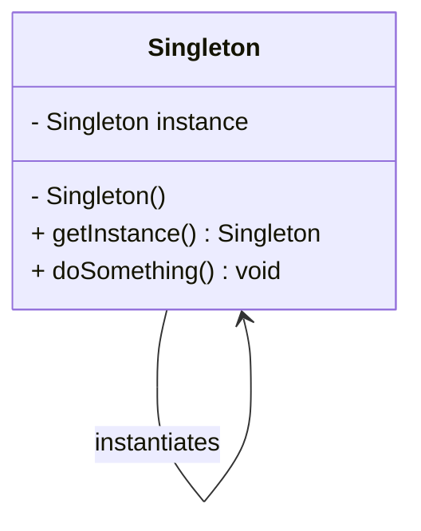

# 单例模式详解

## 定义

单例模式（Singleton Pattern）是一种创建型设计模式，旨在确保某个类只有一个实例，并提供一个全局访问点。

## 特点

1.  **唯一性**：保证一个类只有一个实例。
2.  **全局访问**：提供对实例的全局访问点。
3.  **延迟初始化**：仅在需要时创建实例（可选）。

## 适用场景

-   **配置管理**：如日志管理器、配置管理器等，需要唯一的全局实例。
-   **资源管理**：如线程池、数据库连接池。
-   **控制访问**：如访问计数器、跨模块共享的全局状态。

## 优缺点

-   **优点**：
    -   降低内存开销。
    -   保证全局状态一致性。
    -   提供对资源的受控访问。
-   **缺点**：
    -   不适合并发环境（需考虑线程安全）。
    -   可能造成代码过度耦合，违反单一职责原则。

----------

# 使用案例

1.  **日志系统**：确保只有一个日志文件被写入。
2.  **数据库连接池**：确保共享同一个连接池实例以提高性能。
3.  **配置文件加载器**：整个应用程序共享一个配置加载实例。

----------

# 实现代码
C++ 实现
```cpp
#include <iostream>
#include <mutex>

class Singleton {
public:
    // 禁用拷贝构造和赋值运算符
    Singleton(const Singleton&) = delete;
    Singleton& operator=(const Singleton&) = delete;

    // 获取唯一实例
    static Singleton& getInstance() {
        static Singleton instance; // 使用C++11的magic static，线程安全
        return instance;
    }

    void doSomething() {
        std::cout << "Doing something in Singleton instance!" << std::endl;
    }

private:
    // 私有化构造函数
    Singleton() {
        std::cout << "Singleton initialized." << std::endl;
    }
};

int main() {
    Singleton& instance = Singleton::getInstance();
    instance.doSomething();
    return 0;
}

```
C# 实现
```csharp
using System;

public sealed class Singleton {
    private static readonly Lazy<Singleton> lazyInstance = 
        new Lazy<Singleton>(() => new Singleton());

    // 私有化构造函数
    private Singleton() {
        Console.WriteLine("Singleton initialized.");
    }

    public static Singleton Instance => lazyInstance.Value;

    public void DoSomething() {
        Console.WriteLine("Doing something in Singleton instance!");
    }
}

class Program {
    static void Main(string[] args) {
        Singleton instance = Singleton.Instance;
        instance.DoSomething();
    }
}

```



# 进一步扩展内容

## 单例模式的变种

### 1. 饿汉式单例

-   **实现**：实例在类加载时初始化。
-   **特点**：
    -   初始化时即创建实例，线程安全。
    -   如果实例未使用，会浪费资源。

#### C++ 实现
```cpp
class Singleton {
public:
    static Singleton& getInstance() {
        return instance;
    }
    void doSomething() {}

private:
    Singleton() {}
    static Singleton instance; // 静态成员变量
};

// 初始化静态成员变量
Singleton Singleton::instance;

```
#### C# 实现
```csharp
public sealed class Singleton {
    private static readonly Singleton instance = new Singleton();
    private Singleton() {}
    public static Singleton Instance => instance;
}
```
### 2. 懒汉式单例

-   **实现**：实例在首次调用时创建。
-   **特点**：
    -   延迟初始化，减少资源浪费。
    -   需要显式处理线程安全问题。

#### C++ 实现
```cpp
#include <mutex>

class Singleton {
public:
    static Singleton* getInstance() {
        if (!instance) {
            std::lock_guard<std::mutex> lock(mutex);
            if (!instance) { // 双重检查锁
                instance = new Singleton();
            }
        }
        return instance;
    }
    void doSomething() {}

private:
    Singleton() {}
    static Singleton* instance;
    static std::mutex mutex;
};

// 初始化静态成员
Singleton* Singleton::instance = nullptr;
std::mutex Singleton::mutex;

```

#### C# 实现
```csharp
using System;

public sealed class Singleton {
    private static Singleton instance;
    private static readonly object lockObj = new object();

    private Singleton() {}

    public static Singleton Instance {
        get {
            if (instance == null) {
                lock (lockObj) {
                    if (instance == null) { // 双重检查锁
                        instance = new Singleton();
                    }
                }
            }
            return instance;
        }
    }
}

```
### 3. 静态内部类单例（Java风格，C++/C# 不常用）

-   **实现**：依赖于类加载的线程安全特性。
-   **特点**：
    -   利用静态内部类，确保延迟加载和线程安全。
    -   C++/C# 的类似实现可以通过 `magic static` 或 `Lazy<T>` 实现。


---

## 线程安全的实现细节

### 问题来源

-   多线程环境中，多个线程可能同时创建实例，导致非唯一性或线程死锁。


### 解决方案  
1. **C++11 的 `magic static`**：
   - 静态变量的初始化线程安全。
   ```cpp
   static Singleton& getInstance() {
       static Singleton instance;
       return instance;
   }
   ```
2. **双重检查锁（DCL）**：
   - 适用于懒汉式单例。
   - 减少锁的频率，提高效率。
3. **C# 的 `Lazy<T>`**：
   - 提供线程安全的延迟初始化机制。
   ```csharp
   private static readonly Lazy<Singleton> instance = 
       new Lazy<Singleton>(() => new Singleton());
   ```


---

## 单例模式与依赖注入（DI）

### 依赖注入（DI）的定义

依赖注入是一种设计模式，通过将类的依赖项通过构造函数、属性或方法传入，而不是类自己创建依赖对象。


#### 区别  
| **特性**         | **单例模式**                     | **依赖注入**                  |
|------------------|----------------------------------|-------------------------------|
| **实例管理**     | 由类自己控制实例的创建。         | 由容器管理实例的创建和生命周期。|
| **耦合性**       | 高耦合（类依赖自身实例）。        | 低耦合（外部控制依赖注入）。   |
| **使用场景**     | 全局唯一实例场景。               | 灵活注入不同依赖的场景。       |
| **测试难度**     | 难以单元测试（强依赖类内部实现）。 | 易于测试（可替换依赖实现）。   |

### 结合使用

单例模式和依赖注入并不冲突，单例实例可以作为依赖注入的一部分：

-   **容器管理单例实例**：通过 DI 容器将单例模式封装，避免手动管理实例。
	```csharp
	services.AddSingleton<Singleton>();
	```

### 示例

在 ASP.NET Core 中：
```csharp
public interface ILoggerService {
    void Log(string message);
}

public class SingletonLogger : ILoggerService {
    public void Log(string message) {
        Console.WriteLine($"Log: {message}");
    }
}

// 注册单例
services.AddSingleton<ILoggerService, SingletonLogger>();

// 使用
public class SomeService {
    private readonly ILoggerService _logger;
    public SomeService(ILoggerService logger) {
        _logger = logger;
    }

    public void DoWork() {
        _logger.Log("Work in progress.");
    }
}

```