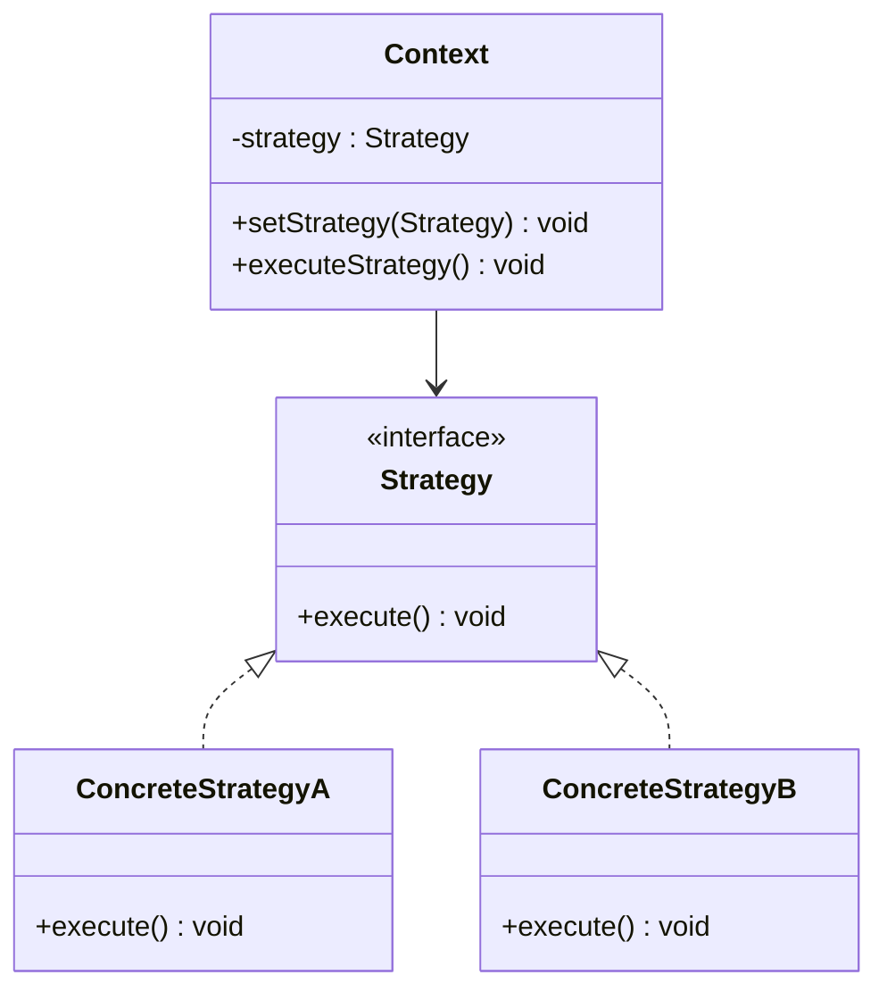

# 策略模式（Strategy Pattern）详解

## 定义

**策略模式**是一种行为型设计模式，它允许你在运行时选择算法或行为，而不是在编译时确定。通过将具体算法封装成独立的类，并通过一个统一的接口与客户端交互，可以实现算法的动态替换，同时避免了代码的重复和复杂条件语句。

通俗地说，策略模式就像换工具干活：你有一堆工具（算法），可以根据任务需要随时选择最合适的那个，而不用修改已有工具或任务逻辑。

----------

## 生活中的例子

1.  **支付方式**  
    当你购物结算时，可以选择支付宝、微信支付、信用卡等不同方式。这些支付方式是不同的“策略”，系统根据用户选择动态调用对应策略。
    
2.  **导航应用**  
    地图导航中可以选择不同的路径规划方式，如“最短时间”、“最短距离”或“避开拥堵”。每种规划方式对应一个策略。
    
3.  **促销活动**  
    商场在不同节日可能有“满减”、“折扣”或“积分兑换”等促销方案，策略模式可以轻松切换不同的促销方案。
    

----------

## 策略模式的特点

### 优点

1.  **简化代码**：避免复杂的条件语句（如 `if-else` 或 `switch`）。
2.  **易于扩展**：新增算法时，只需增加一个策略类，不影响其他代码。
3.  **行为动态化**：可以在运行时更换策略，提升程序灵活性。

### 缺点

1.  **类数增加**：每个策略都需要一个类，可能导致类数量激增。
2.  **客户端需要了解不同策略**：客户端需要知道何时选择哪个策略。

----------

## 适用场景

场景

示例

**行为变化需要动态选择**

支付方式切换、算法选择

**减少条件语句的复杂性**

替代复杂的 `if-else` 或 `switch` 语句

**需要扩展算法或行为**

新增促销活动、增加新的导航规划方式

----------

## 策略模式的实现步骤

1.  **定义策略接口**  
    所有策略（算法）共有的接口，规定统一的方法签名。
    
2.  **实现具体策略**  
    每个策略（算法）实现该接口，封装具体的行为。
    
3.  **定义上下文类（Context）**  
    上下文持有策略的引用，负责调用策略对象的算法，而无需关心策略的具体实现。
    
4.  **客户端动态设置策略**  
    客户端通过上下文动态选择需要使用的策略。
    

----------

## 策略模式与其他模式的对比

| 特性       | 策略模式                           | 工厂方法模式                         |
|----------|---------------------------------|---------------------------------|
| **核心关注点** | 动态切换算法或行为，将算法封装成对象，使得算法可以相互替换。 | 动态创建对象，将对象的创建和使用分离，使得系统更容易扩展。 |
| **行为扩展方式** | 添加新的策略实现类，不需要修改原有代码，只需添加新的策略类即可扩展新的行为。 | 添加新的工厂或子类，不需要修改原有工厂代码，只需添加新的工厂类即可创建新的对象。 |
| **客户端角色** | 客户端需要了解并选择策略，以便在运行时根据需要选择和切换不同的策略。 | 客户端通常只需调用工厂方法来获取所需的对象，不关心对象是如何被创建和表示的。 |


## C++ 示例：支付方式选择

```cpp
#include <iostream>
#include <memory>
#include <string>
using namespace std;

// 策略接口
class PaymentStrategy {
public:
    virtual void pay(int amount) = 0;
    virtual ~PaymentStrategy() = default;
};

// 具体策略：支付宝支付
class Alipay : public PaymentStrategy {
public:
    void pay(int amount) override {
        cout << "Paid " << amount << " using Alipay." << endl;
    }
};

// 具体策略：信用卡支付
class CreditCard : public PaymentStrategy {
public:
    void pay(int amount) override {
        cout << "Paid " << amount << " using Credit Card." << endl;
    }
};

// 上下文类
class PaymentContext {
private:
    unique_ptr<PaymentStrategy> strategy;

public:
    void setStrategy(unique_ptr<PaymentStrategy> newStrategy) {
        strategy = move(newStrategy);
    }

    void executePayment(int amount) {
        if (strategy) {
            strategy->pay(amount);
        } else {
            cout << "No payment strategy set!" << endl;
        }
    }
};

// 客户端代码
int main() {
    PaymentContext context;

    // 使用支付宝支付
    context.setStrategy(make_unique<Alipay>());
    context.executePayment(100);

    // 切换到信用卡支付
    context.setStrategy(make_unique<CreditCard>());
    context.executePayment(200);

    return 0;
}
```

----------

## C# 示例：导航规划

```csharp
using System;

// 策略接口
public interface IRouteStrategy {
    void BuildRoute(string start, string end);
}

// 具体策略：最短时间路径
public class FastestRoute : IRouteStrategy {
    public void BuildRoute(string start, string end) {
        Console.WriteLine($"Building the fastest route from {start} to {end}.");
    }
}

// 具体策略：最短距离路径
public class ShortestRoute : IRouteStrategy {
    public void BuildRoute(string start, string end) {
        Console.WriteLine($"Building the shortest route from {start} to {end}.");
    }
}

// 上下文类
public class Navigator {
    private IRouteStrategy _strategy;

    public void SetStrategy(IRouteStrategy strategy) {
        _strategy = strategy;
    }

    public void BuildRoute(string start, string end) {
        if (_strategy != null) {
            _strategy.BuildRoute(start, end);
        } else {
            Console.WriteLine("No route strategy set!");
        }
    }
}

// 客户端代码
class Program {
    static void Main(string[] args) {
        var navigator = new Navigator();

        // 使用最短时间路径
        navigator.SetStrategy(new FastestRoute());
        navigator.BuildRoute("Home", "Office");

        // 切换到最短距离路径
        navigator.SetStrategy(new ShortestRoute());
        navigator.BuildRoute("Home", "Gym");
    }
}
```

----------

## 策略模式的类图



----------

## 策略模式总结

1.  **灵活性高**：可以轻松地添加新策略，扩展性好。
2.  **职责清晰**：将算法逻辑封装在独立的策略类中，简化了上下文的代码。
3.  **场景适配**：非常适合需要动态切换行为或算法的场景，比如支付系统、导航系统等。
4.  **注意点**：避免类爆炸（策略类过多），并且客户端需要了解可用策略的功能。