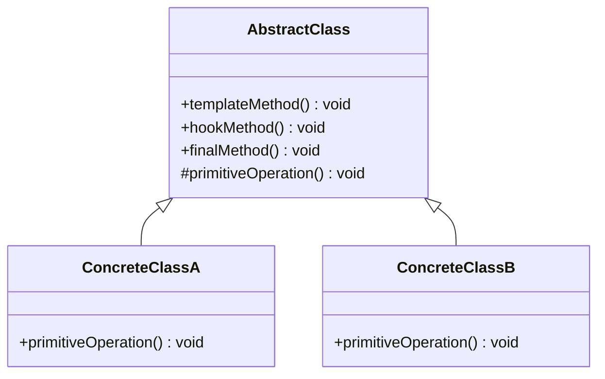

# 模板方法模式（Template Method Pattern）详解

## 1. 定义

模板方法模式是一种行为型设计模式，定义一个操作中的算法骨架，将某些步骤的实现延迟到子类。通过模板方法，子类可以在不改变算法结构的情况下重新定义算法的某些步骤。

**通俗解释：**  
模板方法就像烹饪中的食谱，它定义了做菜的步骤（算法骨架），而每道菜的具体细节（比如调味方式）由厨师（子类）决定。这样既保证了流程的一致性，又允许定制化。

----------

## 2. 使用场景


| 使用场景         | 描述                                                         |
|--------------|------------------------------------------------------------|
| **算法框架一致，细节可变** | 比如不同类型的文件解析：整体流程相同，但具体解析逻辑因文件类型不同而不同。 |
| **避免重复代码**       | 公共逻辑上移到父类，实现代码复用，具体逻辑留给子类实现。                   |
| **确保算法框架不被修改** | 算法骨架在父类中定义，不允许被改变，而只开放局部步骤供子类扩展。           |


## 3. 模板方法模式的优缺点


| 特性         | 模板方法模式                                               | 策略模式                                                     |
|------------|----------------------------------------------------------|----------------------------------------------------------|
| **优点**       | **复用性高**：提取通用逻辑，避免重复代码。<br>**扩展性强**：子类只需实现定制化步骤。<br>**清晰明确**：明确了算法的执行顺序，逻辑更清楚。 | **灵活性高**：可以在运行时动态替换算法或行为。<br>**扩展性强**：通过新增策略类来扩展新的算法或行为，无需修改原有代码。<br>**遵循开闭原则**：对扩展开放，对修改封闭。 |
| **缺点**       | **灵活性降低**：父类定义的算法框架限制了子类的自由度。<br>**继承问题**：容易导致子类层次结构过于复杂。<br>**违反开闭原则**：算法框架一旦定义，修改困难。 | **可能的性能开销**：在某些情况下，策略模式可能引入额外的性能开销，因为需要在运行时决定使用哪个策略。<br>**客户端代码复杂性**：客户端可能需要了解所有策略的细节，以便在适当的时机选择和使用它们。 |


## 4. 模板方法模式的组成

1.  **抽象类**  
    定义算法的骨架（模板方法）和必要的抽象方法。
    
2.  **具体子类**  
    实现抽象类中的具体步骤，定制行为。
    
3.  **模板方法**  
    在抽象类中定义，通常是 `final` 的，不允许子类修改。
    

----------

## 5. 示例：文件解析

### 示例描述：

不同类型的文件（比如 JSON 和 XML）解析逻辑大致相同：

1.  打开文件。
2.  读取内容。
3.  解析数据。
4.  关闭文件。

其中，解析数据的细节因文件类型不同而不同。

----------

### C++ 示例

```cpp
#include <iostream>
#include <string>
using namespace std;

// 抽象类：文件解析器
class FileParser {
public:
    // 模板方法，定义解析流程
    void parseFile(const string& fileName) {
        openFile(fileName);
        readFile();
        parseData();  // 留给子类实现
        closeFile();
    }

    virtual ~FileParser() = default;

protected:
    void openFile(const string& fileName) {
        cout << "Opening file: " << fileName << endl;
    }

    void readFile() {
        cout << "Reading file content..." << endl;
    }

    virtual void parseData() = 0;  // 抽象方法，子类实现

    void closeFile() {
        cout << "Closing file." << endl;
    }
};

// 具体子类：JSON文件解析器
class JSONParser : public FileParser {
protected:
    void parseData() override {
        cout << "Parsing JSON data." << endl;
    }
};

// 具体子类：XML文件解析器
class XMLParser : public FileParser {
protected:
    void parseData() override {
        cout << "Parsing XML data." << endl;
    }
};

// 客户端代码
int main() {
    FileParser* parser = new JSONParser();
    parser->parseFile("data.json");
    delete parser;

    parser = new XMLParser();
    parser->parseFile("data.xml");
    delete parser;

    return 0;
}
```

----------

### C# 示例

```csharp
using System;

// 抽象类：文件解析器
public abstract class FileParser {
    // 模板方法
    public void ParseFile(string fileName) {
        OpenFile(fileName);
        ReadFile();
        ParseData(); // 留给子类实现
        CloseFile();
    }

    protected void OpenFile(string fileName) {
        Console.WriteLine($"Opening file: {fileName}");
    }

    protected void ReadFile() {
        Console.WriteLine("Reading file content...");
    }

    protected abstract void ParseData(); // 抽象方法

    protected void CloseFile() {
        Console.WriteLine("Closing file.");
    }
}

// 具体子类：JSON文件解析器
public class JSONParser : FileParser {
    protected override void ParseData() {
        Console.WriteLine("Parsing JSON data.");
    }
}

// 具体子类：XML文件解析器
public class XMLParser : FileParser {
    protected override void ParseData() {
        Console.WriteLine("Parsing XML data.");
    }
}

// 客户端代码
class Program {
    static void Main() {
        FileParser parser = new JSONParser();
        parser.ParseFile("data.json");

        parser = new XMLParser();
        parser.ParseFile("data.xml");
    }
}
```

----------

### 模板方法模式的类图



----------

## 6. 模板方法模式的扩展

### 钩子方法（Hook Method）

模板方法模式中可以包含钩子方法，子类可以通过覆盖钩子方法来影响模板方法的行为，但不是必须实现的。这种方法进一步增强了模式的灵活性。

----------

## 7. 模板方法模式与其他模式对比

| 特性         | 模板方法模式                                 | 策略模式                                   |
|------------|------------------------------------------|----------------------------------------|
| **核心作用**    | 固定算法流程，允许部分步骤定制                           | 动态替换算法或行为                             |
| **子类角色**    | 扩展部分算法步骤                                 | 提供具体算法实现                             |
| **抽象层次**   | 抽象类和子类                                 | 接口和实现类                               |
| **场景适用**   | 算法逻辑固定但有定制需求                            | 需要灵活切换算法或行为                          |


## 模板方法模式总结

1.  **适用范围**：当多个类具有相似的操作流程，且部分步骤需要定制时，使用模板方法模式非常合适。
2.  **设计哲学**：使用“模板”将不变的部分抽象出来，同时开放定制点以支持扩展。
3.  **注意事项**：避免过多的抽象和继承层次，防止代码复杂化。