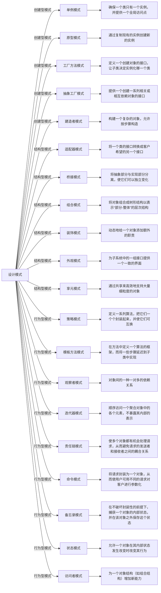

# 设计模式概述

设计模式是软件工程中的一种最佳实践，它描述了软件设计过程中一些常见问题的解决方案。这些模式是经过验证的、可重用的设计方案，可以帮助开发者解决特定的问题，提高代码的可重用性、可读性和可靠性。

## 为什么要学习设计模式

1.  **提高思维能力**：设计模式是对面向对象设计原则的实际运用，有助于提高程序员的思维能力、编程能力和设计能力。
2.  **标准化程序设计**：使程序设计更加标准化，代码编制更加工程化，提高软件开发效率，缩短开发周期。
3.  **增强代码质量**：设计的代码具有高可重用性、强可读性、高可靠性、良好灵活性和易维护性。

## 如何学习设计模式

1.  **理解基本原则**：掌握SOLID原则（单一职责原则、开闭原则、里氏替换原则、接口隔离原则、依赖倒置原则）。
2.  **学习经典模式**：深入学习GoF（Gang of Four）的23种设计模式，理解每种模式的适用场景和实现方式。
3.  **实践应用**：通过实际项目应用设计模式，加深理解并掌握其精髓。
4.  **阅读源码**：分析流行框架的源码，了解设计模式在实际开发中的应用。

## 流行框架中的设计模式应用

-   **单例模式**：在Spring框架中，Bean的默认作用域是单例，确保每个Bean只有一个实例。
-   **工厂模式**：在Java集合框架中，ArrayList、LinkedList等都是通过工厂方法创建的。
-   **装饰器模式**：在Java I/O库中，通过装饰器模式动态地给流添加功能，如BufferedReader装饰InputStream。
-   **观察者模式**：在GUI编程中，事件监听和处理机制通常使用观察者模式实现。

## 设计模式的分类

设计模式可以分为三大类：创建型、结构型和行为型。

### 创建型模式

-   **单例模式**：确保一个类只有一个实例，并提供一个全局访问点。
-   **原型模式**：通过复制现有的实例创建新的实例。
-   **工厂方法模式**：定义一个创建对象的接口，让子类决定实例化哪一个类。
-   **抽象工厂模式**：提供一个创建一系列相关或相互依赖对象的接口。
-   **建造者模式**：构建一个复杂的对象，允许按步骤构造。

### 结构型模式

-   **适配器模式**：将一个类的接口转换成客户希望的另一个接口。
-   **桥接模式**：将抽象部分与实现部分分离，使它们可以独立变化。
-   **组合模式**：将对象组合成树形结构以表示“部分-整体”的层次结构。
-   **装饰模式**：动态地给一个对象添加额外的职责。
-   **外观模式**：为子系统中的一组接口提供一个一致的界面。
-   **享元模式**：通过共享来高效地支持大量细粒度的对象。

### 行为型模式

-   **策略模式**：定义一系列算法，把它们一个个封装起来，并使它们可互换。
-   **模板方法模式**：在方法中定义一个算法的框架，而将一些步骤延迟到子类中实现。
-   **观察者模式**：对象间的一种一对多的依赖关系。
-   **迭代器模式**：顺序访问一个聚合对象中的各个元素，不暴露其内部的表示。
-   **责任链模式**：使多个对象都有机会处理请求，从而避免请求的发送者和接收者之间的耦合关系。
-   **命令模式**：将请求封装为一个对象，从而使用户可用不同的请求对客户进行参数化。
-   **备忘录模式**：在不破坏封装性的前提下，捕获一个对象的内部状态，并在该对象之外保存这个状态。
-   **状态模式**：允许一个对象在其内部状态发生改变时改变其行为。
-   **访问者模式**：为一个对象结构（如组合结构）增加新能力。

## 总结
