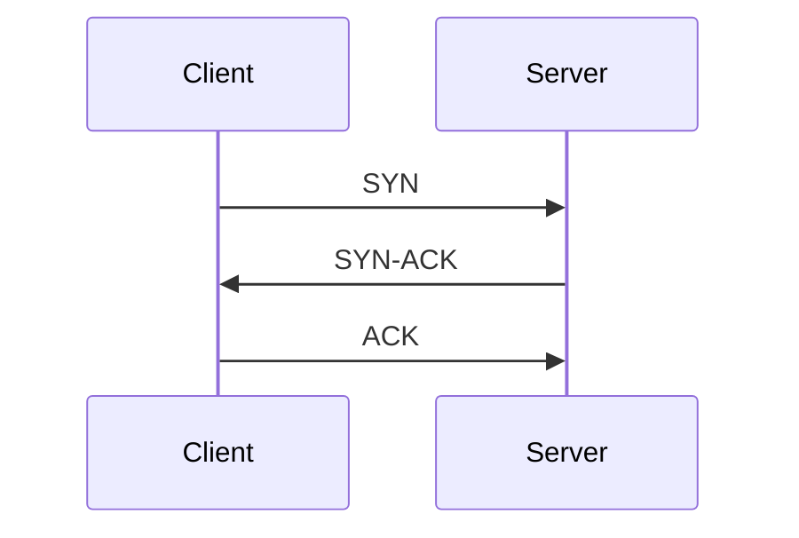
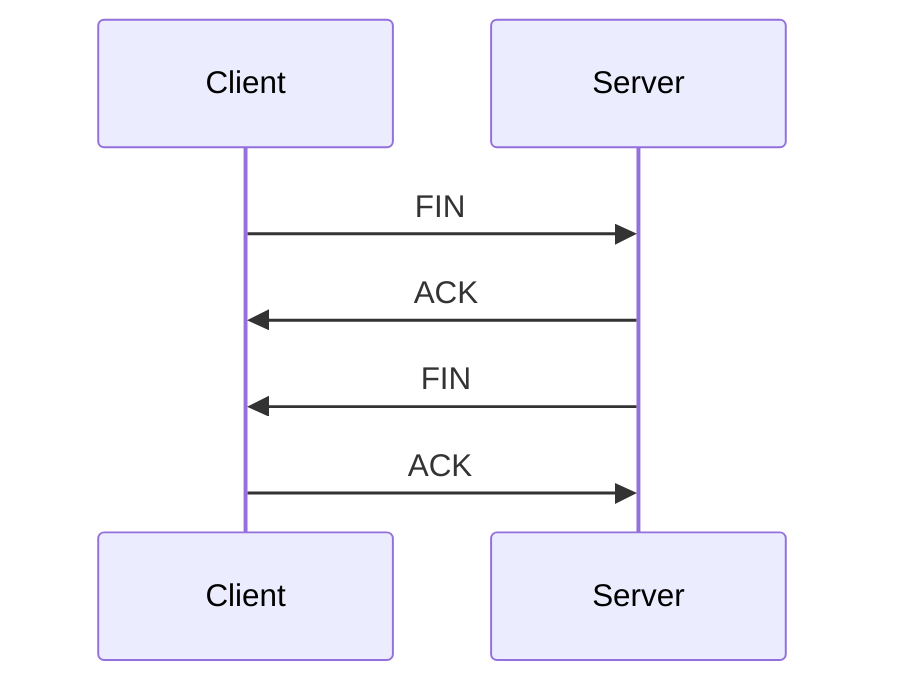

# 第一问：谈谈你理解的TCP协议

## 一、网络模型概述

在计算机网络中，TCP（传输控制协议）是一个重要的协议，它在OSI（开放系统互联）模型的第四层——传输层中发挥着关键作用。为了更好地理解TCP，我们首先需要了解七层网络模型的基本结构：

| 层次        | 名称         | 功能描述                                               | 常见协议                     |
|-------------|--------------|------------------------------------------------------|------------------------------|
| 7           | 应用层      | 提供网络服务给用户应用程序，处理高层数据           | HTTP, FTP, SMTP, DNS        |
| 6           | 表示层      | 数据格式化、加密和解密，确保数据能被应用层理解     | JPEG, GIF, SSL/TLS          |
| 5           | 会话层      | 管理会话和连接，控制对话的建立、维护和终止         | RPC, NetBIOS                 |
| 4           | 传输层      | 提供端到端的通信，确保数据完整性和顺序             | **TCP**, UDP                     |
| 3           | 网络层      | 负责数据包的路由选择和转发，处理逻辑地址           | IP, ICMP, ARP                |
| 2           | 数据链路层  | 处理物理地址，提供节点间的可靠传输                 | Ethernet, PPP, Frame Relay   |
| 1           | 物理层      | 传输原始比特流，定义物理媒介和信号传输方式         | USB, RS-232, DSL             |

在这个模型中，TCP与UDP（用户数据报协议）都是传输层协议，但它们的特性和应用场景却大相径庭。

## 二、TCP与UDP的对比

| 特性          | TCP                          | UDP                          |
|---------------|------------------------------|------------------------------|
| 连接方式      | 面向连接                     | 无连接                       |
| 可靠性        | 提供可靠的数据传输          | 不保证数据传输的可靠性      |
| 数据传输顺序  | 保证数据按顺序到达          | 不保证数据顺序              |
| 流量控制      | 支持流量控制和拥塞控制      | 不支持流量控制              |
| 头部开销      | 20字节                       | 8字节                        |
| 适用场景      | 文件传输、网页浏览等        | 视频直播、在线游戏等        |

## 三、TCP的三次握手和四次挥手

### 3.1 三次握手过程

TCP连接的建立采用“三次握手”过程，在三次握手中，连接的发起通常是由客户端发起的，具体步骤如下：

1. **第一次握手**：客户端发送一个SYN（同步）报文段，表示请求建立连接。
2. **第二次握手**：服务器收到SYN报文段后，回复一个SYN-ACK（同步-确认）报文段，表示同意建立连接。
3. **第三次握手**：客户端收到SYN-ACK后，发送一个ACK（确认）报文段，表示连接建立完成。

#### 为什么是三次握手？两次行不行？

在TCP协议中，连接的建立采用三次握手（Three-Way Handshake）过程，这是为了确保双方能够可靠地建立连接。虽然从表面上看，似乎两次握手也可以完成连接的建立，但实际上，三次握手是必要的，原因如下：

##### 三次握手的必要性

1. **确保双方的接收能力**：
   - **第一次握手**（SYN）：客户端发送SYN报文段，表示请求建立连接。此时，客户端进入SYN_SEND状态。
   - **第二次握手**（SYN-ACK）：服务器收到SYN后，回复SYN-ACK报文段，表示同意建立连接。此时，服务器进入SYN_RCVD状态。
   - **第三次握手**（ACK）：客户端收到SYN-ACK后，发送ACK报文段，表示连接建立完成。此时，客户端进入ESTABLISHED状态，服务器也进入ESTABLISHED状态。

   通过三次握手，双方都确认了对方的存在和接收能力，确保双方都准备好进行数据传输。

2. **防止重复连接**：
   - 如果只进行两次握手，可能会导致重复连接的问题。例如，假设客户端发送了SYN请求，但由于网络延迟，服务器没有及时收到这个请求，客户端在超时后重新发送SYN请求。如果服务器在此时收到了之前的SYN请求并回复了SYN-ACK，客户端可能会错误地认为这是一个新的连接请求，从而导致重复连接的发生。

3. **确认初始序列号**：
   - TCP是一个面向连接的协议，每个连接都有一个初始序列号（ISN）。在三次握手中，双方通过交换SYN和ACK报文段来确认彼此的初始序列号。这一过程确保了数据的有序传输和完整性。

##### 如果只进行两次握手会发生什么？

假设只进行两次握手，流程如下：

1. 客户端发送SYN请求。
2. 服务器回复SYN-ACK。

在这种情况下，客户端在收到SYN-ACK后就会认为连接已经建立，但实际上，服务器并没有确认客户端的接收能力。如果此时网络出现问题，导致客户端没有收到服务器的SYN-ACK，客户端可能会在超时后重新发送SYN请求，这样就可能导致服务器误认为是新的连接请求，从而引发连接混乱和数据传输错误。

### 3.2 四次挥手过程

TCP连接的断开采用“四次挥手”过程，区别于三次握手，挥手时任一方（客户端或服务器）都可以主动发起断开连接请求，这里以客户端主动发起断开请求为例，具体步骤如下：

是的，在TCP的四次挥手过程中，发送FIN报文的一方表示它已经完成了数据的发送，并且不再发送任何数据。这一过程的具体含义和机制如下：
1. **第一次挥手**：
   - 主动关闭连接的一方（例如客户端）发送一个FIN（Finish）报文段，表示它已经完成数据的发送，并希望关闭连接。
   - 发送FIN报文的一方进入**FIN_WAIT_1**状态。

2. **第二次挥手**：
   - 另一方（例如服务器）收到FIN报文后，回复一个ACK（确认）报文段，表示同意关闭连接。
   - 服务器进入**CLOSE_WAIT**状态，客户端进入**FIN_WAIT_2**状态。

3. **第三次挥手**：
   - 服务器在完成所有数据的发送后，发送一个FIN报文段，表示它也希望关闭连接。
   - 服务器进入**LAST_ACK**状态。

4. **第四次挥手**：
   - 客户端收到服务器的FIN报文后，回复一个ACK报文段，表示连接关闭完成。
   - 客户端进入**TIME_WAIT**状态，服务器进入**CLOSED**状态。

>  **发送FIN的一方**在发送FIN报文后，表示它不再发送任何数据。这意味着：
>  - 该方已经完成了所有的数据传输，并且不再需要发送更多的数据。
>  - 该方可以继续接收来自另一方的数据，直到另一方也发送FIN报文。

#### 为什么是四次挥手？

四次挥手的原因在于TCP是全双工的协议，双方都需要独立地关闭连接。第一次和第二次挥手用于关闭客户端到服务器的连接，第三次和第四次挥手用于关闭服务器到客户端的连接。

### 3.3 TIME_WAIT机制

在TCP的连接关闭过程中，客户端在发送最后一个ACK报文段后，会进入**TIME_WAIT**状态，持续一段时间（通常是2倍的MSL，最大报文生存时间）。这个机制的目的是为了确保服务器能够收到客户端的最后一个ACK报文段，防止因网络延迟导致的旧连接请求干扰新连接。

## 四、TCP的使用问题：粘包与拆包

在TCP协议中，由于其面向字节流的特性，可能会出现粘包和拆包的问题。粘包是指多个报文段在传输过程中被合并成一个报文段，而拆包则是指一个报文段被拆分成多个部分。

### 解决方案

1. **固定长度**：每个报文段的长度固定，接收方根据固定长度读取数据。
2. **分隔符**：在报文段之间使用特定的分隔符，接收方通过分隔符来识别报文的边界。
3. **长度字段**：在报文头部添加一个长度字段，接收方先读取长度字段，然后根据长度读取相应的数据。

## 五、总结

TCP作为一种可靠的传输协议，广泛应用于需要高可靠性的数据传输场景。通过三次握手和四次挥手机制，TCP确保了连接的可靠建立和断开。然而，在实际应用中，开发者需要注意粘包和拆包的问题，并采取相应的解决方案，以确保数据的正确传输。

