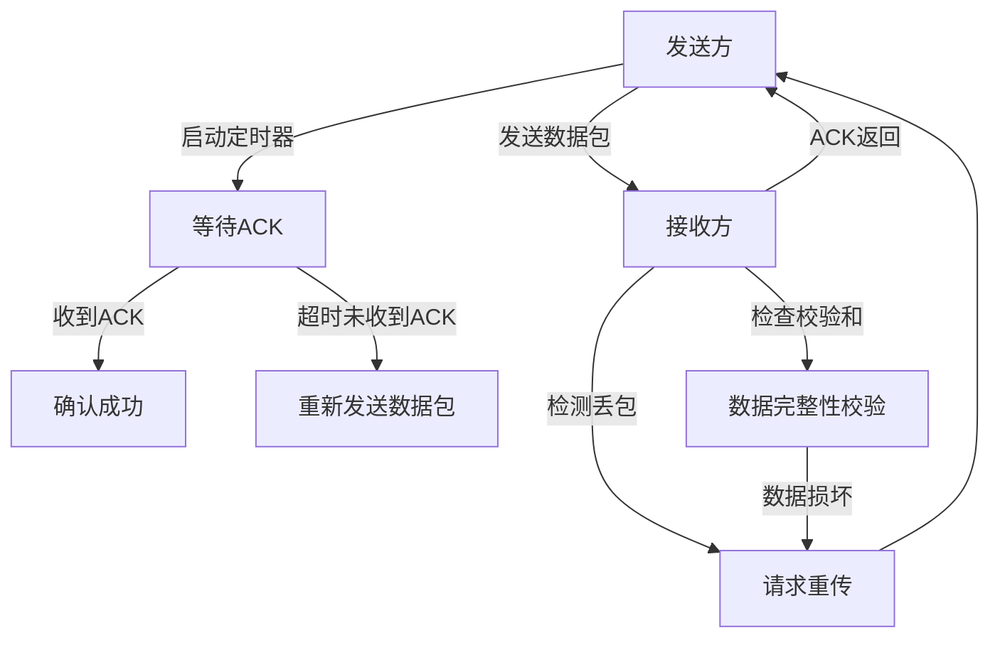

# 第十问：TCP协议是怎么做到可靠性的？它的可靠指的是到哪一层的可靠？

TCP（Transmission Control Protocol）是一种面向连接的传输层协议，其可靠性是其核心特性之一。以下从**底层原理**逐步解释TCP的可靠性机制。

需要注意的是，TCP的可靠性指的是从传输层到传输层的可靠性，传输层之上地方的可靠性，是程序员的工作！

----------

### **TCP可靠性的核心机制**

1.  **数据分片与排序**
    
    -   TCP将应用层的大量数据分片成适合传输的小数据包（Segment），每个数据包有一个**序号（Sequence Number）**。
    -   接收方通过序号重新排序，确保数据按照发送方的顺序还原。
2.  **确认机制（ACK）**
    
    -   每个数据包发送后，接收方需返回一个确认包（ACK）。
    -   ACK中包含**接收方期望收到的下一个字节的序号**，确认了之前所有数据的正确接收。
3.  **超时重传**
    
    -   发送方在发送一个数据包后启动定时器，若未收到ACK且超时，发送方会重传该数据包。
4.  **流量控制**
    
    -   TCP通过窗口机制（Sliding Window）控制发送方的发送速率，避免接收方缓冲区溢出。
5.  **拥塞控制**
    
    -   TCP实现了复杂的拥塞控制算法（如慢启动、拥塞避免、快速重传和快速恢复），保证网络的稳定性和可靠性。
6.  **校验和**
    
    -   TCP头部和数据部分均包含一个校验和（Checksum），用于校验数据是否在传输中损坏。
7.  **数据完整性与丢包处理**
    
    -   TCP能够检测丢失的数据包并重传，同时对乱序数据包进行重新排序。

----------

### **TCP可靠性机制详细表格**

| 机制                   | 实现方式                                 | 作用                                                         |
|----------------------|---------------------------------------|------------------------------------------------------------|
| **数据分片与排序**            | 基于序列号（Sequence Number）         | 确保数据能按顺序重组，即使在传输过程中数据包到达顺序不同。                             |
| **确认机制（ACK）**         | 接收方发送ACK，ACK包含期望的下一个字节序号 | 确保数据正确到达并防止丢包，ACK机制是TCP可靠传输的核心，通过确认响应来告知发送方数据已成功接收。 |
| **超时重传**             | 定时器超时未收到ACK，发送方重发             | 确保丢失的数据包能再次传输，提高数据传输的可靠性。                                   |
| **滑动窗口**             | 窗口大小控制发送速率（接收方通告窗口 + 拥塞窗口） | 避免接收方或网络超载，通过动态调整窗口大小来控制数据流，实现流量控制。                     |
| **拥塞控制**             | 包括慢启动、拥塞避免、快速重传与快速恢复       | 防止网络拥塞崩溃，通过调整数据发送速率来避免网络过载。                                   |
| **校验和**               | TCP头部和数据部分包含校验和，用于传输校验     | 确保数据传输过程中未被破坏，通过校验和可以检测数据在传输过程中是否出现错误。                 |
| **乱序与重排**            | 接收方根据序列号对乱序数据重新排序           | 确保数据能按发送顺序正确组装，即使数据在传输过程中出现乱序。                             |

### **TCP可靠性机制工作流程图**

以下是TCP可靠性机制的主要工作流程：

----------

### **核心数据结构分析**

#### **TCP报文段格式**

TCP报文段中一些关键字段与可靠性相关：

| 字段名称               | 长度  | 功能描述                                                     |
|----------------------|-----|----------------------------------------------------------|
| **源端口（Source Port）** | 16 bits | 标识发送方的应用进程。                                           |
| **目的端口（Destination Port）** | 16 bits | 标识接收方的应用进程。                                           |
| **序号（Sequence Number）** | 32 bits | 数据段的序列号，用于分片和排序，确保数据的有序性和完整性。                             |
| **确认号（Acknowledgment Number）** | 32 bits | 接收方期望的下一个字节序号，用于告诉发送方已经成功接收的数据量，是数据接收的反馈。           |
| **窗口大小（Window Size）** | 16 bits | 接收方的缓冲区容量，用于流量控制，告诉发送方可以发送多少数据，防止发送方发送过多数据导致接收方处理不过来。 |
| **校验和（Checksum）** | 16 bits | 检测数据传输中的错误，确保数据的完整性。                                   |
| **标志位（Flags）**       | 9 bits | 包括ACK、SYN、FIN、RST等，用于连接管理和状态控制，如建立连接、终止连接、重置连接等。             |

### **关键算法详解**

#### **超时重传的RTT估算**

TCP的超时重传基于RTT（Round Trip Time）的动态估算：

1.  估算公式：
$$
\text{RTT}_{\text{new}} = (1 - \alpha) \cdot \text{RTT}_{\text{old}} + \alpha \cdot \text{RTT}_{\text{measured}}
$$

2.  超时间（RTO）计算：
$$
\text{RTO} = \text{RTT}_{\text{new}} + 4 \cdot \text{RTT}_{\text{variance}}
$$

#### **滑动窗口与流量控制**

1.  **发送窗口**：发送方可以发送的数据范围，受限于拥塞窗口（cwnd）和接收窗口（rwnd）。
2.  **窗口调整**：接收方根据当前的缓冲区大小动态调整rwnd。

----------

### **总结**

TCP的可靠性通过多层机制（如序列号、ACK、窗口控制和超时重传）共同实现，确保即使在复杂的网络环境下数据也能稳定传输。通过这些机制，TCP成为了现代网络中数据传输的核心协议。