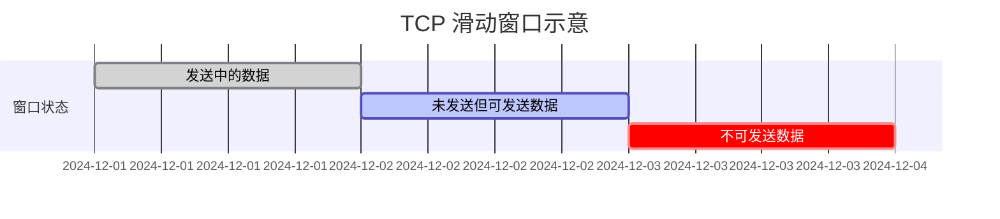
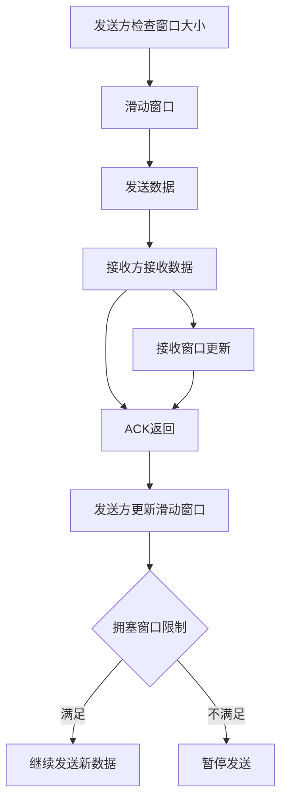

# 第十一问：TCP的窗口机制是什么？

TCP的窗口机制（**Window Mechanism**）是其实现流量控制和拥塞控制的重要机制之一，主要通过动态调整发送和接收双方的通信速率，确保数据传输的高效性和可靠性。窗口机制涉及的核心概念包括**滑动窗口**、**接收窗口（rwnd）**和**拥塞窗口（cwnd）**。

----------

## **窗口机制的核心概念**

### **1. 滑动窗口（Sliding Window）**

滑动窗口是一个动态调整的窗口，定义了发送方允许发送的数据范围。

-   **基本原理**：
    -   发送方在滑动窗口内可以连续发送数据，无需等待ACK。
    -   当接收方发送ACK后，窗口滑动，释放已确认的数据空间，使得新数据可以发送。
-   **关键变量**：
    -   **窗口起点**：已确认的最后一个字节。
    -   **窗口终点**：允许发送的最后一个字节。

### **2. 接收窗口（rwnd，Receive Window）**

接收窗口由接收方控制，表示其当前接收缓冲区的剩余容量。

-   接收方在ACK中通告其可用的`rwnd`值。
-   发送方根据`rwnd`调整数据发送量，避免接收方缓冲区溢出。

### **3. 拥塞窗口（cwnd，Congestion Window）**

拥塞窗口由发送方控制，用于防止网络拥塞。

-   初始值较小，通过拥塞控制算法动态调整。
-   实际发送窗口的大小为： 有效窗口=min⁡(rwnd,cwnd)\text{有效窗口} = \min(\text{rwnd}, \text{cwnd})

### **4. 广告窗口（Advertised Window）**

接收窗口是通过TCP头部的`Window Size`字段通告给发送方的，称为广告窗口。

----------

## **滑动窗口的工作原理**

以下是滑动窗口的工作过程：

1.  **发送数据**：
    -   发送方根据当前窗口大小发送数据。
2.  **等待ACK**：
    -   接收方确认已收到的数据，并返回ACK，通告其更新的`rwnd`值。
3.  **窗口滑动**：
    -   发送方根据ACK滑动窗口，释放已确认的数据空间，继续发送新数据。

### **滑动窗口示意图**

----------

## **窗口机制详细表格**

| 窗口类型       | 控制方       | 作用                                         | 大小动态变化       | 说明                                       |
|--------------|------------|--------------------------------------------|----------------|------------------------------------------|
| 滑动窗口       | 发送方       | 控制当前允许发送的数据范围                           | 根据ACK滑动       |                                          |
| 接收窗口（rwnd） | 接收方       | 防止发送方发送过多数据导致接收方缓冲区溢出                 | 根据接收方缓冲区动态调整 |                                          |
| 拥塞窗口（cwnd） | 发送方       | 防止网络拥塞崩溃                                   | 根据拥塞控制算法动态调整 |                                          |
| 广告窗口       | 接收方（通告） | 通知发送方当前接收缓冲区可用容量                         | 与接收窗口一致     | 发送到发送方TCP头的Window Size字段         |

## **窗口机制中的动态调整**

### **1. 窗口缩小与增大**

-   **窗口缩小**：
    -   接收缓冲区接近满时，`rwnd`减小，发送方降低速率。
-   **窗口增大**：
    -   接收缓冲区空闲时，`rwnd`增大，发送方加快发送速率。

### **2. 零窗口（Zero Window）**

-   如果接收缓冲区满了，接收方通告`rwnd=0`，发送方暂停发送。
-   发送方定期发送**窗口探测包**（Window Probe）询问是否有新空间。

### **3. 拥塞窗口与流量控制**

-   拥塞窗口的调整通过慢启动、拥塞避免等机制动态变化：
    -   **慢启动**：指数增长。
    -   **拥塞避免**：线性增长。
    -   **拥塞发生**：窗口快速减小。

----------

## **TCP窗口机制的完整流程图**

----------

## **示例：TCP窗口变化分析**

假设以下场景：

1.  **初始状态**：
    
    -   `rwnd = 4096` 字节，`cwnd = 1024` 字节。
    -   发送方最多可发送 1024 字节数据。
2.  **慢启动阶段**：
    
    -   第一次发送：1024 字节，接收ACK。
    -   第二次发送：2048 字节（`cwnd`翻倍）。
3.  **稳定阶段**：
    
    -   `cwnd`稳定在网络链路容量，窗口大小由`rwnd`决定。

----------

## **常见问题**

1.  **为什么发送窗口取`min(rwnd, cwnd)`？**
    
    -   防止既填满接收方缓冲区（`rwnd`限制），又避免网络拥塞（`cwnd`限制）。
2.  **窗口大小是否固定？**
    
    -   **不固定**，接收窗口和拥塞窗口会动态调整，滑动窗口会随ACK滑动。
3.  **如何观察窗口变化？**
    
    -   使用抓包工具（如Wireshark）查看TCP头的`Window Size`字段和ACK字段。
4.  **零窗口会导致死锁吗？**
    
    -   不会。TCP会定期发送窗口探测包，检测接收方是否恢复。

----------

## **总结**

TCP窗口机制通过动态调整发送窗口，平衡**网络拥塞控制**和**接收端流量控制**的需求，是TCP高效可靠传输的重要保障。窗口的动态调整机制（如滑动窗口、拥塞窗口和接收窗口）共同确保了数据传输的平稳性和可靠性。通过抓包和分析实际网络行为，可以深入研究其在特定场景下的表现。