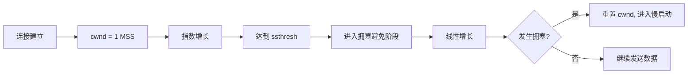

# 第十二问：TCP慢起动详细解释
TCP 的 **慢启动**（Slow Start）是其 **拥塞控制** 的一部分，旨在防止网络拥塞。在连接建立初期，TCP 会逐步增加发送的数据量，以探测网络的可用容量，而不是立即发送大量数据，从而避免网络过载。

----------

## **慢启动的核心目标**

1.  **逐步探测网络能力**：初始阶段假设网络可能拥塞，数据发送速率逐步增加，确保网络不被瞬时大流量压垮。
2.  **动态调整发送速率**：通过接收方的 ACK 确认来调整拥塞窗口（Congestion Window, cwnd）。

----------

## **慢启动的原理**

TCP 的发送速率由以下两个窗口共同决定：

1.  **拥塞窗口（cwnd）**：
    
    -   发送方维护的窗口，用于限制自身发送数据的速度。
    -   初始值较小，通常为一个 MSS（最大分段大小）。
2.  **接收窗口（rwnd）**：
    
    -   接收方通告的窗口大小，表示其接收缓冲区剩余容量。

**实际发送窗口大小**是两者中的较小值：

发送窗口大小=min⁡(cwnd,rwnd)\text{发送窗口大小} = \min(\text{cwnd}, \text{rwnd})

----------

## **慢启动的过程**

### **1. 初始状态**

-   当连接建立后，`cwnd` 的初始值通常是 1 个 MSS（RFC 3390 修改后，可能初始为 2-4 MSS）。

### **2. 指数增长阶段**

-   每收到一个 ACK，`cwnd` 增加 1 个 MSS。
-   发送方可以在一个 RTT 内发送的数据量大致翻倍。

### **3. 到达慢启动阈值（ssthresh）**

-   `ssthresh` 是一个拥塞窗口的阈值，当 `cwnd` 达到 `ssthresh` 时，进入 **拥塞避免阶段**。
-   在拥塞避免阶段，`cwnd` 增加方式改为线性增长。

### **4. 拥塞发生**

-   如果发生数据丢失或网络拥塞（未收到 ACK 或收到重复 ACK），TCP 会减小 `cwnd`，重新进入慢启动。

----------

## **慢启动示例**

假设：

-   MSS = 1KB
-   RTT = 100ms
-   初始 `cwnd = 1 MSS`
-   `ssthresh = 8 MSS`

以下是慢启动过程：

| RTT | 发送数据量（cwnd） | 累计发送数据量 |
|-----|-------------------|--------------|
| 1   | 1 KB              | 1 KB         |
| 2   | 2 KB              | 3 KB         |
| 3   | 4 KB              | 7 KB         |
| 4   | 8 KB              | 15 KB        |

当 `cwnd = 8 MSS` 时，到达 `ssthresh`，TCP 进入拥塞避免阶段。

----------

## **慢启动示意图**

----------

## **慢启动与网络拥塞的关系**

-   **慢启动初期**：
    -   网络负载较小，指数增长的速度不会造成拥塞。
-   **到达阈值后**：
    -   网络流量接近容量，进入线性增长的拥塞避免阶段。
-   **拥塞恢复**：
    -   数据丢失（丢包）或超时是网络拥塞的信号，TCP 会重置 `cwnd`，并降低 `ssthresh`，再次尝试慢启动。

----------

## **关键机制**

1.  **慢启动阈值（ssthresh）**：
    
    -   动态调整的参数，通常为发生拥塞时 `cwnd` 的一半。
    -   决定何时结束慢启动，进入拥塞避免阶段。
2.  **丢包的处理**：
    
    -   **超时重传**：
        -   `cwnd` 重置为 1 MSS，重新开始慢启动。
    -   **快速重传和快速恢复**：
        -   如果检测到轻微拥塞（如重复 ACK），`cwnd` 降低但不回到初始值。
3.  **RTT 的作用**：
    
    -   RTT 影响慢启动的速度：RTT 越短，ACK 返回越快，`cwnd` 增长越快。

----------

## **常见问题**

1.  **慢启动的优缺点**：
    
    -   优点：防止初始阶段的网络拥塞。
    -   缺点：初始阶段数据传输速度较慢。
2.  **如何优化慢启动？**
    
    -   **TCP 快速打开（TCP Fast Open）**：减少慢启动的影响，加快初始数据传输。
    -   **动态调整 ssthresh**：根据历史传输记录优化 `ssthresh` 设置。
3.  **慢启动适用的场景？**
    
    -   主要适用于新连接建立或网络发生拥塞后的恢复阶段。

----------

## **总结**

TCP 的慢启动机制通过指数增长发送速率，动态探测网络容量，避免初始阶段的拥塞风险。它与拥塞避免和快速恢复机制共同构成了 TCP 的拥塞控制策略，是 TCP 实现高效可靠传输的重要基础。