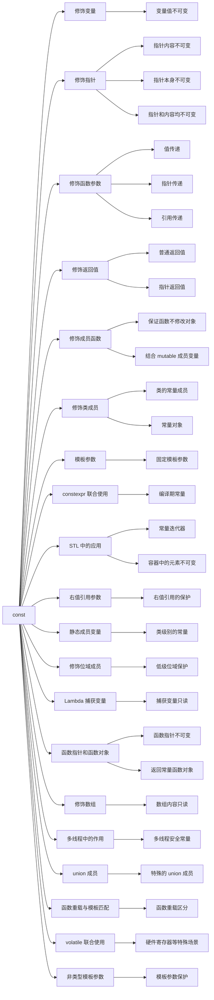

# 第二问：C++中const用法都有哪些，它如何保证不变性？

# 概述

const` 是 C++ 中用于定义常量性的重要关键字，其主要作用是防止值被修改。以下是 `const` 的主要用法及其如何保证不变性的详细说明：

----------

# 详细说明
## 1. **修饰变量**

定义常量变量后，变量的值在整个作用域中不可修改：

```cpp
const int a = 10;
// a = 20; // 错误，无法修改 const 变量
```

**原理：**  
编译器会在编译期检测到对 `const` 变量的修改，并报错，从而保证变量值不可变。

----------

## 2. **修饰指针**

### (1) 指向的内容不可变

```cpp
const int value = 10;
const int* ptr = &value; // 指针所指向的值不可变
// *ptr = 20; // 错误，无法修改指向的内容
```

**解读：**  
`const int* ptr` 表示指针指向的对象是常量，指针自身可以改变指向。

### (2) 指针本身不可变

```cpp
int value = 10;
int value2 = 20;
int* const ptr = &value; // 指针本身不可变
ptr = &value2; // 错误，无法修改指针本身
```

**解读：**  
`int* const ptr` 表示指针本身不可变，但指向的内容可以改变。

### (3) 指针本身和指向内容都不可变

```cpp
const int value = 10;
const int* const ptr = &value; // 指针和内容均不可变
```

**解读：**  
这种用法常用于需要绝对不变的场景，例如安全访问硬件寄存器或配置。

----------

## 3. **修饰函数参数**

### (1) 值传递

在函数参数中使用 `const`，避免对参数值的修改：

```cpp
void func(const int x) {
    // x = 20; // 错误，无法修改 x
}
```

### (2) 指针参数

```cpp
void func(const int* ptr) {
    // *ptr = 20; // 错误，无法修改指针所指的值
}
```

### (3) 引用参数

引用传递的参数被修饰为 `const`，可以避免函数中修改原始值：

```cpp
void func(const int& ref) {
    // ref = 20; // 错误，无法修改引用的值
}
```

**作用：**

-   防止意外修改参数值。
-   提高代码的可读性，明确意图。

----------

## 4. **修饰返回值**

### (1) 修饰普通返回值

```cpp
const int func() {
    return 10;
}
// int& x = func(); // 错误，无法绑定非常量引用
```

**作用：**  
防止函数返回值被错误修改，常用于拷贝返回。

### (2) 修饰指针返回值

```cpp
const int* func() {
    static int value = 10;
    return &value;
}
```

**作用：**  
保证返回的指针所指内容不可变。

----------

## 5. **修饰成员函数**

### (1) 保证成员函数不修改对象状态

```cpp
class MyClass {
public:
    void show() const {
        // 成员函数中无法修改类成员变量
    }
};
```

**作用：**  
通过在函数后加 `const`，确保函数内部不会修改成员变量，也不会调用其他非 `const` 成员函数。

### (2) 配合 `mutable` 成员变量

`const` 成员函数中可以修改被 `mutable` 修饰的成员变量：

```cpp
class MyClass {
private:
    mutable int count;
public:
    void increment() const {
        count++;
    }
};
```

----------

## 6. **修饰类成员**

### (1) 常量成员变量

必须在类的构造函数初始化列表中初始化：

```cpp
class MyClass {
private:
    const int value;
public:
    MyClass(int val) : value(val) {}
};
```

### (2) 常量对象

```cpp
const MyClass obj;
// obj.modify(); // 错误，无法调用非 const 成员函数
```

**作用：**  
确保常量对象的状态不被修改。

----------

> 上面列举的是 `const` 的主要使用场景，但并不是 **全部**。C++ 中 `const` 的应用非常广泛，有一些更高级或特定场景的用法，我再补充如下，力求全面覆盖：

----------

## **7. 修饰模板中的参数**

`const` 可用于模板参数声明中，限制模板参数为常量值：

```cpp
template <int N>
class Array {
    int data[N]; // 固定大小的数组
};
Array<10> arr; // 模板参数是一个常量
```

----------

## **8. 与 `constexpr` 联合使用**

`const` 可以与 `constexpr` 配合，用于定义编译期的常量：

```cpp
constexpr const int MAX_SIZE = 100; // 既是常量，又可用于编译期计算
```

**注意：**

-   `constexpr` 比单独使用 `const` 更强大，因为它还要求值在编译期就能确定。

----------

## **9. 在 STL 容器中的应用**

在标准库（如 `std::vector`、`std::map` 等）中，`const` 用法有以下场景：

### (1) 常量迭代器

`const_iterator` 用于保证迭代器指向的内容不可修改：

```cpp
std::vector<int> vec = {1, 2, 3};
for (std::vector<int>::const_iterator it = vec.begin(); it != vec.end(); ++it) {
    // *it = 10; // 错误，无法修改
}
```

### (2) 修饰容器中的元素

可以使用 `const` 确保容器中的元素不可修改：

```cpp
std::vector<const int*> vec; // 存储不可修改的指针
```

----------

## **10. 修饰右值引用参数（C++11 引入）**

`const` 结合右值引用，主要用于重载函数，防止移动操作修改临时对象：

```cpp
void func(const int&& x) {
    // x 是一个右值引用，但其值不可被修改
}
```

右值通常用于临时变量，`const` 修饰可以保护这些临时变量。

----------

## **11. 与类的 `static` 成员变量结合**

`const` 修饰类的静态成员变量，通常用于定义不可改变的类级别常量：

```cpp
class MyClass {
public:
    static const int MAX_VALUE = 100; // 静态常量成员
};
```

静态常量成员可以直接在类内初始化，**但仅限于整型或枚举类型**。非整型必须在类外定义并初始化。

----------

## **12. 修饰位域（bit-field）成员**

位域是 C++ 中处理结构体的低级特性，`const` 可以保护位域成员：

```cpp
struct Flags {
    const unsigned int flag1 : 1; // 常量位域
    unsigned int flag2 : 2;
};
```

----------

## **13. 修饰捕获变量（C++11 Lambda 表达式）**

在 Lambda 捕获列表中，`const` 可以确保捕获的变量不可修改：

```cpp
int x = 10;
auto lambda = [x]() mutable {
    // x = 20; // 如果未加 `mutable`，默认 x 是 const
};
```

如果没有 `mutable` 修饰，捕获的变量是不可修改的，默认按 `const` 值传递。

----------

## **14. `const` 在函数指针和函数对象中的应用**

### (1) 修饰函数指针

函数指针的常量性可以通过 `const` 限定：

```cpp
void func() {}
void (*const funcPtr)() = func; // funcPtr 指向的函数不可改变
```

### (2) 修饰返回函数对象

如果函数返回的是一个 `const` 对象，可以保护返回值不被修改：

```cpp
const std::function<void()> getFunc() {
    return []() { /* Do something */ };
}
```

----------

## **15. 修饰数组**

在数组中，`const` 可以保护整个数组内容不被修改：

```cpp
const int arr[] = {1, 2, 3};
// arr[0] = 10; // 错误，无法修改数组内容
```

----------

## **16. `const` 在多线程中的作用**

在多线程中，`const` 变量是线程安全的，因为它们不会被修改，避免了数据竞争（data race）：

```cpp
const int threadCount = 4; // 多线程间安全共享的常量
```

----------

## **17. 修饰 `union` 成员（特殊场景）**

C++ 中 `union` 的成员通常不允许是 `const`，但如果 `union` 的成员是对象，则可以间接地包含 `const` 成员：

```cpp
union MyUnion {
    const int value; // 在特殊情况下可能需要使用
};
```

----------

## **18. 在函数重载与模板匹配中的特殊用法**

`const` 修饰的函数或模板可以区分重载：

```cpp
void func(int x) {
    // 普通版本
}
void func(const int x) {
    // 常量版本
}
```

----------

## **19. 与 volatile 联合使用**

`const` 和 `volatile` 联合使用时，表示变量的值不能被程序修改，但可能会被硬件或外部事件改变：

```cpp
const volatile int reg = 0x1234; // 例如硬件寄存器
```

**典型场景：**

-   嵌入式开发中保护硬件寄存器的值。

----------

## **20. 修饰非类型模板参数**

在模板中，非类型参数可以使用 `const` 修饰：

```cpp
template <const int N>
class Matrix {
    int data[N][N];
};
Matrix<4> m; // 矩阵大小固定为 4x4
```

----------

# 用法分类


# 总结

 `const` 保证不变性的原理可以概括为以下三点：
1.  **编译时检测**：编译器在编译阶段检查 `const` 的限制条件，禁止对 `const` 数据的非法操作。
2.  **内存保护**：在某些平台上（例如嵌入式系统），`const` 数据可能会放在只读存储区，防止运行时修改。
3.  **限定作用域**：通过 `const` 明确表达代码意图，减少因误修改引起的错误。


C++ 的 `const` 用法极其广泛，涵盖变量、指针、数组、函数、类成员、模板、Lambda 表达式等多个方面。从编译时检查到运行时保护，`const` 在提高程序安全性、可读性和优化性能方面扮演了重要角色，正确使用 `const` 可以提高代码的安全性和可读性，是现代 C++ 编程中非常重要的实践。

如果还有更特殊的应用场景，欢迎探讨！