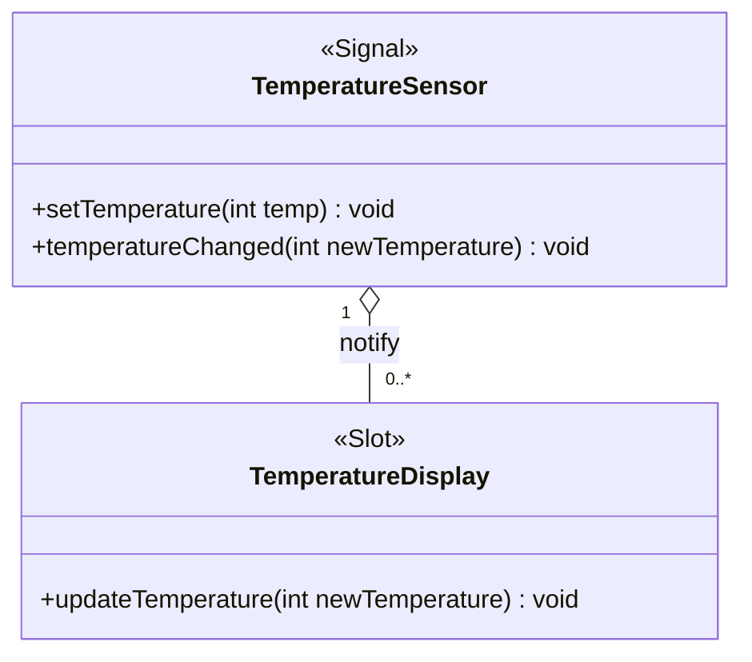

# 第四问：QT中信号和槽原理

在Qt中，观察者模式被广泛应用于信号与槽机制（Signal-Slot Mechanism）。Qt的信号与槽机制是观察者模式的一种典型实现，它允许对象之间进行通信而不需要知道彼此的具体实现。这个机制使得对象能够在不直接相互依赖的情况下进行交互，符合观察者模式的思想。

----------

## Qt中的信号与槽机制

### **信号（Signal）**

信号是Qt对象用来通知其他对象某个事件发生的机制。信号不直接执行任何动作，只是发出一个通知，表示某个事件已经发生。

### **槽（Slot）**

槽是响应信号的函数。当一个信号发出时，所有连接到该信号的槽函数都会被自动调用。槽可以是普通的成员函数，也可以是匿名函数。

### **连接（Connect）**

信号和槽之间的连接通过`QObject::connect()`函数完成。当信号发出时，Qt会自动调用与之连接的槽。

### **解耦**

信号与槽机制的关键在于“解耦”，即发送信号的对象并不知道哪些对象会响应这个信号，且接收信号的对象也不需要知道发送信号的对象。这种松耦合的设计正是观察者模式的精髓。

----------

## 观察者模式与Qt信号槽机制的比较


| 特性           | 观察者模式                          | Qt的信号与槽机制                |
|----------------|-------------------------------------|---------------------------------|
| 主题（Subject）| 管理和通知所有观察者                | Qt中的对象可以发出信号         |
| 观察者（Observer）| 接收通知并更新自身状态            | 槽函数接收信号并进行响应       |
| 依赖关系       | 观察者依赖主题，主题通知观察者      | 信号与槽的连接是松耦合的       |
| 通知机制       | 主题通知所有观察者                  | 信号发出时自动调用槽函数       |


## Qt 信号与槽机制的工作原理

### 1. **信号声明**

信号在Qt中通常在类的`signals`部分声明，例如：

```cpp
class MyWidget : public QWidget {
    Q_OBJECT

public:
    MyWidget(QWidget *parent = nullptr) : QWidget(parent) {}

signals:
    void valueChanged(int newValue);
};
```

### 2. **槽函数声明**

槽是响应信号的成员函数，通常在`public slots`或`private slots`部分声明。例如：

```cpp
class MyWidget : public QWidget {
    Q_OBJECT

public:
    MyWidget(QWidget *parent = nullptr) : QWidget(parent) {}

public slots:
    void onValueChanged(int newValue) {
        qDebug() << "Value changed to" << newValue;
    }
};
```

### 3. **信号与槽连接**

信号和槽之间的连接通过`QObject::connect()`来完成。信号发出时，连接的槽函数会自动执行。

```cpp
MyWidget *widget = new MyWidget();
connect(widget, &MyWidget::valueChanged, widget, &MyWidget::onValueChanged);
```

### 4. **触发信号**

当某些事件发生时（例如用户交互），可以触发信号的发出：

```cpp
widget->valueChanged(42); // 触发信号，自动调用onValueChanged
```

----------

## Qt 中信号与槽机制的优点

1.  **松耦合**：发送信号的对象和接收信号的对象之间不需要直接关联。发送者只知道自己发出信号，接收者只知道自己处理信号。
    
2.  **灵活性和扩展性**：可以在运行时动态添加和删除信号与槽之间的连接。例如，可以在程序的任何地方动态连接信号和槽函数，而无需修改类的实现。
    
3.  **自动通知**：当信号发出时，所有连接的槽函数会自动被调用，不需要手动管理通知过程。
    
4.  **线程安全**：Qt的信号和槽机制支持跨线程通信。在不同线程之间发出信号时，Qt会自动将信号的传递和槽的调用安排在正确的线程上下文中。
    

----------

## 示例：Qt中的观察者模式实现

假设我们有一个`TemperatureSensor`类，多个显示器（`TemperatureDisplay`）作为观察者，监听温度传感器的变化。

### 1. **温度传感器类（主题）**

```cpp
class TemperatureSensor : public QObject {
    Q_OBJECT

public:
    void setTemperature(int temp) {
        if (temp != temperature) {
            temperature = temp;
            emit temperatureChanged(temperature); // 发出信号
        }
    }

signals:
    void temperatureChanged(int newTemperature);

private:
    int temperature;
};
```

### 2. **温度显示器类（观察者）**

```cpp
class TemperatureDisplay : public QObject {
    Q_OBJECT

public slots:
    void updateTemperature(int newTemperature) {
        qDebug() << "Temperature updated to:" << newTemperature;
    }
};
```

### 3. **连接信号与槽**

```cpp
int main() {
    TemperatureSensor sensor;
    TemperatureDisplay display;

    QObject::connect(&sensor, &TemperatureSensor::temperatureChanged,
                     &display, &TemperatureDisplay::updateTemperature);

    sensor.setTemperature(25); // 发出信号，显示器会自动更新
    sensor.setTemperature(30); // 发出信号，显示器会自动更新

    return 0;
}
```

### 类图

### 解释：

-   **TemperatureSensor** 类：表示主题，包含一个 `setTemperature` 方法来设置温度，并发出 `temperatureChanged` 信号。这个信号会通知所有注册的观察者。
-   **TemperatureDisplay** 类：表示观察者，包含一个槽 `updateTemperature`，它响应 `TemperatureSensor` 发出的 `temperatureChanged` 信号。
-   **关系**：一个 `TemperatureSensor` 对象可以通知多个 `TemperatureDisplay` 对象，所以它们之间是“一对多”关系。箭头表示 `TemperatureSensor` 通过信号通知 `TemperatureDisplay`，而 `TemperatureDisplay` 则通过槽来接收更新。

### 关键点：

-   **信号** (`temperatureChanged`)：由 `TemperatureSensor` 发出，用来通知观察者温度变化。
-   **槽** (`updateTemperature`)：由 `TemperatureDisplay` 接收，用来处理来自 `TemperatureSensor` 的更新。

----------

## 总结

-   **信号与槽机制**是Qt对观察者模式的实现，通过信号来表示“事件”或“状态变化”，通过槽来处理这些事件。
-   在Qt中，信号和槽之间是松耦合的，发送信号的对象并不需要知道谁在接收信号，也不需要担心接收者如何响应。这使得Qt的事件处理非常灵活且易于扩展。
-   观察者模式与Qt的信号与槽机制非常契合，Qt本身就提供了一种高效、解耦的事件驱动编程方式，非常适合用于实现UI更新、数据绑定等场景。


