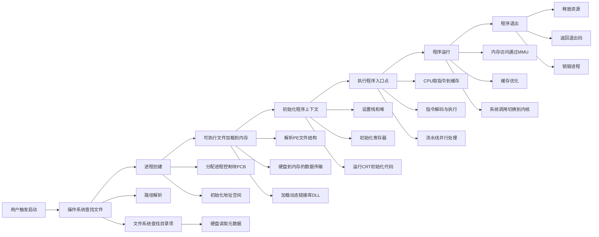

# 第五问：一个程序从点击到启动发生了什么？

一个可执行程序（`exe` 文件）从用户双击启动到程序运行的过程可以分为以下8个主要阶段，下面结合硬盘、内存、缓存等机制，分阶段展开说明。

----------

## **1. 用户触发启动**

用户通过某种操作（如鼠标双击）触发程序启动，操作本质上通过输入设备将信号传递到 CPU 中的中断处理系统：

-   **鼠标操作**：
    -   鼠标信号通过 USB 或其他接口传递到 CPU 中的中断控制器。
    -   中断控制器触发操作系统事件（如鼠标点击事件）。
-   **操作系统响应**：
    -   操作系统捕获鼠标点击事件。
    -   图形界面处理模块（如 Windows 的桌面窗口管理器 DWM）识别到用户点击了某个 `exe` 文件的图标，调用相应的文件管理服务来处理启动请求。

----------

## **2. 操作系统查找文件**

操作系统通过文件系统模块定位`exe`文件，涉及硬盘与文件系统的交互：

1.  **路径解析**：
    -   如果是绝对路径，直接从根目录开始查找。
    -   如果是相对路径，操作系统会结合当前工作目录构造绝对路径。
2.  **文件系统访问**：
    -   **文件系统（如 NTFS、ext4）查找目录项**：
        -   读取磁盘中存储的文件目录结构，找到 `exe` 文件的元数据（文件的起始地址、大小等）。
    -   **硬盘读取文件元数据**：
        -   文件系统发出读取请求，经过 I/O 调度系统，硬盘控制器将元数据加载到内存中。
3.  **权限验证**：
    -   操作系统检查用户是否具有执行权限。

----------

## **3. 进程创建**

### **3.1 分配 PCB**

操作系统分配一个**进程控制块（PCB）**，包括以下信息：

-   进程 ID。
-   程序计数器（指向入口地址）。
-   寄存器快照。
-   虚拟内存表。
-   打开的文件句柄列表等。

### **3.2 初始化地址空间**

-   操作系统为新进程分配一个独立的虚拟地址空间。
-   虚拟地址空间划分为以下部分：
    -   **代码段**：存储程序的机器指令。
    -   **数据段**：存储全局变量和静态变量。
    -   **栈段**：为函数调用和局部变量分配。
    -   **堆段**：动态分配的内存区域。

----------

## **4. 可执行文件加载到内存**

### **4.1 解析可执行文件结构**

以 Windows 为例，`exe` 文件使用 PE（Portable Executable）格式，操作系统会：

-   **读取文件头**：
    -   通过磁盘 I/O，从硬盘将文件头读取到内存缓存。
    -   解析 PE Header，提取代码段、数据段、入口点等信息。
-   **加载程序段**：
    -   将硬盘上的 `.text`（代码段）、`.data`（数据段）、`.rdata`（只读段）等映射到内存。

### **4.2 硬盘到内存的数据传输**

数据加载涉及以下硬件：

-   **磁盘调度**：
    -   操作系统调用磁盘驱动，通过 SATA、NVMe 或其他接口读取文件。
-   **DMA（Direct Memory Access）传输**：
    -   硬盘控制器通过 DMA 将文件块直接传输到物理内存，而无需 CPU 参与，提升效率。
-   **高速缓存**：
    -   读取数据可能先加载到 CPU 的三级缓存（L1/L2/L3）中，以加速后续访问。

### **4.3 动态链接库加载**

-   **查找 DLL 文件路径**：
    -   操作系统从注册表、系统路径、程序目录等位置查找所需的 DLL 文件。
-   **加载 DLL 文件**：
    -   与加载 `exe` 文件类似，将 DLL 的各个段映射到内存。
-   **符号解析**：
    -   将程序中对外部函数的调用（例如 `printf`）绑定到 DLL 中对应函数的实际地址。

----------

## **5. 初始化程序上下文**

操作系统为程序配置运行环境，包括：

1.  **设置栈和堆**：
    -   栈空间通常从高地址向低地址分配。
    -   堆空间从低地址向高地址分配。
2.  **初始化寄存器**：
    -   程序计数器（EIP/RIP）指向入口地址。
    -   栈指针（ESP/RSP）指向栈顶地址。
3.  **运行 CRT（C 运行时库）初始化函数**：
    -   初始化全局变量和静态变量。
    -   构造 C++ 对象。

----------

## **6. 执行程序入口点**

CPU 开始执行程序的第一条指令：

-   **CPU 取指令**：
    -   从入口点地址（RIP/EIP）开始，读取指令到 L1 指令缓存。
-   **指令解码与执行**：
    -   解码指令并通过寄存器、内存等完成操作。
-   **指令流水线**：
    -   CPU 使用指令流水线机制并行处理多条指令，提升执行效率。

----------

## **7. 程序运行**

程序从入口函数（如 `main`）开始，按照编译好的指令顺序执行：

1.  **内存访问**：
    -   虚拟地址通过 MMU（内存管理单元）转换为物理地址。
    -   如果数据不在内存，触发**页面调度**，从磁盘中加载页面到内存。
2.  **缓存优化**：
    -   经常访问的数据会保存在 CPU 的高速缓存中（L1/L2/L3）。
3.  **系统调用**：
    -   程序需要访问文件、网络等资源时，会通过系统调用切换到内核模式。

----------

## **8. 程序退出**

当程序结束时：

1.  **释放资源**：
    -   操作系统回收堆栈空间、文件句柄等资源。
2.  **返回退出码**：
    -   将程序的退出状态返回给父进程。
3.  **销毁进程**：
    -   从调度队列中移除，释放 PCB 和相关内存。

----------

### **硬件交互简要总结**

| 阶段         | 描述                                                                 |
|--------------|----------------------------------------------------------------------|
| **硬件交互** | 硬盘控制器通过 DMA 将文件元数据加载到内存。                          |
| **文件查找** | 磁盘读取程序段，DMA 将数据传输到内存，CPU 通过缓存（L1/L2/L3）优化读取。 |
| **文件加载** | MMU 实现虚拟地址到物理地址转换，未命中页表时触发页面调度加载。        |
| **内存管理** | 指令从内存加载到指令缓存，流水线和分支预测优化执行速度。              |
| **CPU 执行** | 系统调用通过中断与设备驱动程序交互，如文件读写通过硬盘控制器完成。    |

### **图形说明**

