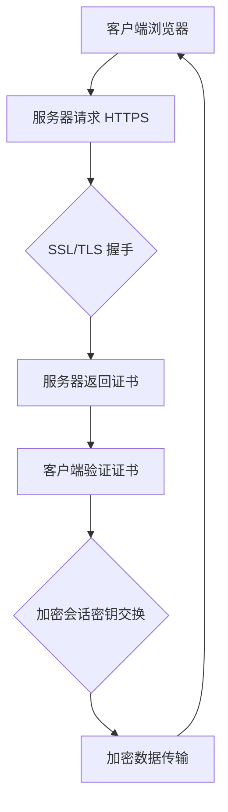

# 第六问：http和https区别与联系

HTTP（超文本传输协议）和HTTPS（安全超文本传输协议）是现代网络通信中的两种重要协议。它们都用于通过互联网传输数据，但在安全性和加密方面有显著区别。我会从**底层原理**和**实际应用**两个层面来详细分析它们的关系和区别。

## 1. **底层原理**

### HTTP（HyperText Transfer Protocol）

-   **协议类型**：HTTP是一个明文传输协议，它并没有提供数据加密、认证或数据完整性检查的功能。
-   **通信过程**：在HTTP中，客户端（如浏览器）与服务器之间的请求和响应都是明文的，数据传输没有任何加密保护，容易受到中间人攻击（Man-in-the-middle）。
-   **端口号**：HTTP使用的是**80端口**。

### HTTPS（HyperText Transfer Protocol Secure）

-   **协议类型**：HTTPS是在HTTP的基础上加入了加密层，通常是通过SSL/TLS协议实现的安全通信。它在传输数据时提供加密、身份验证和数据完整性保障。
-   **SSL/TLS**：HTTPS协议采用SSL（Secure Sockets Layer）或TLS（Transport Layer Security）协议来加密数据，并验证服务器的身份，确保数据在传输过程中的安全性。
    -   **加密**：数据传输前会经过加密，确保即使被窃取，数据也无法被破解。
    -   **身份验证**：HTTPS通过数字证书（通常由受信任的证书颁发机构CA签发）验证服务器的身份，防止伪装攻击。
    -   **数据完整性**：TLS/SSL协议通过消息认证码（MAC）技术确保数据在传输过程中没有被篡改。
-   **端口号**：HTTPS使用的是**443端口**。

## 2. **实际应用**

在实际应用中，HTTP和HTTPS的区别对用户和开发者的影响主要体现在安全性和用户信任两个方面。

### HTTP的使用场景

-   **非敏感信息传输**：例如新闻网站、博客等内容展示类网站，数据没有敏感性，能够接受明文传输。
-   **调试与开发**：在开发阶段，开发者通常使用HTTP来简化调试过程。

### HTTPS的使用场景

-   **在线支付**：例如电商网站和银行系统，必须保护用户的支付信息。
-   **账户登录**：例如社交网站和邮件服务，用户的账号密码需要加密传输以防泄露。
-   **用户隐私保护**：一些网站需要保护用户的个人数据和行为数据，避免数据被窃取或篡改。

## 3. **HTTP与HTTPS的对比表格**
| 特性         | HTTP                             | HTTPS                             |
|--------------|----------------------------------|----------------------------------|
| **加密性**   | 不加密，明文传输                | 加密传输，确保数据安全          |
| **端口号**   | 80端口                           | 443端口                          |
| **安全性**   | 容易受到中间人攻击（MITM）      | 防止中间人攻击，保障数据完整性  |
| **认证机制** | 无认证，无法验证服务器身份      | 通过SSL/TLS证书验证服务器身份  |
| **性能**     | 传输速度相对较快                | 因为加密/解密过程稍微影响性能  |
| **使用场景** | 内容展示、非敏感数据传输        | 需要保密或安全性高的应用场景    |

## 4. **实际应用中的安全风险**

### HTTP的风险

-   **数据泄露**：敏感信息（如密码、银行卡号等）以明文方式传输，容易被第三方窃取。
-   **中间人攻击**：攻击者可以在客户端和服务器之间篡改传输的数据。

### HTTPS的优势

-   **数据加密**：所有传输的数据都经过加密处理，即使数据包被窃取，内容也无法读取。
-   **身份验证**：通过证书验证服务器的合法性，防止用户连接到伪造的站点。
-   **防篡改**：保证传输数据没有被篡改或伪造。

## 5. **HTTPS的工作流程**

HTTPS的工作流程可以简单描述为以下几个步骤：

1.  **客户端请求**：用户访问一个HTTPS网站时，浏览器会向服务器发起HTTPS请求。
2.  **服务器响应**：服务器通过SSL/TLS协议响应并发送数字证书（包括公钥）。
3.  **密钥交换**：客户端使用公钥加密生成一个“会话密钥”，并发送给服务器。
4.  **数据加密传输**：双方使用会话密钥加密传输的数据，确保安全性。

## 6. **示意图**

## 总结

-   **HTTP**：一个没有加密的协议，适用于无敏感信息的网站。
-   **HTTPS**：在HTTP基础上加入了加密层（SSL/TLS），适用于需要保护用户数据、确保安全的场景。

在实际应用中，越来越多的网站和服务都强制使用HTTPS来确保用户数据的安全性，尤其是在涉及到敏感信息时。

