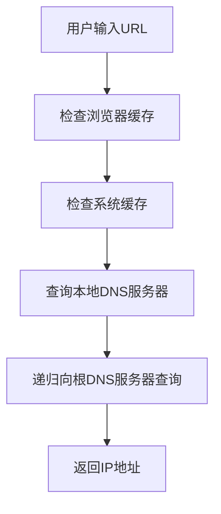
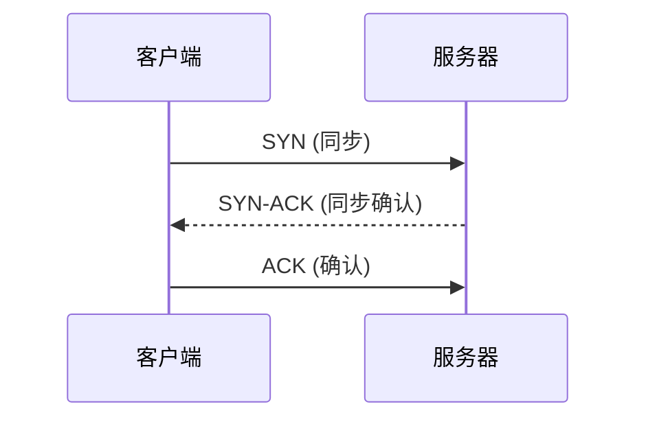
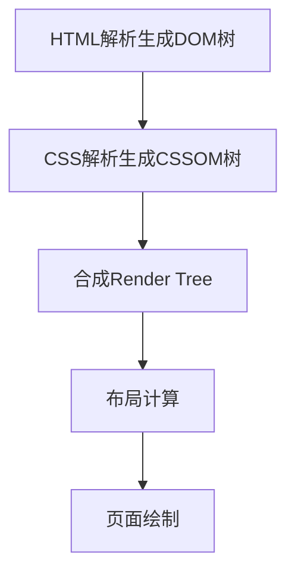

# 第八问：在浏览器中输入URL后发生了什么？

当在浏览器中输入一个URL并按下回车键时，背后会发生一系列复杂的过程，以下是详细的步骤说明。

----------

## 1. **用户输入 URL**

-   用户输入一个 URL（例如 `https://www.example.com`）。
-   浏览器会解析输入，判断是完整的 URL 还是需要补全为默认的协议（如 `http://`）。

----------

## 2. **DNS 解析**

-   浏览器会将域名（如 `www.example.com`）转换为 IP 地址。
-   这个过程包括：
    1.  检查本地缓存。
    2.  检查操作系统的缓存（通过 `hosts` 文件）。
    3.  查询 DNS 服务器。
    4.  如果 DNS 服务器无法解析，会递归向上一级 DNS 查询直到根域名服务器。



----------

## 3. **建立 TCP 连接**

-   使用三次握手（TCP Three-way Handshake）建立连接：
    1.  客户端发送 SYN。
    2.  服务器返回 SYN-ACK。
    3.  客户端发送 ACK。



-   **知识点：TCP/IP 协议**
    -   TCP 确保数据传输的可靠性。
    -   在三次握手中，客户端和服务器确认可以相互通信。

----------

## 4. **发送 HTTP/HTTPS 请求**

-   浏览器根据 URL 的协议（HTTP 或 HTTPS）发送请求。
-   **HTTPS** 的额外步骤：
    1.  TLS 握手。
    2.  验证证书，生成对称密钥。
    3.  加密通信。

----------

## 5. **服务器处理请求**

-   服务器接收到请求后，进行以下步骤：
    1.  检查请求的资源（文件、动态页面等）。
    2.  如果是动态页面，调用后端程序（如 PHP、Node.js）。
    3.  返回响应数据。

**HTTP 请求示例：**

```http
GET /index.html HTTP/1.1
Host: www.example.com
```

**HTTP 响应示例：**

```http
HTTP/1.1 200 OK
Content-Type: text/html
Content-Length: 1256
```

----------

## 6. **浏览器渲染页面**

1.  **解析 HTML**
    -   HTML 解析生成 DOM 树。
2.  **解析 CSS**
    -   CSS 解析生成 CSSOM 树。
3.  **合成 Render Tree**
    -   将 DOM 和 CSSOM 合并。
4.  **布局与绘制**
    -   计算页面元素位置并绘制。



----------

## 7. **页面展示**

-   浏览器将绘制后的页面呈现在用户面前。
-   可能还会加载其他资源（图片、视频、JS 等）。

----------

## 总结表格

| **步骤**             | **操作**                           | **涉及技术/协议**              |
|-----------------------|------------------------------------|--------------------------------|
| 用户输入 URL          | 判断是否为有效 URL                 | URL、URI                      |
| DNS 解析              | 将域名解析为 IP 地址               | DNS 协议、递归查询            |
| TCP 连接              | 建立与服务器的通信                 | TCP 三次握手                  |
| HTTPS 安全通信        | 加密通信                           | TLS/SSL                       |
| HTTP 请求与响应       | 请求资源并接收响应                 | HTTP/HTTPS 协议               |
| 浏览器渲染页面        | 构建 DOM、CSSOM，绘制页面          | HTML、CSS、JavaScript 渲染    |
