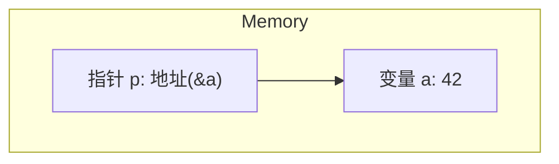
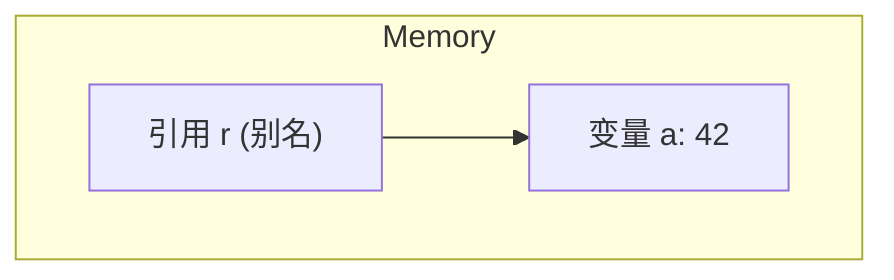

# 第九问：能否尽可能详细阐述指针和引用的区别？

在C++中，**指针（Pointer）**和**引用（Reference）**是两个非常重要的概念，分别提供了不同方式来操作内存地址和数据。以下内容从概念、特点、底层原理和实现等多个角度详尽阐述。

----------

## **指针和引用的概念**

| 特性         | 指针                         | 引用                         |
|--------------|------------------------------|-------------------------------|
| 定义         | 保存内存地址的变量             | 已有变量的别名                 |
| 初始化       | 可以延后初始化，甚至指向`nullptr` | 必须在定义时初始化               |
| 指向对象的更改 | 可以更改指向的对象             | 一旦绑定到对象，就不能更改       |
| 空值         | 可以为空 (`nullptr`)          | 不存在“空引用”                 |
| 算术操作     | 可以进行指针算术               | 不支持任何算术操作               |
| 内存地址     | 存储的是地址                   | 本质是变量的地址               |

## **底层原理**

### **指针**

-   **存储的内容**：指针本质上是一个变量，其存储的内容是某块内存的地址。
-   **内存模型**：指针变量占用内存，一般为4字节（32位系统）或8字节（64位系统）。
-   **间接访问**：通过解引用操作符（`*`）访问指针指向的内存。
-   **灵活性**：可以动态分配和释放内存。

```cpp
int a = 42;
int *p = &a; // 指针p指向变量a的地址
```

### **引用**

-   **存储的内容**：引用本质上是指针的语法糖，它直接绑定到变量，操作引用实际上操作的是被绑定变量。
-   **内存模型**：引用没有独立的内存空间，只是已存在变量的别名。
-   **不可重新绑定**：引用一旦绑定对象，就不可改变指向。

```cpp
int a = 42;
int &r = a; // 引用r绑定到变量a
```

----------

## **实现的例子**

### **指针的实现**

```cpp
#include <iostream>

void demonstratePointer() {
    int a = 42;
    int *p = &a; // p存储了变量a的地址
    std::cout << "Value of a: " << a << "\n";
    std::cout << "Address of a: " << &a << "\n";
    std::cout << "Value of p: " << p << "\n";
    std::cout << "Dereferenced p: " << *p << "\n";

    // 改变指针指向的值
    *p = 100;
    std::cout << "New value of a: " << a << "\n";
}
```

### **引用的实现**

```cpp
#include <iostream>

void demonstrateReference() {
    int a = 42;
    int &r = a; // r是a的引用
    std::cout << "Value of a: " << a << "\n";
    std::cout << "Value of r: " << r << "\n";

    // 改变引用值，实际上改变了a
    r = 100;
    std::cout << "New value of a: " << a << "\n";
}
```

----------

## **可视化图示**

使用Mermaid图表描述内存模型。

### **指针的内存模型**



### **引用的内存模型**



----------

## **深入分析**

### **指针的高级操作**

1.  **动态内存分配**：使用`new`和`delete`。
    
    ```cpp
    int *ptr = new int(5); // 分配内存
    delete ptr;           // 释放内存
    ```
    
2.  **数组和指针**：指针可以遍历数组。
    
    ```cpp
    int arr[] = {1, 2, 3};
    int *ptr = arr;
    for (int i = 0; i < 3; ++i) {
        std::cout << *(ptr + i) << " ";
    }
    ```
    
3.  **空指针检查**：防止野指针。
    
    ```cpp
    if (ptr != nullptr) {
        *ptr = 10;
    }
    ```
    

### **引用的限制**

1.  **不能重新绑定**：绑定后无法指向其他变量。
    
    ```cpp
    int a = 5, b = 10;
    int &ref = a;
    // ref = &b; // 错误
    ```
    
2.  **不能为nullptr**：引用总是有效。
    

----------

## **总结表格**

| 特性           | 指针                          | 引用                             |
|----------------|-------------------------------|-----------------------------------|
| 是否需要初始化   | 可延迟初始化，也可为`nullptr`   | 必须初始化                         |
| 是否可重新绑定   | 可通过赋值改变指向             | 不可重新绑定                       |
| 是否占用内存     | 占用额外的内存（存储地址）     | 不额外占用内存                     |
| 操作对象的方式   | 通过解引用访问指向的对象       | 直接操作绑定的对象                 |
| 灵活性         | 支持动态分配、算术操作和空值   | 简单易用，但灵活性有限               |
| 使用场景       | 动态内存管理、复杂数据结构操作   | 参数传递和局部变量操作               |


## **结论**

-   指针提供了更大的灵活性和控制力，适合复杂的内存操作。
-   引用更直观，适合简化代码并提高可读性。
-   根据实际需求选择适合的工具。


```mermaid

graph TD
    A[变量 a: 42]  
    P[指针 p: 地址(&a)]  
    R[引用 r (别名)]
    
    %% 描述指针和引用的关系
    A --> P[指向地址]
    A --> R[引用同一块内存]
    
    %% 备注说明
    P -.->|指向| A
    R -.->|指向| A
```